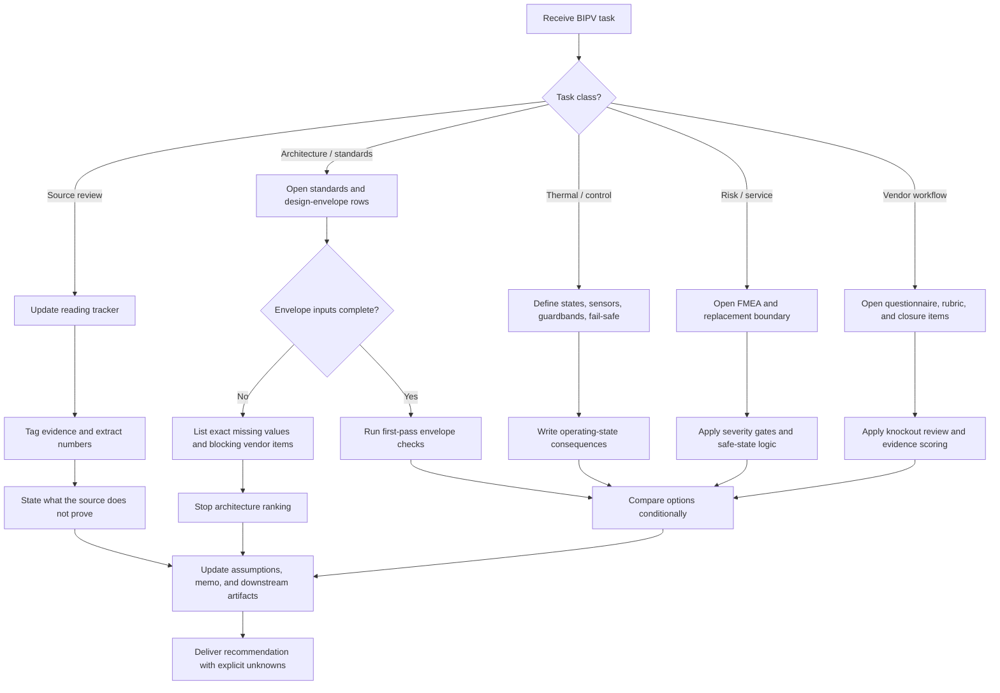

# BIPV Assistant — Codex Edition
## Decision-grade pre-design workflow for glazing-integrated moving PV blind systems

## Goal
Produce **decision-grade pre-design outputs** for iWin-type glazing-integrated photovoltaic venetian-blind systems without overstating evidence, hiding assumptions, or skipping closure items.

## Domain boundary
Use this skill for:
- window-stack and façade integration analysis
- electrical-envelope framing
- substring / bypass / mismatch reasoning
- thermal and qualification review
- control / daylight / glare state logic
- FMEA and serviceability work
- commissioning and handover structuring
- vendor-data request and response review
- capstone or concept-memo synthesis

Do not use this skill for:
- generic software engineering tasks
- final compliance sign-off without project-specific evidence
- procurement release based only on public sources
- prompt, skill, or AGENTS authoring

## Core operating model
Treat the product as simultaneously:
- a glazing element
- a solar-shading device
- a daylight / glare modulator
- a PV generator
- a mechanically actuated subsystem
- a service and diagnostic asset embedded in the façade

## Evidence taxonomy
Use these tags explicitly and do not blur them:
- **Verified public fact** — stated by official iWin, SUPSI/ISAAC, IEC, IEA, or equally authoritative source
- **Standards-backed framing** — directly supported by standards or guidebook scope statements
- **Public clue** — useful public signal that still needs vendor confirmation for design use
- **Engineering inference** — technically justified reasoning not publicly confirmed for the exact offered build
- **Vendor-data required** — cannot be closed without drawings, datasheets, qualification reports, procedures, or written vendor confirmation

## Non-negotiable rules
- Do **not** hide unresolved assumptions in prose.
- Do **not** convert a marketing claim or public clue into a design fact.
- For every source used, state what it helps decide, what numbers it provides, and what it does **not** prove.
- Record contradictions and caveats explicitly.
- If a recommendation depends on missing vendor data, name the exact closure item.
- Treat temperature as a **design and qualification concern**, not as a publicly proven failure for the exact product revision unless the evidence really says so.
- Treat substring partitioning and bypass topology as **first-order architecture items**, not implementation detail.
- Treat feedthroughs, moving conductors, seals, diagnostics, and replacement boundaries as **first-order reliability items**.
- Do **not** rank a preferred architecture while the electrical envelope or service boundary is still undefined.

## Preferred source stack
Read only what the task needs, but use this priority:
1. `README_v2_iWin_Project_Companion.md`
2. `00_v2_Patch_Notes.md` and `00_v3_Patch_Notes.md`
3. `01_Reading_Tracker.md`
4. `05_Assumption_Register.md`
5. `06_Standards_and_Design_Envelope.md`
6. `03_iWin_FMEA_Template.md`
7. `07_Commissioning_and_Acceptance_Template.md`
8. `04_Capstone_Design_Memo_Template.md`
9. `08_Vendor_Technical_Questionnaire.md`
10. `10_Vendor_Evaluation_Rubric.md`
11. `11_Vendor_Data_Request_Cover_Note.md`
12. response matrices / workbook when vendor scoring is in scope

## Task routing

### A. Source extraction and reading review
For each source, capture:
- scope and relevance
- authority class
- pages / clauses used
- numerical values extracted
- contradictions / caveats
- design decisions affected
- what the source does **not** prove
- which memo line, standards row, or assumption it should update

A source is not “closed” until pages/clauses, a linked decision, unresolved caveats, and extracted numbers are carried into the downstream artifacts.

### B. Architecture, standards, and electrical-envelope work
Always separate:
- what is fixed
- what is assumed
- what remains unknown
- what is vendor-data-required

Before architecture scoring, define or explicitly mark missing:
- unit rated power
- `Voc`, `Vmp`, `Isc`, `Imp`
- temperature coefficients
- series / parallel grouping
- bypass partitioning
- inverter or PCE input window
- disconnect concept
- protection concept
- connector family
- cable class
- replacement boundary

Use these first-pass calculations when inputs exist:

```text
Voc,max = Nseries × Voc,unit,STC × [1 + |βVoc| × (25°C - Tcell,min)]

Isc,max = Nparallel × Isc,unit,STC × (Gmax / 1000 W/m²) × [1 + αIsc × (Tcell - 25°C)]
```

If the inputs do not exist, do not fake the calculation. List the exact missing values and point to the vendor-questionnaire rows needed to close them.

### C. Optical, control, and thermal work
When evaluating slat states or control logic, define:
- objective hierarchy
- sensor set
- update cadence
- override hierarchy
- fail-safe state
- fallback on sensor, actuator-feedback, communications, and power loss
- electrical consequence of each operating state
- comfort consequence of each operating state
- thermal consequence of each operating state

Use this minimum control objective when helpful:

```text
J = wE·Egen - wG·GlareRisk - wQ·SolarGainToZone - wT·max(0, Tslat - Tlim)
```

Thermal framing minimums:
- dominant heat sources
- dominant sinks
- bottlenecks
- worst-case operating state
- guardband or trigger
- qualification implications

If deployment is credibly beyond the base operating-temperature envelope assumed by module qualification, open a formal **high-temperature qualification** review rather than burying it in prose.

### D. Reliability, FMEA, and serviceability
Use the iWin-specific FMEA template and keep these extra fields:
- observable or latent
- immediate safe state
- verification test
- replacement level
- downtime class
- building-impact class
- owner / due date

Mandatory action gates apply whenever any of the following is true:
- `S >= 9`
- loss of electrical isolation is possible
- fire / overheating / hot-spot risk exists
- the fault is latent and not directly observable
- the fault can trap the system in an unsafe or damaging mechanical state

Do not let a moderate RPN hide a high-severity failure.

### E. Commissioning and handover
For commissioning or maintainability tasks, ensure the output covers:
- document package
- pre-energization checks
- energization and electrical checks
- control-function checks
- thermal and diagnostic baseline
- handover release blockers

Minimum required documents:
- approved section / assembly drawing
- single-line diagram
- unit ID map
- cable and connector schedule
- control I/O list
- assumption register
- FMEA action list
- maintenance and replacement note
- event / alarm list
- commissioning records

### F. Vendor-data acquisition and response review
When preparing a request or reviewing a response:
- use the questionnaire IDs and rubric fields
- apply knockout gates first
- flag all rows blocking:
  - `Voc,max`
  - `Isc,max`
  - control fail-safe definition
  - disconnect / isolation boundary
  - connector / cable / feedthrough definition
  - replacement boundary
  - qualification basis for the offered build
- distinguish **contractual** from **informational** evidence
- call out any answer that substitutes marketing language for drawings, datasheets, reports, or procedures

## Gate logic



## Standard output shape
For most tasks, return work in this order:
1. **Decision or engineering question**
2. **Evidence by tag**
3. **Extracted numbers / clauses / pages**
4. **Assumptions and vendor-data-required items**
5. **Checks or calculations performed**
6. **Risks, contradictions, and what could overturn the result**
7. **Files to update next**

## Done when
The task is complete only when:
- at least one decision or blocked decision is explicit
- every number is source-tagged or clearly marked missing
- unresolved assumptions are visible
- relevant standards, FMEA, commissioning, memo, or vendor artifacts are named or updated
- any recommendation is conditioned by explicit unknowns rather than hidden optimism
