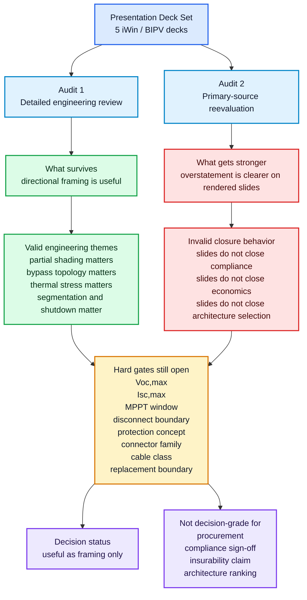
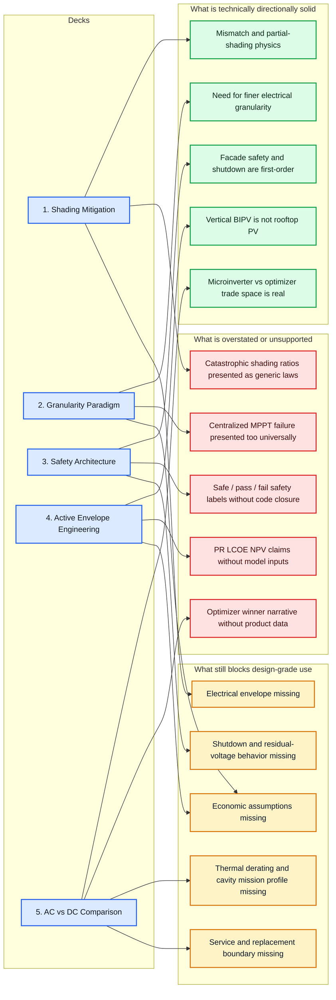
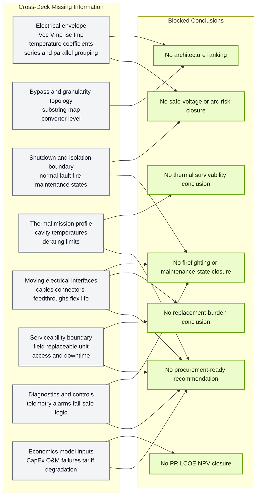
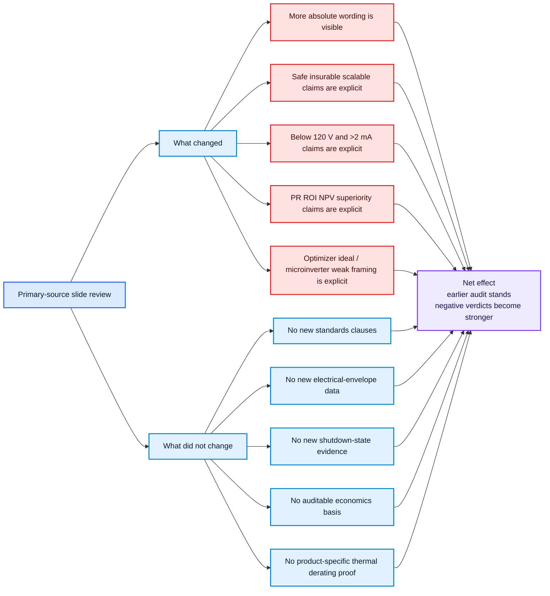

# BIPV Presentation Deck Audits - Graphical Representation

These diagrams transform the narrative findings from:

- [BIPV_Presentation_Deck_Audit.md](./BIPV_Presentation_Deck_Audit.md)
- [BIPV_Presentation_Deck_Primary_Source_Reevaluation.md](./BIPV_Presentation_Deck_Primary_Source_Reevaluation.md)

Design intent:

- render reliably in Obsidian
- preserve the audit logic rather than decorate it
- separate what the decks do well from what remains blocked
- keep architecture ranking explicitly gated by missing electrical and safety inputs

## 1. Combined Audit Synthesis

## 2. Deck-by-Deck Verdict Map

## 3. Cross-Deck Closure Dependency Map

## 4. Primary-Source Escalation View

This diagram isolates what changed after direct slide review.

## 5. Color Legend

- Blue: source, deck, or neutral structural items
- Green: technically solid or blocked-output items
- Red: overstatement, unsupported claims, or stronger negative findings
- Amber: unresolved hard gates
- Gray: missing closure information
- Purple: final synthesis or decision-status nodes

## 6. Use Notes For Obsidian

- The overview and closure maps read best in a wide pane.
- The deck verdict map is easier to scan in reading mode than live preview.
- If Mermaid line breaks render poorly in your vault, replace ` ` with shorter node text rather than adding extra subgraphs.
