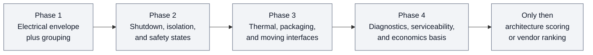

# BIPV Presentation Deck Missing-Information Map

## Objective / decision

Turn the two existing presentation-deck audit notes into one decision-oriented map of the missing information still blocking design-grade conclusions for iWin-type glazing-integrated PV blinds.

This note does not add new public technical evidence. It reorganizes the already-audited gaps into a graphical dependency view so the next work can target closure items instead of re-reading slide rhetoric.

## Evidence by tag

- `Verified public fact`
  - No new external technical facts are introduced here. This note is derived from the local audit artifacts already in the repo.
- `Standards-backed framing`
  - The repo hard gate still stands: architecture scoring remains blocked until the electrical envelope, disconnect / isolation boundary, protection concept, connector family, cable class, and replacement boundary are defined or explicitly marked missing.
- `Engineering inference`
  - Across the five decks, the missing items collapse into five closure streams:
    - electrical envelope and granularity
    - shutdown / isolation and safety state
    - thermal / packaging
    - moving-interface and serviceability
    - diagnostics / economics
- `Vendor-data required`
  - Any claim about:
    - safe-voltage architecture
    - shutdown pass/fail
    - slim-profile fit
    - thermal survivability
    - PR / LCOE / NPV / ROI
    - preferred optimizer or microinverter winner
    remains blocked without product data, drawings, listings, and project calculations.

## Numbers, clauses, or source pages used

Derived from the following local source sections:

- [BIPV_Presentation_Deck_Audit.md](C:/Users/Denys/Documents/Projects/PVplant/BIPV_Codex_Edition/analysis/BIPV_Presentation_Deck_Audit.md)
  - consolidated hard-gate list
  - per-deck "Assumptions and vendor-data-required items"
  - "Cross-deck missing information" table
- [BIPV_Presentation_Deck_Primary_Source_Reevaluation.md](C:/Users/Denys/Documents/Projects/PVplant/BIPV_Codex_Edition/analysis/BIPV_Presentation_Deck_Primary_Source_Reevaluation.md)
  - strengthened missing-item list after direct slide review
  - claim examples that remain blocked:
    - Deck 1, page 3: `5%` shaded, `80%` total power drop
    - Deck 3, page 12: `below 120V per sector`
    - Deck 4, page 12: `>74% PR`
    - Deck 5, page 13: optimizers labeled `IDEAL`

## Graphical map

```mermaid
flowchart TB
    subgraph C["Blocked conclusion families"]
        C1["Architecture ranking<br/>and topology preference"]
        C2["Safety / compliance / insurability claims"]
        C3["Thermal survivability<br/>and package-fit claims"]
        C4["Yield / PR / LCOE / NPV / ROI claims"]
        C5["Commissioning and maintenance release"]
    end

    subgraph M["Derived missing-information streams"]
        M1["Electrical envelope<br/>Voc,max; Vmp; Isc,max; Imp;<br/>temperature coefficients;<br/>series/parallel grouping;<br/>MPPT input window"]
        M2["Bypass and granularity topology<br/>cell-string layout;<br/>bypass-diode map;<br/>module vs submodule control"]
        M3["Shutdown / isolation boundary<br/>single-line by state;<br/>residual voltage;<br/>time to safe state;<br/>per-floor segmentation logic"]
        M4["Thermal mission profile<br/>cavity temperature;<br/>airflow assumptions;<br/>temperature gradients;<br/>derating limits"]
        M5["Moving electrical interfaces<br/>cable class;<br/>flex life;<br/>feedthrough detail;<br/>strain relief"]
        M6["Packaging and product evidence<br/>dimensions;<br/>clearances;<br/>ingress rating;<br/>heat-sink requirements"]
        M7["Diagnostics and controls<br/>telemetry points;<br/>alarm schema;<br/>protocol mapping;<br/>fail-safe logic"]
        M8["Serviceability boundary<br/>field-replaceable unit;<br/>access method;<br/>downtime class;<br/>replacement boundary"]
        M9["Economics basis<br/>CapEx; O&M; replacement;<br/>tariff / self-consumption value;<br/>degradation; availability;<br/>discount rate"]
    end

    subgraph A["Closure artifacts"]
        A1["Electrical-envelope worksheet"]
        A2["Shutdown-state definition<br/>plus single-line set"]
        A3["Thermal-risk worksheet"]
        A4["Vendor-data request package"]
        A5["Scored architecture decision matrix"]
    end

    C1 --> M1
    C1 --> M2
    C1 --> M4
    C1 --> M6
    C1 --> M8
    C2 --> M3
    C2 --> M5
    C2 --> M6
    C2 --> M8
    C3 --> M4
    C3 --> M5
    C3 --> M6
    C3 --> M8
    C4 --> M4
    C4 --> M7
    C4 --> M8
    C4 --> M9
    C5 --> M3
    C5 --> M5
    C5 --> M7
    C5 --> M8

    M1 --> A1
    M2 --> A1
    M3 --> A2
    M4 --> A3
    M5 --> A4
    M6 --> A4
    M7 --> A4
    M8 --> A4
    M9 --> A5

    A1 --> A5
    A2 --> A5
    A3 --> A5
    A4 --> A5

    classDef blocked fill:#fdecea,stroke:#b42318,color:#101828;
    classDef missing fill:#fff4e5,stroke:#b54708,color:#101828;
    classDef artifact fill:#eaf2ff,stroke:#175cd3,color:#101828;

    class C1,C2,C3,C4,C5 blocked;
    class M1,M2,M3,M4,M5,M6,M7,M8,M9 missing;
    class A1,A2,A3,A4,A5 artifact;
```

## Derived missing-information register

| Stream | Why it blocks | Closure items | Deck emphasis |
| --- | --- | --- | --- |
| Electrical envelope and grouping | No topology can be scored without actual electrical limits | `Voc,max`, `Vmp`, `Isc,max`, `Imp`, temperature coefficients, grouping, MPPT window, protection concept | Decks 1, 2, 5 |
| Bypass and granularity topology | Shading-loss and DMPPT claims change with actual partitioning | cell-string layout, bypass map, module vs submodule granularity | Decks 1, 2 |
| Shutdown / isolation and safety state | "safe", "pass", and compliance language are not auditable without state definitions | single-lines for normal, fault, fire-service, and maintenance states; residual-voltage profile; arc-fault basis; segmentation logic | Decks 3, 4 |
| Thermal mission profile and package fit | Reliability and package-choice claims depend on actual enclosure temperatures and derating | cavity temperatures, airflow assumptions, gradients, derating curves, enclosure limits, dimensions, clearances | Decks 4, 5 |
| Moving interfaces and serviceability | PV blinds add motion, feedthrough, and replacement constraints not closed in the decks | cable class, flex life, feedthrough detail, strain relief, field-replaceable unit, access method, downtime class | Cross-deck, strongest in 3 and 5 |
| Diagnostics and controls | DMPPT value depends on actionable telemetry, not generic visibility claims | telemetry points, alarm classes, protocol mapping, BMS exposure, fail-safe logic | Decks 2, 4 |
| Economics basis | ROI, PR, LCOE, and NPV claims are non-auditable without model inputs | CapEx, O&M, replacement burden, degradation, availability, tariff, discount rate, baseline definition | Decks 2, 4 |

## Assumptions and vendor-data-required items

- Assumption:
  - this map is derived only from the two local audit notes and does not re-run source validation
- Vendor-data-required items that dominate multiple streams:
  - offered module or louver electrical datasheet
  - bypass partitioning and louver grouping definition
  - actual per-floor or per-sector single-line architecture
  - shutdown initiation method, residual-voltage profile, and time to safe state
  - arc-fault detection basis, listing, and false-positive behavior
  - thermal derating and enclosure-temperature limits for candidate MLPE
  - packaging drawings, clearances, ingress rating, and cooling path
  - connector family, cable class, flex qualification, and feedthrough detail
  - field replacement boundary and service access sequence
  - telemetry / controls interface specification
  - economics model inputs and baseline definitions

## Checks / calculations performed

- Deduplicated the missing-information items from both audit notes.
- Grouped them by blocked conclusion rather than by deck title.
- Checked the grouping against the repo hard gate:
  - result: no new node bypasses the electrical-envelope gate
- Checked whether any missing-information stream can be closed by slide text alone:
  - result: none can
- No envelope or economics calculation was performed because the required inputs remain absent.

## Risks, contradictions, and what could overturn the recommendation

- This note is a derived map, not a new evidence source.
- If the missing companion documents later appear in the repo, some closure items may need to be split into more formal standards, FMEA, or commissioning rows.
- A vendor package with complete electrical, thermal, and shutdown documentation could collapse several nodes quickly.
- A jurisdiction-specific code path could add new gates or invalidate assumptions embedded in the current deck rhetoric.

## Next artifact updates needed

- Build the first electrical-envelope worksheet from `M1` and `M2`.
- Build the shutdown-state definition from `M3`.
- Build the thermal-risk worksheet from `M4`.
- Build the vendor-data request package from `M5` through `M8`.
- Do not create a scored architecture matrix until `A1` through `A4` exist.
