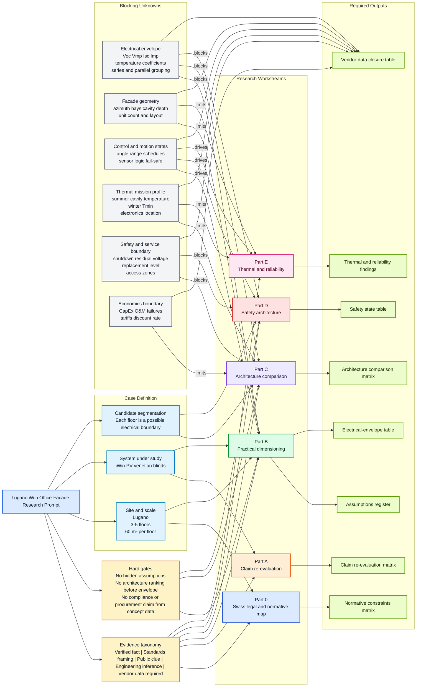
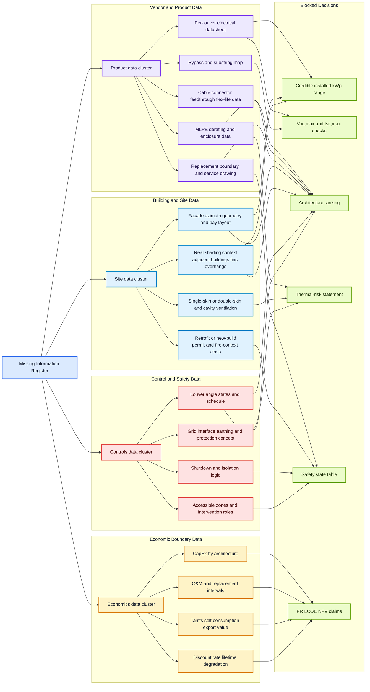

# Research Prompt - Lugano iWin Office Facade - Diagrams

These Mermaid diagrams are derived from:

- [Research_Prompt_Lugano_iWin_Office_Facade.md](/C:/Users/Denys/Documents/Codex/BIPV_Codex_Edition/analysis/Research_Prompt_Lugano_iWin_Office_Facade.md)
- [BIPV_Presentation_Deck_Audit.md](/C:/Users/Denys/Documents/Codex/BIPV_Codex_Edition/analysis/BIPV_Presentation_Deck_Audit.md)

Design goals for Obsidian:

- conservative Mermaid syntax
- no nested styling tricks or unsupported icons
- short node labels with line breaks for readability
- explicit `classDef` colors instead of theme-dependent defaults
- one overview diagram plus one closure diagram

## 1. Research Structure Overview

## 2. Missing-Information Closure Map

## 3. Color Legend

- Blue: prompt structure, case inputs, and site/context framing
- Amber: rules and economics
- Green: outputs or blocked decision items
- Purple: product or architecture-related data
- Red: safety and control boundaries
- Gray: unresolved gaps

## 4. Obsidian Notes

- `TD` works better for the overview in a portrait note pane.
- `LR` works better for the closure map in a wider pane.
- If node text wraps too aggressively in your theme, shorten labels first rather than adding more subgraphs.
- If your local Obsidian Mermaid version renders HTML line breaks inconsistently, replace ` ` with plain spaces and shorter labels.
