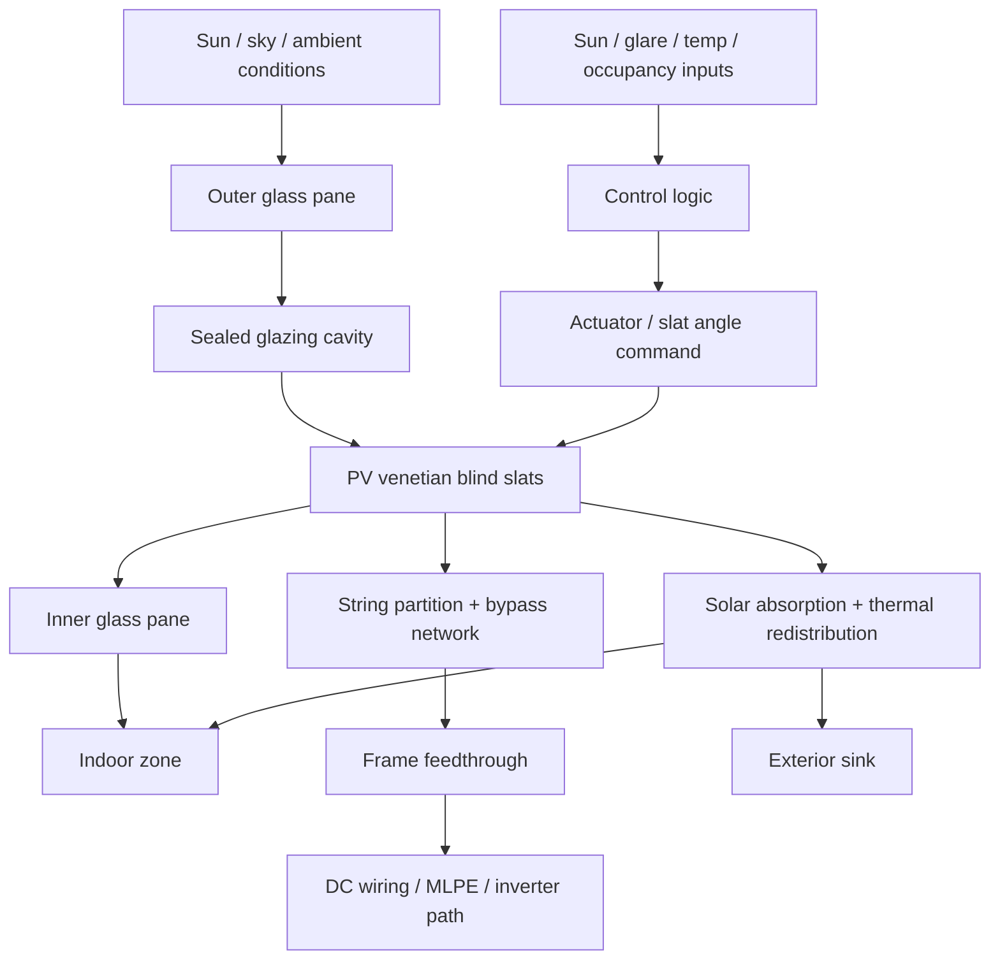

# iWin-Type BIPV Project Companion

## Purpose
This pack is a **working companion** for studying and scoping an **iWin-type glazing-integrated photovoltaic venetian blind** product.

It is optimized for the engineering shift from **generic BIPV** to **window-stack + dynamic shading + mismatch-aware electro-thermal design**.

## Authority / evidence boundary
Use these labels explicitly:

- **Verified public fact** — stated by official iWin / SUPSI / IEC / IEA source.
- **Standards-backed framing** — directly consistent with IEC / IEA scope statements.
- **Engineering inference** — technically justified, but not publicly confirmed for the exact product.
- **Vendor-data required** — cannot be closed without supplier drawings, datasheets, or test reports.

## What changes versus generic BIPV
For generic BIPV, the early lessons are usually:
- façade orientation
- shading
- strings
- standards

For an **iWin-type system**, the highest-value early lessons shift to:
- **window-stack physics**
- **dynamic slat-angle control**
- **electrical mismatch inside a moving glazing-integrated element**
- **feedthrough / seal / service architecture**

That shift follows from the public architecture: iWin describes the product as a **photovoltaic venetian-blind shading device integrated inside an insulating window**, while SUPSI frames the related research activity as **multifunctional active-envelope / BIPV development** and notes that iWin emerged from that team.

## Public concept anchor
### Product-level architecture
```text
Solar radiation
      ↓
[Outer glass pane]
      ↓
[Sealed glazing cavity / insulating unit]
      ↓
[PV venetian blind slats]
      ├─ optical function: shading / glare / daylight modulation
      ├─ electrical function: PV generation
      └─ thermal effect: absorbs + redistributes solar load
      ↓
[Inner glass pane]
      ↓
Indoor space
```

### Electrical and control paths
```text
Electrical path:
PV slats → string partition / bypass network → frame feedthrough → local DC wiring / MLPE / inverter path

Control path:
sun / glare / temperature / occupancy logic → slat-angle command → optical + electrical operating point
```

### System view


## The six Pareto lessons

### 1. Treat it as an electro-optical-thermal window subsystem
Do **not** treat it as “PV on a façade.” It is simultaneously:
- an insulating glazing unit component
- a solar-shading device
- a daylight/glare control element
- a PV generator

**Consequence:** the baseline model must include **optical, thermal, electrical, mechanical, and service interfaces**.

### 2. Slat angle / control strategy matters almost as much as cell efficiency
The product value proposition is not only kWh. It also includes:
- solar control
- glare control
- daylight modulation
- summer overheating reduction

**Consequence:** the first useful control study is not MPPT alone; it is **comfort-vs-yield-vs-heat-gain co-optimization**.

### 3. Thermal behavior in and around the glazing unit is first-order
BIPV guidance frames these products as both **building products** and **PV systems**. For iWin-type architectures, the PV is embedded in a glazing/shading assembly rather than behaving like a freely rear-ventilated rooftop module.

**Consequence:** temperature rise, thermal gradients, seal stress, and reduced PV efficiency must be treated as primary design variables.

### 4. String partitioning and bypass design are not implementation details
For dynamic slat-based systems, partial shading and incidence-angle variation are structural, not exceptional.

**Consequence:** mismatch analysis must start at the **slat / substring / bypass** level, not only at façade-string level.

### 5. Frame feedthrough, sealing, and moving-interface reliability are core topics
Once PV and blind mechanics are enclosed in an insulating window, the difficult parts move to:
- electrical feedthroughs
- actuator integration
- seal durability
- vibration / repeated motion effects
- replacement logistics

**Consequence:** reliability is dominated by interfaces, not only by PV cell choice.

### 6. Serviceability and commissioning must be designed from day 1
A “low-maintenance” claim does not eliminate the need for:
- unit identification
- commissioning evidence
- access planning
- fault isolation
- replacement strategy

**Consequence:** the product should be documented like a façade element **and** like a PV asset.

## Evidence-backed anchor points

### Verified public facts
- iWin publicly describes its solution as a **photovoltaic venetian-blind shading device integrated inside an insulating window (double glazing unit)**.
- iWin publicly claims combined functions of **renewable energy production, light and solar-radiation control, glare protection, and aesthetics**.
- SUPSI publicly states that its Innovative Envelope team works on **multifunctional photovoltaic envelope products** and that **team members founded iWin in 2019**.
- IEC 63092-1 and IEC 63092-2 split BIPV requirements into **module** and **system** levels.
- IEC 62446-1 is the baseline for **documentation, commissioning tests, and inspection** of grid-connected PV systems.

### Strong engineering inferences
- The dominant early design trade-off is not only panel efficiency; it is **control policy versus optical/thermal/electrical outcomes**.
- Sealed or semi-enclosed integration raises the importance of **temperature and service interfaces** compared with more conventional external-shading PV.
- The most fragile interfaces are likely **frame feedthroughs, flexible wiring at moving elements, and seal transitions**.

### Vendor-data required
Close these before any serious concept freeze:
- exact cross-section of the IGU / blind chamber
- whether the blind sits in the main cavity or a dedicated chamber
- slat cell technology and lamination / bonding stack
- actuator type and service path
- exact feedthrough construction and rated environmental life
- replaceable-unit boundaries: glass only / blind cassette / electronics / motor
- approved maximum electrical aggregation per window and per façade string

## 12-week roadmap
| Week | Theme | Goal | Core output |
|---|---|---|---|
| 1 | Product decomposition | Reduce the concept to functions and interfaces | Functional block diagram |
| 2 | Window-stack integration | Understand cavity, feedthroughs, replacement boundaries | Section view with marked assumptions |
| 3 | Solar geometry on vertical façades | Understand vertical incidence by season/orientation | Monthly incidence + irradiance plots |
| 4 | Daylight / glare / shading logic | Capture non-electrical value proposition | Slat-state decision table |
| 5 | Dynamic control co-design | Compare comfort-first / yield-first / hybrid logic | Trade-off comparison sheet |
| 6 | Slat/string partitioning and mismatch | Understand shading propagation electrically | I–V / P–V sketches + mismatch note |
| 7 | Downstream electrical architecture | Compare string / optimizer / microinverter-like paths | Architecture trade-off table |
| 8 | Monitoring and diagnostics | Define observability and fault isolation | Monitoring-point list |
| 9 | Thermal model | Build first-order slat/glazing heat-balance intuition | Thermal network note |
| 10 | Reliability and failure modes | Build real deployment risk picture | FMEA |
| 11 | Commissioning and maintainability | Turn concept into deployable project discipline | Mini commissioning pack |
| 12 | Capstone | Integrate all assumptions into one concept memo | 5–8 page design memo |

## Weekly execution pattern
For each week, complete the same six steps:
1. **State authority:** verified fact vs inference vs unknown.
2. **Draw the system:** one section / block / state diagram.
3. **Model first-order behavior:** no premature detail.
4. **List dominant failure modes.**
5. **Write required vendor questions.**
6. **Record next-week dependencies.**

## Fast toolchain
### Core
- **Ladybug Tools** — sun path, façade irradiance, incidence geometry
- **Honeybee / EnergyPlus** — daylight, glare, cooling-load consequences of control logic
- **Python or MATLAB** — mismatch, bypass topology, simple thermal networks, MCDA
- **CAD sections** — frame, feedthrough, replacement/service concept

### Optional
- **THERM / FEM** — frame-edge thermal bridges, local temperature concentration
- **PVsyst / PV*SOL** — only as high-level sanity check, with explicit simplifications

## Minimal architecture comparison frame
| Architecture | Main advantage | Main weakness | Best-fit hypothesis |
|---|---|---|---|
| Direct stringing | Lowest part count | High mismatch sensitivity | Uniform façades, limited shading diversity |
| String + optimizers | Better mismatch handling | More parts in constrained integration | Mixed orientations / nonuniform slat behavior |
| Microinverter-like partitioning | Maximum modular independence | Cost, service, and electronics-environment penalty | Highly fragmented systems |

## First-order thermal balance
```text
Q_solar,absorbed = Q_to exterior + Q_to interior + Q_stored

At equilibrium:
T_slat rises until heat balance closes
η_PV(T) falls as T_slat rises
Seal / adhesive / feedthrough stress usually increases with temperature and cycling
```

## Minimal monitoring architecture
- unit ID map
- façade elevation map
- slat / zone grouping map
- DC aggregation map
- feedthrough location register
- actuator status and motion faults
- string V / I where measurable
- local temperature if available
- irradiance reference or proxy
- event / alarm log

## Folder map for this companion
```text
/iwin_project_companion/
├─ README_iWin_Project_Companion.md
├─ 01_Reading_Tracker.md
├─ 02_Weekly_Checklist.md
├─ 03_iWin_FMEA_Template.md
├─ 04_Capstone_Design_Memo_Template.md
└─ 05_Assumption_Register.md
```

## Use order
1. Read this file once.
2. Start `05_Assumption_Register.md` before any modeling.
3. Use `02_Weekly_Checklist.md` each week.
4. Start `03_iWin_FMEA_Template.md` no later than Week 4.
5. Draft the capstone in parallel from Week 8 onward.

## Reference backbone to verify first
Use the following public anchors first:
- official iWin product description
- SUPSI Innovative Envelope / ISAAC overview
- IEA PVPS Task 15 BIPV technical guidebook overview
- IEC 63092-1 / IEC 63092-2 scope statements
- IEC 62446-1 scope statement
- the 2024 Solar RRL dynamic BIPV shading-system paper

## Main caution
The current public information is enough to justify the **study direction**, but **not enough to freeze a product architecture**. Any serious TRS or concept proposal still needs vendor-confirmed data for cavity design, wiring, feedthrough construction, service boundaries, and environmental qualification.
