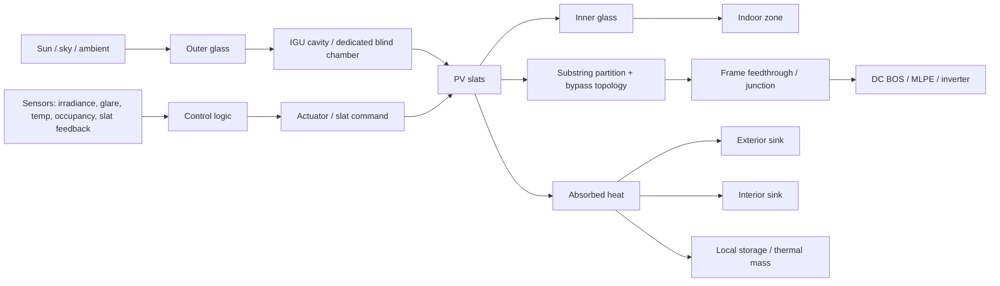

# iWin-Type BIPV Project Companion — v3

## Scope

This pack is a **pre-design engineering companion** for studying and scoping an **iWin-type glazing-integrated photovoltaic venetian-blind system**.

It is optimized for the shift from **generic BIPV** to **window-stack + dynamic shading + mismatch-aware electro-thermal design**.

---


## v3 addition — vendor closure layer

v3 extends the pre-design pack with a **vendor-data acquisition and review workflow**:

- `08_Vendor_Technical_Questionnaire.md`
- `09_Vendor_Response_Matrix.tsv`
- `10_Vendor_Evaluation_Rubric.md`
- `11_Vendor_Data_Request_Cover_Note.md`
- `12_Vendor_Response_Workbook.xlsx`

Use these files to close the **vendor-data-required** items in the assumption register and standards/design-envelope matrix before architecture down-select or design freeze.

---

## Public-source anchors checked for this revision

These are the public anchors this pack is built around:

- The current iWin product page describes the concept as a **photovoltaic venetian-blind shading device integrated inside an insulating window (double glazing unit)**.
- The same page states combined functions of **renewable energy production, light and solar-radiation control, glare protection, and aesthetics**.
- The same page states a **sealed glass-enclosed chamber**, a claim of **almost no maintenance**, and a patent-pending production method integrating **thin-film photovoltaic solar cells** on venetian blinds inside a **two-glass enclosed chamber**.
- SUPSI / ISAAC states that some team members founded **iWin in 2019** and that the collaboration continues.
- The 2024 Solar RRL paper from the SUPSI line reports that an **optimized slat design with one bypass diode per string** delivered **consistently lower module temperatures** and **more than 20% higher energy yield during spring and summer** than a standard design where **two strings shared one bypass diode**.
- The same paper also reports that the pilot installation did **not** observe extreme temperature and humidity conditions at the actual building.

**Engineering consequence:** the public evidence is strong enough to justify an iWin-specific roadmap centered on **window-stack physics, control logic, thermal path, mismatch, and service interfaces**.

---

## Evidence legend

Use these tags explicitly in all notes and decisions:

- **Verified public fact** — stated by official iWin, SUPSI/ISAAC, IEC, or IEA source.
- **Standards-backed framing** — directly consistent with IEC / IEA scope statements.
- **Public clue** — publicly visible indication that still needs vendor confirmation for design use.
- **Engineering inference** — technically justified but not publicly confirmed for the exact product revision.
- **Vendor-data required** — cannot be closed without drawings, ratings, qualification reports, or written supplier confirmation.

---

## What changes versus generic BIPV

For generic BIPV, early lessons usually emphasize:
- façade orientation
- shading
- string layout
- standards

For an **iWin-type system**, the highest-value early lessons shift to:
- **window-stack physics**
- **dynamic slat-angle control**
- **electrical mismatch inside a moving glazing-integrated element**
- **frame feedthrough / seal / service architecture**
- **commissioning and diagnostics of inaccessible façade hardware**

This is not a stylistic difference. It follows from the product architecture.

---

## System boundary to keep in mind

```text
Solar radiation
      ↓
[Outer glass pane]
      ↓
[Sealed glazing cavity / insulating unit]
      ↓
[PV venetian blind slats]
      ├─ optical function: shading / glare / daylight modulation
      ├─ electrical function: PV generation
      ├─ thermal effect: absorbs + redistributes solar load
      └─ mechanical/control function: angle change and actuation
      ↓
[Inner glass pane]
      ↓
Indoor space
```

```text
Electrical path:
PV slats → substring partition / bypass network → feedthrough / frame exit
        → local DC wiring → optional MLPE / stringing / inverter path

Control path:
sun / glare / indoor light / temperature / occupancy / schedule
→ controller
→ slat-angle command
→ optical + thermal + electrical operating point
```



---

## The six Pareto lessons

### 1. Treat it as an electro-optical-thermal window subsystem
Do **not** treat it as “PV on a façade.”

It is simultaneously:
- a glazing element
- a solar-shading device
- a daylight / glare modulator
- a PV generator
- a mechanically actuated subsystem
- a service/diagnostic asset embedded in the façade

**Minimum modeling consequence:** carry **optical, thermal, electrical, control, mechanical, and service** interfaces from the start.

### 2. Slat-angle control is nearly as important as cell efficiency
The product value proposition is not only kWh.

It also includes:
- glare control
- solar control
- daylight admission
- cooling-load moderation
- occupant acceptance

**Minimum design consequence:** treat control strategy as a first-order design variable, not a commissioning afterthought.

### 3. Temperature is a first-order design unknown and qualification trigger
Because the PV element is integrated inside a glazing/shading assembly, the thermal path differs materially from freely rear-ventilated modules.

**Correct wording:** temperature is a **design and qualification concern that must be investigated aggressively**. Public evidence does **not** yet show an extreme-temperature problem for the cited pilot installation.

### 4. Substring partitioning and bypass topology are not implementation details
The strongest public quantitative clue in this field is already electrical:
- one bypass diode per string
- lower module temperature
- >20% energy gain in spring and summer under the pilot conditions

**Minimum design consequence:** do mismatch work at **slat / substring / bypass** level before doing façade-string simplifications.

### 5. Feedthroughs, seals, and moving interfaces dominate reliability risk
In a glazing-integrated moving PV element, the fragile interfaces are usually:
- feedthrough / frame exit
- conductor fatigue and bend management
- actuator integration
- moisture and seal integrity
- replacement logistics

**Minimum design consequence:** reliability analysis must be **interface-led**, not only cell-led.

### 6. Serviceability and commissioning must be designed from day 1
A sealed chamber and low-maintenance claim do **not** remove the need for:
- unit ID map
- electrical grouping map
- access and replacement boundary
- commissioning evidence
- diagnostic observability
- acceptance criteria

**Minimum design consequence:** document it like a façade element **and** like a PV system.

---

## Public performance clue that changes the engineering priorities

The 2024 Solar RRL pilot-validation paper is the highest-value public result for this product family.

### Publicly reported comparison
| Compared designs | Reported outcome | Engineering consequence |
|---|---|---|
| Standard: two strings share one bypass diode | Higher temperature and lower seasonal yield | Coarser partitioning can penalize both thermal and electrical behavior |
| Optimized: one bypass diode per string | Lower module temperature and >20% higher yield in spring and summer | Substring/bypass design belongs in the first architecture loop |

### Important nuance
The same abstract states that the actual pilot installation did **not** observe extreme temperature and humidity conditions.

**Use this correctly:**
- do **not** claim a publicly proven overheating problem for this exact product;
- do treat **thermal characterization** as mandatory, because the architecture changes the heat path and because higher-temperature qualification guidance exists specifically for deployments beyond the base qualification envelope.

---

## Standards backbone — minimum stack for v2

These are the documents that make the pack design-usable rather than descriptive.

| Area | Minimum reference | What it contributes |
|---|---|---|
| BIPV module as building product | `IEC 63092-1` | Module-level building-product framing |
| BIPV system in building | `IEC 63092-2` | System-level building integration framing |
| PV array design | `IEC 62548-1` | DC wiring, protection, switching, earthing, design safety |
| Documentation / commissioning | `IEC 62446-1` | Handover docs, commissioning tests, inspection |
| Maintenance | `IEC 62446-2` | Preventive/corrective maintenance logic |
| Thermographic inspection | `IEC TS 62446-3` | Outdoor IR inspection framework |
| Integrated electronics close to PV | `IEC 62109-3` | Safety of electronic devices combined with PV elements |
| Junction/feedthrough boxes | `IEC 62790` | Junction-box safety requirements and tests |
| PV DC connectors | `IEC 62852` | Connector safety requirements and tests |
| PV DC cable | `IEC 62930` | Cable type and voltage-side suitability |
| PV module construction safety | `IEC 61730-1/-2` | Construction and testing safety baseline |
| PV module design qualification | `IEC 61215-1/-2` | Module qualification baseline |
| Performance characterization | `IEC 61853-1/-2` | Irradiance/temperature response, incidence-angle effects, operating temperature characterization |
| High-temperature deployment | `IEC TS 63126` | Additional testing when deployment is beyond base temperature envelope |
| Practical implementation anchor | `IEA PVPS Task 15 BIPV Guidebook (2025)` | BIPV implementation framing and realized examples |

**Rule:** `IEC 62446` does **not** replace `IEC 62548`. Commissioning/documentation is not the same thing as array design.

**Thermal qualification note:** keep a visible trigger tied to the base module temperature envelope; if the deployment is credibly outside the base qualification assumption, escalate to the high-temperature review path rather than burying it in a generic thermal-risk paragraph.

---

## Electrical design envelope — mandatory first-pass calculations

Do not compare architectures until these items exist, even as placeholders.

### 1. Voltage envelope
Use:

```text
Voc,max = Nseries × Voc,unit,STC × [1 + |βVoc| × (25°C - Tcell,min)]
```

Where:
- `Voc,max` = worst-case open-circuit voltage [V]
- `Nseries` = number of units or subassemblies in series [-]
- `Voc,unit,STC` = open-circuit voltage at STC for the chosen unit [V]
- `βVoc` = absolute value of voltage temperature coefficient [1/°C]
- `Tcell,min` = minimum cell temperature at the relevant operating state [°C]

### 2. Current envelope
Use:

```text
Isc,max = Nparallel × Isc,unit,STC × (Gmax / 1000 W/m²) × [1 + αIsc × (Tcell - 25°C)]
```

Where:
- `Isc,max` = worst-case short-circuit current [A]
- `Nparallel` = number of parallel paths [-]
- `Isc,unit,STC` = short-circuit current at STC [A]
- `Gmax` = design irradiance [W/m²]
- `αIsc` = current temperature coefficient [1/°C]

### 3. Additional mandatory checks
At minimum, define:
- MPPT voltage window of the selected PCE
- maximum number of units per series group
- substring / bypass count per slat
- reverse-current protection concept
- isolation / disconnect boundary
- earthing or insulation-monitoring concept
- connector family and mating control
- cable class and route
- replacement boundary per faulted unit
- safe-state behavior on control or power loss

---

## Quantitative control logic — minimum viable formulation

Do not leave control as narrative.

A usable first-pass objective is:

```text
J = wE·Egen - wG·GlareRisk - wQ·SolarGainToZone - wT·max(0, Tslat - Tlim)
```

Where:
- `Egen` = expected electrical generation benefit
- `GlareRisk` = DGP or defined glare proxy
- `SolarGainToZone` = solar heat-gain proxy into the occupied zone
- `Tslat` = slat temperature
- `Tlim` = chosen slat temperature guardband
- `wE, wG, wQ, wT` = project-specific weights

### Minimum control-definition fields
- sensor set
- update cadence
- override hierarchy
- occupancy logic
- loss-of-sensor fallback
- fail-safe slat position
- manual override behavior
- event logging

---

## Thermal model — what “good enough” means in early phase

### First-order balance
```text
Qsolar,absorbed = Qto,exterior + Qto,interior + Qstored
```

At equilibrium:
```text
Tslat rises until the balance closes
ηPV(T) falls as Tslat rises
thermal gradients load seals, coatings, laminates, and interfaces
```

### Minimum unknowns to estimate
- slat absorptance / optical stack
- cavity geometry
- path to exterior
- path to interior
- frame-edge heat leak
- motion state versus convection regime
- worst-case solar incidence state
- surrounding glass temperature boundary

### Practical trigger
If the modeled or measured deployment is likely outside the base temperature envelope assumed in module qualification, escalate the design review to the **high-temperature qualification** path.

---

## 12-week roadmap — hardened version

| Week | Theme | Required output | Hard gate |
|---|---|---|---|
| 1 | Product decomposition | Functional block diagram + public-fact inventory | No hidden assumptions in prose |
| 2 | Window-stack integration | Section view + replaceable-boundary sketch | Feedthrough and service assumptions visible |
| 3 | Solar geometry | South + east/west incidence plots | Orientation-specific operating periods identified |
| 4 | Daylight / glare / states | State table + first-pass FMEA start | Comfort variables defined quantitatively |
| 5 | Control co-design | Comfort-first / yield-first / hybrid comparison | Fail-safe and sensor logic defined |
| 6 | Substring / bypass mismatch | I–V / P–V sketches + thermal note | Partitioning choice justified |
| 7 | Downstream electrical architecture | String / optimizer / modular comparison + voltage/current envelope placeholders | No architecture scored without electrical envelope |
| 8 | Monitoring and diagnostics | Telemetry list + unit/group map | Fault localization route exists |
| 9 | Thermal model | First-order thermal network + temperature guardband logic | Thermal unknowns made explicit |
| 10 | Reliability | Re-rated FMEA using electrical + thermal model outputs | Severity-gated actions exist |
| 11 | Commissioning / maintainability | Single-line + unit map + acceptance checklist | Handover structure defined |
| 12 | Capstone | Calculation-backed concept memo | Top unknowns and vendor asks explicit |

---

## Design review gates

Use these gates before accepting any “preferred architecture” claim.

### Gate G1 — System definition
Required:
- section view
- unit boundary
- wiring boundary
- control boundary
- source list with evidence tags

### Gate G2 — Electrical envelope
Required:
- `Voc,max`
- `Isc,max`
- MPPT compatibility
- disconnect and protection concept
- connector and cable selection rule

### Gate G3 — Thermal/control envelope
Required:
- control objective
- sensor set
- temperature guardband
- fail-safe slat angle
- worst-case state narrative

### Gate G4 — Service and risk
Required:
- FMEA with severity gate
- replacement boundary
- access path
- fault localization route
- downtime assumption

### Gate G5 — Commissioning readiness
Required:
- single-line
- façade ID map
- acceptance checklist
- startup checklist
- event/alarm schema

---

## Vendor-data list that still blocks concept freeze

Do **not** treat these as optional.

1. Exact section drawing of IGU / blind chamber / feedthrough
2. Cell technology chemistry, ratings, and technology-specific qualification basis
3. Substring and bypass topology per slat / unit
4. Actuator topology, torque margin, and service path
5. Temperature sensing availability and accuracy
6. Allowed aggregation per unit and per façade string
7. Environmental qualification and durability reports
8. Approved connector/cable/feedthrough stack
9. Replacement boundary and replacement procedure
10. Control interface and alarm/event protocol

---

## Toolchain

### Core
- `Ladybug Tools` — sun path, incidence geometry, façade irradiance
- `Honeybee / EnergyPlus` — daylight / glare / cooling-load implications of control strategy
- `Python / MATLAB` — mismatch, bypass topology, simple thermal networks, architecture scoring
- `CAD section drawing` — frame, feedthrough, replacement concept

### Optional
- `THERM / FEM` — frame-edge bridges and local hot spots
- `PVsyst / PV*SOL` — only for high-level sanity checks, with explicit simplifications

---

## Suggested read order

1. Current iWin product page
2. SUPSI / ISAAC Innovative Envelope page
3. Solar RRL 2024 dynamic shading paper abstract
4. IEA PVPS Task 15 BIPV Guidebook (2025)
5. `IEC 63092-1` and `IEC 63092-2`
6. `IEC 62548-1`
7. `IEC 62446-1` and `IEC 62446-2`
8. `IEC 61730-1/-2`, `IEC 61215-1/-2`
9. `IEC TS 63126`
10. `IEC 62109-3`, `IEC 62790`, `IEC 62852`, `IEC 62930`, `IEC 61853-1/-2`

---

## What this pack is for

Use it for:
- internal concept formation
- pre-design review
- technical-risk discovery
- vendor-question planning
- capstone or memo writing

Do not use it, by itself, for:
- compliance sign-off
- installation release
- procurement freeze
- warranty commitments
- façade replacement procedures

---

## Source note for this pack

Public-source check for this v2 revision was based on:
- iWin public product page
- SUPSI / ISAAC public Innovative Envelope pages
- ARIS/SUPSI page for the 2024 Solar RRL paper
- IEC Webstore public publication pages for the standards listed
- IEA PVPS Task 15 public guidebook page
