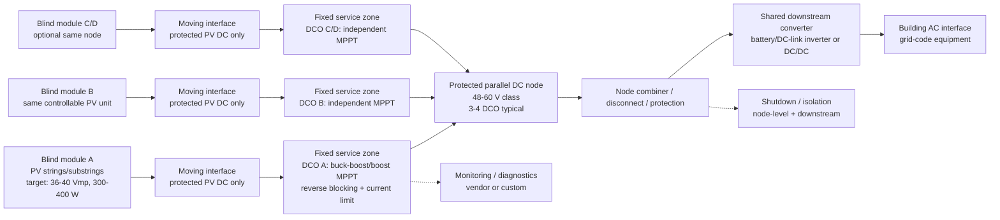

# H2-PDO Competitiveness Review For iWin PV Blinds

Date: 2026-05-28  
Scope: pre-design architecture review. Not procurement readiness, compliance sign-off, safety sign-off, or final architecture selection.  
Architecture reviewed: current H2-PDO branch, inferred because no separate architecture text was pasted.

## Executive Summary

- **Topology identity:** H2 is only coherent if redefined as **H2-PDO: per-blind parallel-output DCO into a protected common DC node**. It is a distributed DC optimization topology with parallel DC collection after independent MPPT, not shared raw LVDC collection.
- **Strongest fit:** technically strongest at **36-40 Vmp**, **300-400 W/blind**, one fixed buck-boost/boost MPPT DCO per blind, and a **48-60 V protected common node** of roughly **3-4 blinds** at 400 W/blind.
- **Biggest blocker:** no decision-grade off-the-shelf blind-scale certified PDO product was found. Current evidence is split between small battery/off-grid MPPT controllers, string-scale commercial DCOs, and reference designs.
- **Voltage/power implication:** H2-PDO wants a different iWin electrical target than H4. H4 tolerates around 45 Vmp; H2-PDO is stronger around **38-40 Vmp**, with `Voc,cold <58 V` and `Isc,max <=14-15 A`.
- **MPPT granularity:** H2-PDO preserves shading mitigation only if each blind module, or each deliberate split section, has its own MPPT before the common node.
- **Moving/fixed boundary:** acceptable only if the moving interface carries protected PV DC and the DCO, fuses/disconnects, bus node, monitoring, and serviceable connectors stay in fixed frame/headbox/facade equipment.

## Conclusions And Opinion

H2-PDO is worth keeping as a **custom-product branch**, not as a near-term commercial component-selection branch. It becomes technically competitive if iWin can standardize around **~40 Vmp / 300-400 W per controllable blind** and accept fixed-frame per-blind buck-boost MPPT electronics. It becomes commercially competitive only if a qualified DCO channel can land near **EUR 45-65 per blind** at volume, including enough protection/monitoring to avoid losing its cost advantage to H4 optimizers or dual-input H3 microinverters.

My current read: **H2-PDO is not competitive with existing decision-grade off-the-shelf devices**, but it could become competitive if iWin owns or partners on the DCO electronics. The decisive question is not "can a 30-40 Vmp module work?" It can. The decisive question is whether a certified, serviceable, low-cost parallel-output DCO can be made or sourced.

## Architecture Mapping

H2-PDO maps to topology archetype 1, distributed DC optimization, with a parallel bus instead of a series string:

```text
PV blind module
-> fixed per-blind DCO with MPPT
-> protected common DC node
-> shared DC/DC, battery inverter, or grid inverter interface
-> building AC
```

It is internally clean only under three rules:

1. One blind module equals one controllable PV unit.
2. Each controllable PV unit has independent MPPT before merge.
3. The merge point is a protected DCO output node, not raw PV parallel wiring.

If multiple differently shaded blinds are merged before MPPT, it falls back into weak shared-LVDC collection and should be treated as rejected for shading mitigation.

## Schematic



## Parameter Table

| Parameter | Value | Evidence status | Confidence | Blocking missing data |
|---|---:|---|---|---|
| Controllable PV unit | 1 whole blind module, or deliberate split section | open assumption | high | final service boundary |
| H2-PDO target `Pmp` | 300-400 W/blind | engineering inference | medium | measured blind power under angle/shade |
| H2-PDO upper `Pmp` | 450 W with custom DCO; 720 W must split | engineering inference | medium | thermal/current margins |
| `Vmp` target | 36-40 V, nominal 40 V | engineering inference from device windows | medium | final cell/string topology |
| `Imp` at 400 W / 40 V | 10.0 A | engineering inference | high | measured MPP current |
| `Voc,STC` at 40 Vmp | 50.0 V using `Voc/Vmp = 1.25` | open assumption | medium | actual `Voc/Vmp` |
| `Voc,cold` at -10 C | 55.2 V for 40 Vmp | engineering inference | medium | vendor betaVoc and cold case |
| `Isc,STC` at 400 W / 40 V | 11.5 A using `Isc/Imp = 1.15` | open assumption | medium | measured Isc |
| `Isc,max` at 400 W / 40 V | 14.1 A using 1200 W/m2 and 75 C current case | engineering inference | low-medium | measured irradiance/temp response |
| DCO MPPT range needed | at least 30-45 V; preferably 15-60 V | engineering inference | medium | selected DCO |
| DCO max input voltage target | >=60 V absolute | engineering inference | medium | selected DCO and `Voc,cold` |
| DCO max input current target | >=15 A preferred | engineering inference | medium | selected DCO |
| DCO power target | 400 W preferred; 450 W useful; 600 W for split flexibility | engineering inference | medium | sourced product or custom design |
| Common DC node | 48-60 V near-term; 120 V custom; 380 V later custom/string-scale | engineering inference | medium | downstream converter strategy |
| DCO/node count at 400 W, 58 V, 32 A | 4 DCO/node | engineering inference | medium | conductor/protection design |
| AC output | downstream shared inverter only, region-specific | standards-backed framing | medium | target grid/code region |

## Fit Checks

Assumptions:

```text
Voc/Vmp = 1.25
betaVoc = -0.30 %/C
Tcell,min = -10 C
Isc/Imp = 1.15
Gmax = 1200 W/m2
alphaIsc = +0.04 %/C
Tcell for current case = 75 C
Isc_max factor = 1.2 x [1 + 0.0004 x (75 - 25)] = 1.224
```

### Current And Cold Voltage

| Case | Vmp | Pmp | Imp = P/V | Voc STC | Voc cold -10 C | Isc STC | Isc max |
|---|---:|---:|---:|---:|---:|---:|---:|
| Commercial low | 36 V | 300 W | 8.33 A | 45.0 V | 49.7 V | 9.58 A | 11.73 A |
| Commercial upper | 40 V | 350 W | 8.75 A | 50.0 V | 55.2 V | 10.06 A | 12.32 A |
| Custom nominal | 40 V | 400 W | 10.00 A | 50.0 V | 55.2 V | 11.50 A | 14.08 A |
| Custom upper | 40 V | 450 W | 11.25 A | 50.0 V | 55.2 V | 12.94 A | 15.84 A |
| Too high current | 36 V | 500 W | 13.89 A | 45.0 V | 49.7 V | 15.97 A | 19.55 A |
| High-power split half | 40 V | 360 W | 9.00 A | 50.0 V | 55.2 V | 10.35 A | 12.67 A |
| High-power unsplit | 40 V | 720 W | 18.00 A | 50.0 V | 55.2 V | 20.70 A | 25.34 A |

Read:

- 300-400 W at 36-40 V fits a 60 V / 15 A custom DCO class.
- 450 W is already edge-case for a 15 A device under max-current assumptions.
- 500 W at 36 V is not a good H2-PDO target because current becomes the dominant constraint.
- 720 W must split into two independent sections if H2-PDO is retained.

### MPPT Window

| Candidate class | Source evidence | H2-PDO read |
|---|---|---|
| Genasun GVB-8-WP | 48 V model: 350 W max panel, 8 A rated input, max recommended Vmp 43 V, recommended Voc STC 50 V, IP68 | Voltage fit for 36-40 Vmp; current/power too low for 400-500 W iWin |
| Lensun boost MPPT | 12 A boost MPPT, supports 24/36/48/60/72 V batteries, max input power listed as 18 V 300 W and 36 V 540 W, USD 79 | Cheap prototype clue; not decision-grade BIPV/certified evidence |
| Elecdan universal buck-boost MPPT | 450 W, input 12-60 V, output 1-60 V, up to 97%, IP67 | Strongest off-grid product-class fit; price/certification/grid path missing |
| Elecdan boost/charger family | 600 W boost input 33-52 V, 600 W lithium charger with 33-52 V input, IP67 | Good voltage fit for 36-40 Vmp; topology and price need closure |
| Infineon REF_4SBB | 400 W, 60 V max, 15 A max, MPPT 15-60 V, >98% max efficiency, >99% MPPT efficiency | Strong custom DCO reference, not a finished product |
| TI TIDA-010949 | 600 W, 15-80 V input, 18 A, buck/buck-boost reference | Strong custom DCO reference, not a finished product |

### Common Node Size

For node current limit `Ilimit` and blind design power `Pblind`:

```text
Nnode <= floor(Ilimit x Vbus / Pblind)
```

At 32 A node current:

| Pblind | 48 V node | 58 V node | 60 V node | 120 V node |
|---:|---:|---:|---:|---:|
| 300 W | 5 | 6 | 6 | 12 |
| 350 W | 4 | 5 | 5 | 10 |
| 400 W | 3 | 4 | 4 | 9 |
| 450 W | 3 | 4 | 4 | 8 |
| 500 W | 3 | 3 | 3 | 7 |
| 720 W | 2 | 2 | 2 | 5 |

Recommended H2-PDO node:

```text
48-60 V protected node
3-4 blinds/node at 400 W/blind
4-5 blinds/node at 350 W/blind
2 blinds/node for 720 W if unsplit, but unsplit is electrically unattractive
```

120 V nodes are electrically cleaner but commercially weaker because no small certified parallel DCO product was found for that bus class.

## Device Fit Table

| Candidate | Topology role | Key limits | Fit result | Required companion hardware | Price evidence | Missing data |
|---|---|---|---|---|---|---|
| Genasun/Sunforge GVB-8-WP | low-voltage boost MPPT to 48 V battery-like bus | 350 W, 8 A, max Vmp 43 V, recommended Voc STC 50 V, IP68 | conditional for <=300-350 W only | battery/DC bus, fusing, node combiner, downstream inverter | manufacturer: USD 170 for Pb-48V-WP; USD 195 for Li-48V-WP | grid/BIPV certification path, parallel node design, higher-power model |
| Genasun/Sunforge GVB-8 non-WP | prototype boost MPPT | same electrical class, IP40 | conditional prototype only | enclosure required | manufacturer: Pb-48V around USD 150 from scraped product page | enclosure, certification, service use |
| Lensun boost MPPT | low-cost boost MPPT prototype clue | 12 A, 24-72 V battery support, 36 V 540 W listed | poor fit for decision-grade; useful bench comparator | fusing, enclosure validation, downstream battery/DC bus | retail: USD 79 sale / USD 129 regular | certification, datasheet depth, reliability, warranty for facade/BIPV |
| Elecdan 450 W universal buck-boost MPPT | off-grid DCO-like controller | 12-60 V input, 1-60 V output, up to 97%, IP67 | conditional technical fit | node protection, output sharing validation, downstream converter | no price found | certifications, price, bus-parallel behavior, monitoring |
| Elecdan 600 W boost / lithium charger | off-grid DCO-like controller | 33-52 V input, up to 98%, IP67, 15 A to 6.8 A charge current depending voltage | conditional if 36-40 Vmp and fixed 48-72 V bus | node protection, battery/DC-link integration | no price found | output sharing, certification, price |
| Infineon REF_4SBB | custom DCO reference | 400 W, 60 V max, 15 A, MPPT 15-60 V | fit as custom design reference | full productization: enclosure, MCU firmware, isolation/protection, certification | no product price | BOM, thermal, EMC, IEC 62109 route |
| TI TIDA-010949 | custom DCO reference | 600 W, 15-80 V input, 18 A | fit as custom design reference | same as above | no product price | same as above |
| Victron SmartSolar MPPT | parallel battery-bus proof | buck behavior; PV must exceed battery by 5 V to start and 1 V thereafter | reject for 36-40 Vmp into 48 V bus | would need lower bus or series PV | standard product pricing not evaluated here | wrong converter direction for 48 V PDO |
| Ampt / Alencon | high-voltage/string-scale PDO evidence | 600-1500 V string-scale, kW class | reject for blind module hardware | utility-scale balance of system | price not found | downscaling not supported |
| Tigo / Deye / SolarEdge / Huawei | H4 series optimizer competitors | series-output string MLPE | reject as H2-PDO devices | their own string/gateway ecosystems | strong price anchors for H4 | not parallel-output DCO |
| APsystems / Hoymiles / NEP / TSUN | H3 competitors | AC output microinverters with 16-60 / 22-55 / 28-45 V MPPT windows | not H2 devices; competitive benchmark | AC branch/gateway/grid profile | EUR 53/input best APsystems anchor; EUR 85-156 lower-cost MI anchors | facade/grid installation |

## Cost Evidence

H2-PDO has no solid commercial cost anchor equal in quality to Tigo/APsystems evidence.

| Cost item | Evidence | Read |
|---|---:|---|
| Tigo TS4-A-O competitor benchmark | EUR 39.36 incl. VAT from ONSA Plus; USD 55.84 from Signature Solar | H2 DCO must beat or justify exceeding this to compete with H4 hardware |
| APsystems EZ1 competitor benchmark | EUR 105.91 incl. VAT for dual-input device, about EUR 52.96/input | H2 DCO must stay near this per blind to compete with low-cost H3 hardware |
| Genasun GVB-8-WP | USD 170-195 depending 48 V chemistry | too expensive per blind and limited to 350 W |
| Lensun boost controller | USD 79 sale / USD 129 regular | low-cost clue, not decision-grade evidence |
| Elecdan 450 W / 600 W MPPT | price not found | commercial competitiveness unresolved |
| Custom DCO | no source price | target should be EUR 35-55 electronics cost and EUR 45-65 total channel cost at volume |

Commercial hypothesis:

```text
H2-PDO competes commercially if:
per-blind DCO channel <= EUR 45-65 at volume,
node combiner/protection/enclosure amortization <= EUR 10-20/blind,
shared downstream converter cost <= EUR 20-40/blind at facade scale,
and service labor is lower than AC microinverter replacement/service.
```

If the DCO channel is closer to Genasun WP pricing, H2-PDO loses to H4 and likely to dual-input H3 unless it gives a large system-level advantage not yet evidenced.

## Safety And Compliance Framing

- **PV array design constraints - standards-backed framing:** IEC 62548-1 remains relevant for DC wiring, protection, switching, and earthing. H2-PDO still has PV source circuits and protected DC nodes.
- **Power-electronics safety - standards-backed framing:** a DCO integrated into or supplied with the PV blind pushes toward module-integrated converter review, including IEC 62109-3 framing; downstream inverter safety remains IEC 62109-1/-2 class.
- **Rapid shutdown / emergency isolation - vendor-data-required:** H2-PDO must define whether shutdown acts per DCO input, per common node, or only downstream. H4 has stronger commercial MLPE evidence here.
- **Anti-islanding / grid-code dependencies - standards-backed framing:** H2-PDO avoids per-blind anti-islanding only if DC/AC conversion is centralized in certified grid equipment.
- **Connector/cable/feedthrough constraints - vendor-data-required:** current at 48-60 V nodes can be high; node current, conductor temperature, connector rating, and disconnect behavior must be designed, not inferred from low voltage.
- **Moving-harness constraints - engineering inference:** the moving interface should carry only protected PV DC from the blind to fixed DCO electronics. Repeated-motion DCO, AC wiring, or node bus wiring in the moving assembly should be rejected unless vendor-specific evidence supports it.
- **BIPV/facade integration - vendor-data-required:** headbox temperature, ingress rating, fire boundary, service access, and replacement procedure decide whether fixed DCO electronics are realistic.
- **Commissioning/service - engineering inference:** H2-PDO needs per-blind DCO telemetry or at least per-channel test points; otherwise a parallel bus makes fault localization harder than H4/H3.

## What-If Oracle

| Branch | Probability | Trigger | Consequence | Required response |
|---|---:|---|---|---|
| Likely case | 45% | iWin wants off-the-shelf electronics and 300-500 W blinds | H2-PDO remains technically plausible but commercially weaker than H4/H3 because qualified blind-scale PDO devices are missing | keep H2 as custom branch; do not rank above H4/H3 |
| Best case | 20% | iWin can set 38-40 Vmp / 300-400 W and source or build a 400 W DCO below EUR 65/channel | H2-PDO becomes a credible competitor: no AC in facade moving interface, independent MPPT, short low-voltage nodes, centralized grid conversion | prototype 3-4 blind node with DCO thermal, fault, and telemetry tests |
| Worst case | 25% | blind power shifts to 500-720 W or DCO channel cost lands above EUR 100 | current, thermal, and cost erase the H2 advantage; high-power blinds need splits and more electronics | reject H2-PDO for baseline; use H4 or H3 split-section paths |
| Contrarian case | 10% | a supplier offers a certified multi-channel 48-60 V PDO service-box at low price | H2-PDO could leapfrog H4/H3 by reducing AC wiring and centralizing service | rerun vendor-specific review and price model immediately |

## Findings / Blockers

1. **No decision-grade commercial PDO device found - verified from source.** Genasun and Lensun prove boost MPPT classes; Elecdan proves off-grid buck/boost MPPT classes; Infineon/TI prove reference designs. None closes BIPV/grid-certified per-blind PDO.
2. **H2-PDO is voltage-sensitive - engineering inference.** It wants 36-40 Vmp, not 45-48 Vmp, if staying in the 60 V DCO input class with cold-voltage margin.
3. **Current dominates above 400 W - engineering inference.** At 450 W/40 V, `Isc,max` is about 15.8 A under the default current assumptions; that is already edge-case for a 15 A DCO.
4. **Commercial off-the-shelf pricing is unfavorable - verified from source.** Genasun WP 48 V devices are USD 170-195 for 350 W input. That is not competitive against Tigo TS4-A-O or APsystems EZ1 per-input hardware anchors.
5. **Cheap boost controllers are not decision-grade - engineering inference.** Lensun at USD 79 is interesting for bench exploration but lacks the evidence depth needed for facade/BIPV architecture ranking.
6. **Shared raw PV collection remains rejected - engineering inference.** H2 is competitive only when every blind has MPPT before merge.
7. **Parallel bus fault behavior is unresolved - vendor-data-required.** Reverse current, branch fault current, shutdown, fusing, and isolation must be defined per node.

## Promising Patterns

- **Fixed per-blind 400 W buck-boost DCO:** closest technical pattern, supported by Infineon REF_4SBB and TI TIDA-010949 reference evidence.
- **48-60 V protected node with 3-4 blinds:** best prototype-scale balance of current, serviceability, and voltage class.
- **38-40 Vmp blind module:** strongest common electrical target if H2-PDO and H3 are both kept alive; still acceptable for many optimizer references, but less ideal than 45 Vmp for H4 string optimizers.
- **Split high-power blinds:** a 720 W blind should become two 300-360 W independent MPPT sections for H2-PDO.
- **Facade service-box DCO package:** H2 becomes more attractive if multiple DCO channels are packaged in one accessible service box while preserving one MPPT per blind.

## Weak Or Rejected Patterns

- **One shared MPPT for several blinds:** reject. It sacrifices shading mitigation.
- **Raw parallel PV blind collection:** reject unless all blinds are electrically and irradiance-homogeneous, which conflicts with the moving shaded blind context.
- **48 Vmp module for 48 V PDO:** reject as a refinement target. It does not solve boost/buck-boost requirements and pushes cold voltage beyond many 60 V devices.
- **Genasun as production H2 device:** weak. It is robust and relevant but too low-power/expensive for the iWin baseline.
- **Marketplace 400-600 W boost boards as architecture evidence:** weak. They can support bench tests, not design ranking.
- **120 V or 380 V PDO as near-term path:** weak without certified blind-scale DCO products and a clear DC safety/shutdown concept.

## Vendor-Data Required

- `Pmp`, `Vmp`, `Imp`, `Voc`, `Isc` for the whole blind and for any split sections.
- `Voc,cold` with real temperature coefficient and minimum design temperature.
- I-V/P-V curves under slat angle, partial self-shading, edge shading, and low irradiance.
- Internal stringing, substring count, bypass topology, and whether split outputs are feasible.
- Moving harness length, bend radius, cycle life, voltage/current/IP rating.
- Connector and feedthrough design, including service disconnect method.
- Headbox/facade thermal profile for DCO placement.
- Target grid/code region and whether a 48 V battery/DC-link is part of the system.
- Rapid-shutdown or emergency isolation strategy for parallel DCO nodes.
- Per-DCO reverse-current blocking and fault-current behavior.
- Monitoring/diagnostics method per blind.
- Service/replacement procedure and warranty-supported configurations.

## H2 Competitiveness Hypothesis

H2-PDO becomes technically and commercially competitive under this bounded hypothesis:

```text
Electrical target:
  blind section Pmp = 300-400 W
  Vmp = 38-40 V
  Voc,cold <= 58 V
  Imp <= 10.5 A
  Isc,max <= 14-15 A

Topology:
  one independent DCO MPPT per blind or split section
  fixed service-zone DCO electronics
  protected PV DC only across moving boundary
  48-60 V common DC node
  3-4 DCO per node at 400 W
  centralized certified DC/AC conversion downstream

Commercial threshold:
  qualified DCO channel <= EUR 45-65/blind at volume
  node protection/enclosure <= EUR 10-20/blind
  downstream converter amortization <= EUR 20-40/blind
```

If any of these fail, H2-PDO should remain behind H4 and H3 in architecture ranking.

## Infographic Prompt

```text
Create a 16:9 technical infographic titled "iWin H2-PDO Parallel DCO Architecture - Competitiveness Conditions".

Top schematic flow:
PV blind module (whole window blind, not slat) -> protected PV DC moving interface -> fixed service-zone DCO with independent MPPT -> protected parallel 48-60 V DC node -> node combiner/disconnect/protection -> shared downstream inverter/DC-link -> building AC.

Show four bottom panels:

Panel A - Target PV Output:
Pmp target 300-400 W/blind; split 720 W into 2 x 360 W; Vmp target 38-40 V; Voc STC about 47.5-50 V; Voc cold target <58 V; Imp target <=10.5 A; Isc max target <=14-15 A.

Panel B - Device Fit:
Genasun GVB-8-WP: 350 W, 8 A, max Vmp 43 V, IP68, USD 170-195, limited.
Lensun boost MPPT: 12 A, 36 V 540 W listed, USD 79, prototype clue only.
Elecdan 450 W buck-boost MPPT: 12-60 V input, 1-60 V output, IP67, price/certification missing.
Infineon REF_4SBB: 400 W, 15-60 V MPPT, 60 V max, 15 A, reference design.
TI TIDA-010949: 600 W, 15-80 V, 18 A, reference design.

Panel C - Voltage/Current Checks:
400 W at 40 V -> Imp 10 A; Isc STC 11.5 A; Isc max 14.1 A.
450 W at 40 V -> Imp 11.25 A; Isc max 15.8 A warning.
40 Vmp -> Voc STC 50 V -> Voc cold -10 C 55.2 V.
Node count at 58 V / 32 A: 4 blinds at 400 W, 5 blinds at 350 W.

Panel D - Architecture Rules:
No slat-level electronics.
No raw parallel PV merge before MPPT.
One independent MPPT per blind or split section.
DCO electronics fixed and serviceable in headbox/facade zone.
Moving interface carries protected PV DC only.
H2 is commercial only if DCO channel is <= EUR 45-65/blind and certified path closes.

Visual constraints:
clean engineering report style, white background, green PV accents, blue DC bus, orange warning markers, no logos, no pseudo-text, no marketing styling, concise labels, show moving/fixed boundary clearly.
```

## Sources

Local:

- `Daily/2026-05-28_iwin_pdo_parallel_dco/parallel_dco_pdo_evaluation.md`
- `Daily/2026-05-21_iwin_pv_blinds_firecrawl_topology_synthesis/optimizer_deep_dive.md`
- `Daily/2026-05-21_iwin_pv_blinds_firecrawl_topology_synthesis/microinverter_deep_dive.md`
- `Daily/2026-05-26_iwin_topology_decision_matrix/decision_matrix.md`
- `Daily/2026-05-26_iwin_price_evidence/price_evidence_report.md`
- `Daily/2026-05-28_iwin_h3_microinverter_topology/h3_microinverter_topology.md`
- `Daily/2026-05-28_iwin_h4_optimizer_topology/h4_optimizer_topology.md`

Firecrawl refresh:

- [Sunforge GVB-8-WP](https://sunforgellc.com/product/gvb-8-wp/)
- [Lensun boost MPPT controller](https://lensunsolar.com/products/lensun-buck-boost-solar-controller)
- [Elecdan MPPT solar regulators](https://elecdan-converter.com/product-category/mppt-solar-regulators/)
- [Infineon REF_4SBB optimizer user guide](https://www.infineon.com/assets/row/public/documents/24/44/infineon-ref-4sbb-optimizer-user-guide-usermanual-en.pdf)
- [TI TIDA-010949](https://www.ti.com/lit/pdf/tiduf99)
- [Victron synchronized charging](https://www.victronenergy.com/media/pg/VE.Smart_Networking/en/synchronised-charging---further-details.html)
- [Victron MPPT 150/35 specs](https://www.victronenergy.com/media/pg/Manual_BlueSolar_150-35__150-45/en/technical-specifications.html)
- [Ampt string optimizers](https://www.ampt.com/products/string-optimizers/)
- [Alencon SPOT](https://alenconsystems.com/dc-dc-optimizers/)
