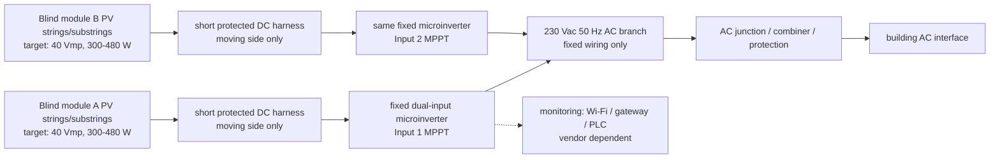

# H3 microinverter topology for iWin PV blinds

Date: 2026-05-28  
Status: plausible H3 composition from existing Firecrawl evidence, not architecture sign-off.

## Executive Summary

For H3, set the iWin blind-module DC output around **40 Vmp at STC**, not 45 Vmp. The reason is simple: the strongest small microinverter candidates found in the evidence pack mostly have **60 Vdc absolute input limits**, and 45 Vmp with a normal `Voc/Vmp ~= 1.25` ratio can push cold `Voc` above 60 V.

The best H3 composition is **one fixed dual-input microinverter per two blind modules**, with **one independent MPPT input per blind module**. The microinverter sits in a fixed headbox/facade service zone. The moving blind side carries only low-voltage DC PV leads, not AC branch wiring.

Recommended H3 electrical target:

| Parameter | H3 target |
| --- | ---: |
| Blind-module `Pmp,STC` design center | **400 W** |
| Practical product band | **300-480 W/blind** |
| Upper one-input band | **500 W only with current/headroom check** |
| High-power 600-720 W blind | **split into 2 independent PV sections** |
| `Vmp,STC` | **40 V nominal** |
| Acceptable `Vmp,STC` band | **38-42 V** |
| `Voc,STC` target | **~50 V** |
| `Voc,cold` design target | **<58 V** |
| Absolute DC input ceiling for common MI class | **<60 V** |
| `Imp,STC` design target | **10-12 A** |
| `Isc,STC` design target | **<=14 A** |
| AC output target for CH/EU | **230 Vac, 50 Hz, certified grid profile** |

## Conclusion And Opinion

My H3 design choice would be:

```text
2 blind modules
-> 2 short DC moving-boundary harnesses
-> 1 fixed dual-input microinverter with 2 independent MPPTs
-> 230 Vac branch wiring in fixed facade/service zone
-> AC junction/combiner/distribution
-> building AC interface
```

The leading device pattern is **APsystems EZ1/DS3 class** for two independent inputs. **Hoymiles 1T** is useful for one MI per blind. **Hoymiles 2T/4T and TSUN 6-in-1** are zone-packaging candidates only if independent MPPT per input is confirmed. **Enphase IQ8** remains a strong certification/manual benchmark, but it is less attractive for a Switzerland/EMEA H3 design because the scraped evidence was North America oriented and current limits are tighter.

## H3 Architecture



## Infographic-Ready Panel Breakdown

### Panel A - Topology

```text
1 blind module = whole PV blind in one window/opening
PV blind internal strings/substrings
-> short fixed-frame/headbox DC harness
-> microinverter mounted in fixed serviceable headbox/facade zone
-> one independent MPPT input per blind module
-> 230 Vac fixed AC branch
-> AC junction / combiner
-> building AC interface
```

Callouts:

```text
No slat-level electronics
No AC across the moving blind interface
Do not combine two differently shaded blinds into one MPPT input
AC output voltage is selected by certified microinverter/grid profile, not set by the PV blind
```

### Panel B - Target iWin H3 PV Module Output

| Value | Target |
| --- | ---: |
| Nominal design point | **400 W at 40 Vmp** |
| Product band | **300-480 W/blind** |
| One-input upper edge | **500 W with selected MI current check** |
| 600-720 W case | **split into 2 x 300-360 W sections** |
| `Vmp,STC` | **40 V nominal** |
| `Voc,STC` | **~50 V** |
| `Voc,cold` | **<58 V design target** |
| `Imp,STC` | **10-12 A target** |
| `Isc,STC` | **<=14 A target** |

### Panel C - Candidate Microinverter Fit

| Candidate | Evidence-fit role | Input window from evidence | H3 implication |
| --- | --- | --- | --- |
| APsystems EZ1-M/H | preferred dual-input pattern | MPPT 28-45 V, operating 26-60 V, max DC 60 V, 20 A x2 | Best fit for 2 blinds per MI if each input gets one blind. |
| APsystems DS3 | hardwired dual-input benchmark | MPPT 28-45 V, operating 26-60 V, max DC 60 V, 18/20 A x2 | Similar electrical fit; AC bus/service design needed. |
| Hoymiles HMS-500-1T | one MI per blind | operating source evidence 16-60 V, start 22 V, 300-500 VA class | Useful for 300-480 W blinds, with AC clipping check. |
| NEP BDM-300 | small-power benchmark | MPPT 22-55 V, max DC 60 V, max input 14 A | Fits lower-power 180-300 W blinds better than 400-500 W blinds. |
| TSUN GEN3 6-in-1 | zone service-box pattern | startup 22 V, MPPT 16-60 V, max DC 60 V, 18 A, 6 MPPTs | Useful if 6 blinds each get one independent MPPT input. |
| Enphase IQ8/IQ8+ | certification/manual benchmark | IQ8+ MPPT 27-45 V, max DC 60 V, 12 A | Good benchmark; less clean for high-current 480-500 W H3 and EMEA. |

### Panel D - Voltage And Current Checks

Assumptions: `Vmp,STC = 40 V`, `Voc/Vmp = 1.25`, `Voc,STC = 50 V`, `betaVoc = -0.30 %/C`, `Isc/Imp = 1.15`.

| Case | `Pmp` | `Imp = P/Vmp` | `Isc ~= 1.15 x Imp` | H3 read |
| --- | ---: | ---: | ---: | --- |
| smallest/min density | 180 W | 4.50 A | 5.17 A | electrically easy, poor MI cost/W |
| largest/min density | 270 W | 6.75 A | 7.76 A | possible with lower-power MI |
| smallest/mid density | 330 W | 8.25 A | 9.49 A | good H3 lower bound |
| midpoint | 412.5 W | 10.31 A | 11.86 A | good H3 design center |
| smallest/max density | 480 W | 12.00 A | 13.80 A | good upper target, device-specific current check |
| largest/mid density | 495 W | 12.38 A | 14.23 A | upper edge; APsystems/Hoymiles preferred over NEP/Enphase |
| high case | 600 W | 15.00 A | 17.25 A | split or use higher-current channel |
| largest/max density | 720 W | 18.00 A | 20.70 A | split into two independent sections |

Cold-voltage check:

| Temperature | `Voc,cold` |
| ---: | ---: |
| -10 C | 55.2 V |
| -20 C | 56.8 V |
| -30 C | 58.2 V |

This is why **40 Vmp** is a better H3 target than **45 Vmp**. With 45 Vmp and the same `Voc/Vmp` assumption, `Voc,STC ~= 56.25 V`, and cold `Voc` can exceed the 60 V class of the shortlisted microinverters.

### Panel E - AC Output And Branch Values

For Switzerland/EMEA predesign:

| Parameter | H3 value |
| --- | ---: |
| AC output class | **230 Vac, 50 Hz** |
| Device selection | **certified EMEA/CH-compatible grid profile required** |
| One 800 VA dual-input MI AC current | `800 VA / 230 V ~= 3.48 A` |
| 2 x 400 W blinds on one MI | **~800 Wdc STC into ~800 VA AC class** |
| 50 blinds at 400 W | **20 kWdc STC** |
| 50 blinds with 2 blinds per MI | **25 dual-input microinverters** |

Do not design this as one single-phase string of many balcony inverters. A facade/floor design must allocate AC branches, protection, phase balance, gateway coverage, service isolation, and local grid-code constraints.

## Quick What-If Oracle

**IF:** H3 is selected and iWin sets the blind-module output near 40 Vmp and 300-480 W.

| Branch | Probability | Result | Trigger | Response |
| --- | ---: | --- | --- | --- |
| Alpha likely | 50% | 330-480 W blinds fit APsystems/Hoymiles-style MI inputs. H3 remains plausible. | measured `Vmp` stays 28-45 V under normal temperature and shade | prototype with dual-input MI, one blind per MPPT input |
| Omega best | 20% | 400 W / 40 V blind standardizes cleanly across dual-input MIs, with good AC-channel utilization. | `Voc,cold <58 V`, `Imp <=12 A`, and no severe internal mismatch | carry H3 as a serious backup to optimizer topology |
| Delta worst | 20% | real blinds are 180-270 W or `Vmp` falls below 28 V under hot/low-irradiance operation, causing poor start/runtime and bad cost/W | low-light MPPT dropout, repeated clipping/underutilization | move to optimizer/custom DC/DC or split product variants |
| Phi contrarian | 10% | high-density 600-720 W blinds dominate the product plan, making one MI input per blind wrong | `Imp >15 A` or `Isc >17 A` at 40 V | split one blind into two independent PV outputs, each with its own MPPT input |

## Architecture Rules

1. Treat one blind module as the controllable PV unit.
2. Use one independent MPPT input per blind module or per deliberate split section.
3. Keep the microinverter fixed and serviceable, not on moving slats or moving louver hardware.
4. Let the moving interface carry low-voltage DC PV only.
5. Select AC output voltage by region and certification. For CH/EU, the target is 230 Vac, 50 Hz, not an arbitrary programmable output.
6. Reject any H3 variant that merges multiple differently shaded blinds before MPPT.

## Source Anchors

| Source | Use |
| --- | --- |
| `Daily/2026-05-21_iwin_pv_blinds_firecrawl_topology_synthesis/microinverter_deep_dive.md` | Main device-input and installation evidence extraction. |
| `Daily/2026-05-26_iwin_price_evidence/price_evidence_report.md` | H3 pricing anchors and gateway/accessory cost context. |
| `Daily/2026-05-26_iwin_price_evidence/normalized_cost_table.csv` | Per-input normalized EUR estimates. |
| [APsystems EZ1 EMEA datasheet](https://global.apsystems.com/wp-content/uploads/2025/04/4306626202_APsystems-Microinverter-EZ1-M-EZ1-H-For-EMEA-Datasheet_-Rev1.1_2024-12-09-BC01.pdf) | Dual-input 230 Vac microinverter evidence. |
| [APsystems EZ1 manual](https://global.apsystems.com/wp-content/uploads/2025/04/4306626102_APsystems-Microinverter-EZ1-M-EZ1-H-for-EMEA-User-manual_-Rev1.1_2024-12-09-BC01.pdf) | Installation/use-scope evidence. |
| [Hoymiles HMS-300..500-1T](https://www.hoymiles.com/products/hms-300-350-400-450-500-1t.html) | Low-power single-input MI evidence. |
| [NEP BDM-300 datasheet](https://northernep.com/wp-content/uploads/2023/10/BDM-300-Datasheet-102623.pdf) | Smaller microinverter benchmark. |
| [TSUN GEN3 6-in-1 datasheet](https://www.tsun-ess.com/files/datasheetgen3-microinverter-6-in-1-0701.pdf) | Multi-input zone packaging pattern. |
| [Enphase IQ8 datasheet](https://enphase.com/download/iq8-and-iq8-microinverters-data-sheet) | Mature certification/manual benchmark. |

## Vendor-Data Required Before Ranking H3

Required iWin data:

```text
Pmp, Vmp, Imp, Voc, Isc at STC
Voc,cold with actual cell/string temperature coefficient
Vmp under hot facade/headbox temperature
I-V/P-V curves under slat-angle and partial-shade cases
internal substring/bypass topology
moving DC harness length, bend radius, cycle life, voltage/current/IP rating
fixed headbox thermal profile and service access
target market grid code and plug-in vs hardwired decision
replacement boundary and recommissioning procedure
```
