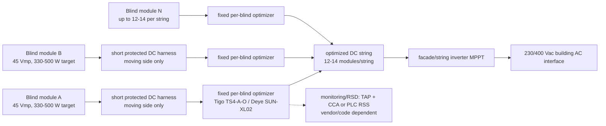

# H4 optimizer topology for iWin PV blinds

Date: 2026-05-28  
Status: plausible H4 composition from refreshed Firecrawl evidence, not architecture sign-off.  
Firecrawl cache: `.firecrawl/2026-05-28-h4-model/`

## Executive Summary

The optimal H4 model is **one DC optimizer per whole blind module**, mounted in a fixed serviceable headbox/facade zone, with optimizer outputs connected in series into a DC string feeding a facade/string inverter.

Recommended H4 electrical target:

| Parameter | H4 target |
| --- | ---: |
| Blind-module `Pmp,STC` design center | **400-500 W** |
| Practical product band | **330-500 W/blind** |
| One-optimizer upper design band | **550-600 W** |
| High-power 720 W blind | **split into 2 independent PV sections** |
| `Vmp,STC` | **45 V nominal** |
| Acceptable `Vmp,STC` band | **42-48 V** |
| `Voc,STC` target | **55-60 V** |
| `Voc,cold` design target | **<68 V/module** |
| Absolute optimizer input ceiling | **<80 V/module** |
| `Imp,STC` normal target | **9-12 A** |
| `Isc,STC` normal target | **<=14 A** |
| One-optimizer current edge | **600 W -> 13.3 A Imp at 45 V** |
| DC string target, 1000 V class | **12-14 blind modules/string** |
| String `Vmp` target | **540-630 Vdc at 12-14 modules** |
| AC output target for CH/EU inverter | **230/400 Vac, 50 Hz certified grid interface** |

## Conclusion And Opinion

Use this as the H4 reference architecture:

```text
Blind module PV strings/substrings
-> short protected DC moving-boundary harness
-> fixed per-blind DC optimizer in headbox/facade service zone
-> optimized outputs connected in series
-> 12-14 blind-module DC string
-> facade/string inverter MPPT
-> 230/400 Vac building AC interface
```

The leading commercial anchor is **Tigo TS4-A-O** because the refreshed evidence gives a current 725 W datasheet, `12-80 V` input `Vmp`, `16 A Imp / 22 A Isc`, `IP68`, `-40 to 70 C`, `MC4/EVO2`, rapid-shutdown and TAP/CCA monitoring evidence, and live EUR price evidence. **Deye SUN-XL02-A/B** is the compact lower-cost alternate, but it should be treated as secondary until manual, concentrator, inverter compatibility, and certification details are closed.

## H4a Architecture



## Infographic-Ready Panel Breakdown

### Panel A - Topology

```text
1 blind module = whole PV blind in one window/opening
PV blind internal strings/substrings
-> short fixed-frame/headbox DC harness
-> optimizer mounted in fixed serviceable headbox/facade zone
-> one optimizer / one MPPT per blind module
-> optimizer outputs connected in series
-> 12-14 blind-module DC string
-> facade/string inverter MPPT
-> 230/400 Vac building AC interface
```

Callouts:

```text
No slat-level electronics
No optimizer on moving slats
Moving side carries PV DC only
Optimizer output voltage is not set manually
String voltage emerges from series optimizers and inverter MPPT
Do not merge differently shaded blinds before independent optimization
```

### Panel B - Target iWin H4 PV Module Output

| Value | Target |
| --- | ---: |
| Nominal design point | **400-500 W at 45 Vmp** |
| Product band | **330-500 W/blind** |
| One-optimizer upper design | **550-600 W** |
| 720 W case | **split into 2 x 360 W sections** |
| `Vmp,STC` | **45 V nominal** |
| Acceptable `Vmp` | **42-48 V** |
| `Voc,STC` | **55-60 V** |
| `Voc,cold` | **<68 V design target** |
| Absolute input ceiling | **<80 V** |
| `Imp,STC` | **9-12 A normal target** |
| `Isc,STC` | **<=14 A normal target** |

### Panel C - Candidate Optimizer Fit

| Candidate | Evidence-fit role | Input window from refreshed evidence | H4 implication |
| --- | --- | --- | --- |
| Tigo TS4-A-O 725 W | primary generic H4 anchor | `12-80 Vmp`, `16 A Imp / 22 A Isc`, 725 W, IP68 | Best fit for one optimizer per blind module. |
| Deye SUN-XL02-A | compact alternate | `12-80 V`, 700 W, 15 A input, 17 A output, IP68 | Good alternate if ecosystem/manual closes. |
| Deye SUN-XL02-B | monitoring/RSD alternate | `12-80 V`, 700 W, 15 A input, IP68 | Promising if concentrator/RSD path closes. |
| SolarEdge / Huawei | ecosystem benchmarks | mature optimizer/string products | Use only if proprietary string/inverter rules are accepted. |

### Panel D - Voltage And Current Checks

Assumptions: `Vmp,STC = 45 V`, `Voc/Vmp = 1.25`, `Voc,STC = 56.25 V`, `betaVoc = -0.30 %/C`, `Isc/Imp = 1.15`.

| Case | `Pmp` | `Imp = P/Vmp` | `Isc ~= 1.15 x Imp` | H4 read |
| --- | ---: | ---: | ---: | --- |
| smallest/min density | 180 W | 4.00 A | 4.60 A | electrically easy, cost/W weak |
| largest/min density | 270 W | 6.00 A | 6.90 A | electrically easy |
| smallest/mid density | 330 W | 7.33 A | 8.43 A | good lower H4 band |
| midpoint | 412.5 W | 9.17 A | 10.54 A | good design center |
| smallest/max density | 480 W | 10.67 A | 12.27 A | good target |
| largest/mid density | 495 W | 11.00 A | 12.65 A | good upper normal |
| upper design | 600 W | 13.33 A | 15.33 A | acceptable only with margin check |
| largest/max density | 720 W | 16.00 A | 18.40 A | split; no margin on TS4 `Imp` |

Cold-voltage check for the 45 Vmp nominal model:

| Temperature | `Voc,cold` |
| ---: | ---: |
| -10 C | 62.2 V |
| -20 C | 63.8 V |
| -30 C | 65.5 V |

Conservative upper-voltage string sizing should also test `Voc,cold = 68 V/module` to cover a `Voc,STC` target near 60 V:

| String count | `Vmp,string` at 45 V/module | `Voc,cold,string` at 68 V/module | 1000 V-class read |
| ---: | ---: | ---: | --- |
| 10 blinds | 450 V | 680 V | easy |
| 12 blinds | 540 V | 816 V | good |
| 14 blinds | 630 V | 952 V | upper normal |
| 15 blinds | 675 V | 1020 V | avoid in 1000 V class |

### Panel E - Cost And Accessory Anchors

Price evidence refreshed/accessed on 2026-05-28:

| Item | Visible price | Use in H4 |
| --- | ---: | --- |
| Tigo TS4-A-O, ONSA Plus | **EUR 32 excl. VAT / EUR 39.36 incl. VAT** | one per blind module |
| Tigo CCA Kit, ONSA Plus | **EUR 145.73 excl. VAT / EUR 179.25 incl. VAT** | shared monitoring/RSD hardware if required |
| Tigo TAP, ONSA Plus | **EUR 35.78 excl. VAT / EUR 44.01 incl. VAT** | wireless TS4 access point; count depends facade geometry |
| Deye SUN-XL02-B, 7Sun | **EUR 42.15 visible** | alternate one per blind, pricing/source needs manual verification |

Example 50-blind hardware anchor:

```text
50 x Tigo TS4-A-O at EUR 39.36 incl. VAT = EUR 1,968
1 x CCA Kit + 1 x TAP = EUR 223.26 incl. VAT
Shared Tigo accessory amortization over 50 blinds ~= EUR 4.47/blind
Optimizer + minimal shared Tigo accessories ~= EUR 43.83/blind
```

This excludes inverter, DC cabling, protection, enclosures, labor, certification, and service access.

## Quick What-If Oracle

**IF:** H4 is selected and iWin sets each blind module near `45 Vmp`, `330-500 W`, with `Voc,cold <68 V`.

| Branch | Probability | Result | Trigger | Required response |
| --- | ---: | --- | --- | --- |
| Alpha likely | 50% | 330-500 W blinds fit TS4/Deye-class optimizers with good current and voltage margin. | measured `Vmp` stays 42-48 V and `Voc,cold <68 V` | prototype one-blind/one-optimizer and 12-14 unit string behavior |
| Omega best | 20% | 400-500 W blind standardizes cleanly; 12-14 blinds/string gives 540-630 Vmp and stays below 1000 V cold. | `Imp <=11 A`, `Isc <=13 A`, repeatable shade curves | carry H4 as primary architecture candidate |
| Delta worst | 20% | high-density 720 W blinds become baseline; one optimizer per blind has no margin or violates alternate optimizer current limits. | `Imp >=16 A` or `Isc >=18 A` at 45 V | split each high-power blind into two independent optimizer-fed sections |
| Phi contrarian | 10% | moving-harness/feedthrough or headbox thermal constraints dominate, not MPPT fit. | bend-cycle, IP, or headbox temperature tests fail | redesign mechanical service boundary before topology ranking |

## Architecture Rules

1. Treat one blind module as the controllable PV unit.
2. Use one optimizer per blind module or per deliberate high-power split section.
3. Keep the optimizer fixed and serviceable in the frame/headbox/facade zone.
4. Let the moving interface carry only protected PV DC leads.
5. Connect optimized outputs in series only after independent optimization.
6. Use 12-14 blinds per 1000 V-class string until actual `Voc,cold` is closed.
7. Do not set optimizer output voltage. H4 sets the **PV input envelope** and string design; the inverter MPPT determines operating point.

## Firecrawl Source Anchors

| Source | Use |
| --- | --- |
| [Tigo TS4-A-O product page](https://www.tigoenergy.com/product/ts4-a-o) | Current product claims, 725 W suitability, downloadable document links. |
| [Tigo TS4-A-O 725 W datasheet](https://cdn.prod.website-files.com/5fad551d7419c7a0e9e4aba4/68827724d772a21c23ceb55e_002-00216-00%201.1%20Datasheet%20TS4-A-O%20(725W)%2020250709%20-%20EN.pdf) | Electrical envelope, rapid-shutdown, comms, connectors, dimensions, standards. |
| [Tigo TS4-A with TAP and CCA manual](https://cdn.prod.website-files.com/5fad551d7419c7a0e9e4aba4/698b65573e1e53f5d116c80f_002-00129-00%202.3%20IO%26M%20TS4A%20with%20TAP%20and%20CCA%2020251001%20-%20EN.pdf) | Installation sequence, stringing, TAP/CCA limits, RSD behavior. |
| [Deye SUN-XL02-A datasheet](https://www.deyeinverter.com/deyeinverter/2023/12/21/datasheet_sun-xl02-a_231221_en.pdf) | Compact alternate optimizer electrical envelope. |
| [Deye SUN-XL02-B product page](https://www.deyeinverter.com/product/accessory-monitoring-1/SUNXL02A-2538.html) | B variant product evidence and manual link. |
| [ONSA Plus Tigo TS4-A-O](https://www.onsaplus.eu/tigo-ts4-a-o/) | Tigo visible EUR price and accessory price anchors. |
| [7Sun Deye SUN-XL02-B](https://7sun.eu/produkt/optymalizator-deye-sun-xl02-b-2/) | Deye visible EUR price and linked documents. |

## Vendor-Data Required Before Ranking H4

Required iWin data:

```text
Pmp, Vmp, Imp, Voc, Isc at STC
actual Voc temperature coefficient
Voc,cold for Lugano/facade installation conditions
Vmp under hot headbox/facade temperature
I-V/P-V curves under slat-angle and partial-shade cases
internal substring/bypass topology
moving DC harness length, bend radius, cycle life, voltage/current/IP rating
fixed headbox thermal profile and service access
allowed connector/cable family and feedthrough design
target inverter class and local grid/code region
rapid-shutdown or equivalent emergency isolation strategy
replacement boundary and recommissioning procedure
```
