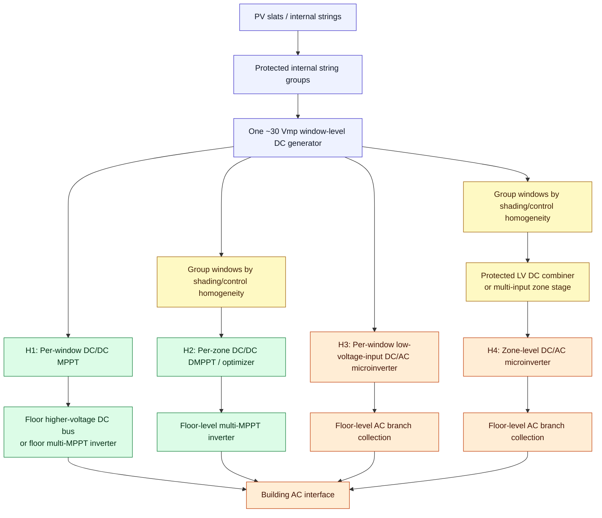
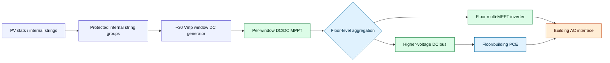
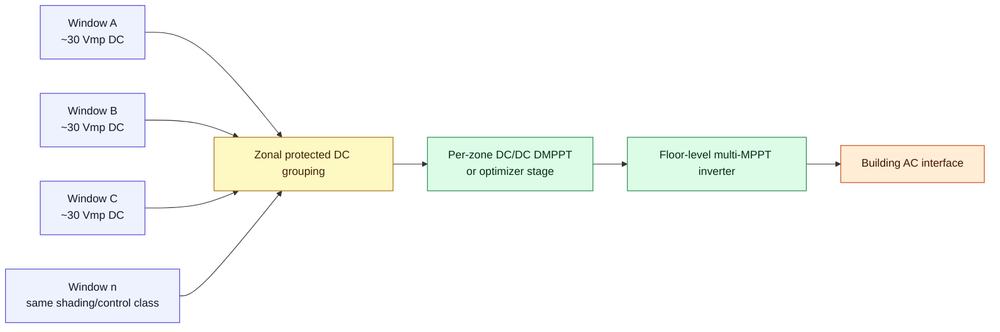
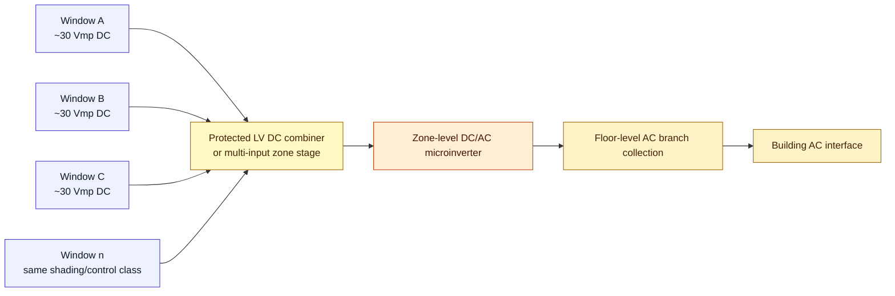

# iWin BIPV Active Architecture Hypotheses — H1/H2/H3/H4

**Project:** iWin-type glazing-integrated BIPV PV venetian blind subsystem  
**Scope:** pre-design architecture hypotheses for Lugano office façade research  
**Version:** v2 corrected architecture memory  
**Date:** 2026-05-28  
**Status:** project-defined active hypotheses; not final design freeze

---

## 0. Correction note — replaces drifted architecture memory

This file replaces the previously drifted H1–H4 interpretation.

**Authoritative project definitions for this revision:**

| Hypothesis | Correct active definition |
|---|---|
| **H1** | Per-window **DC/DC MPPT** + floor-level aggregation |
| **H2** | Per-zone **DC/DC MPPT** + floor-level multi-MPPT inverter |
| **H3** | Per-window **DC/AC microinverter** |
| **H4** | Per-zone **DC/AC microinverter** for multiple windows |

### Explicit corrections

- **H1 is not direct stringing.** It includes one per-window DC/DC MPPT stage.
- **H2 is the zonal DC/DC DMPPT / optimizer hypothesis.** It groups windows by shading/control homogeneity before DC/DC conversion.
- **H3 is per-window low-voltage-input DC/AC conversion.** It collects AC at floor level.
- **H4 is not the generic hierarchical DC/DC architecture.** In this corrected definition, H4 is **per-zone DC/AC microinverter for multiple windows**.

---

## 1. iWin project electrical envelope used by all hypotheses

### Project geometry and power basis

| Parameter | Current project value | Status |
|---|---:|---|
| Target window / blind min size | `1.5 m × 2.0 m = 3.0 m²` | Project-defined |
| Target window / blind max size | `1.5 m × 3.0 m = 4.5 m²` | Project-defined |
| SD-BIPV power density | `60–160 W/m²` | Project-defined working range |
| Conservative absolute minimum per window | `160 W` | Project-defined floor |
| Geometric minimum at 60 W/m² and 3.0 m² | `180 W` | Derived indicator |
| Absolute maximum per window | `720 W` | Derived from `4.5 m² × 160 W/m²` |
| Mid power, min-size window | `330 W` | Derived from `3.0 m² × 110 W/m²` |
| Mid power, max-size window | `495 W` | Derived from `4.5 m² × 110 W/m²` |
| Absolute mid / representative midpoint | `412.5 W` | Project-defined derived midpoint |
| Window-level PV generator target | `Vmp ≈ 30 V` | Project-defined PV-side operating target |

### Critical interpretation

`30 Vmp` belongs to the **PV-side window generator / MPPT input domain**.

It does **not** automatically define:

- DC/DC optimizer output voltage;
- floor DC bus voltage;
- inverter DC-link voltage;
- AC branch voltage;
- string voltage;
- protection class;
- service voltage boundary.

Those are architecture-dependent and must be selected from:

- converter ratio;
- current level and cable losses;
- MPPT / PCE input window;
- isolation and shutdown concept;
- connector / feedthrough rating;
- thermal placement;
- replacement boundary;
- standards and commissioning constraints.

---

## 2. Shared internal iWin source model

All four hypotheses start from the same unresolved internal source model:

```text
PV slats / internal strings
→ protected internal string groups
→ one nominal 30 Vmp window-level DC generator
```

The internal slat/string/bypass map remains **vendor-data required**.

Minimum data needed before final architecture scoring:

| Required item | Why it matters |
|---|---|
| `Voc`, `Vmp`, `Isc`, `Imp` per window | PCE input/output compatibility |
| `βVoc`, `αIsc` | cold-voltage and current envelope |
| slat/string/sub-string map | mismatch behavior and bypass design |
| bypass allocation | hotspot and shading tolerance |
| IV/PV curves under slat-angle/shading cases | DMPPT benefit and topology ranking |
| allowed aggregation rules | H1/H2/H3/H4 feasibility |
| feedthrough and connector design | serviceability, safety, reliability |
| thermal operating envelope | electronics placement and derating |
| replacement boundary | O&M and commissioning strategy |

---

## 3. Master hypothesis map



---

## 4. H1 — per-window DC/DC MPPT + floor-level aggregation

### Definition

```text
PV slats/internal strings
→ protected internal string groups
→ one 30 Vmp window-level DC generator
→ per-window DC/DC MPPT
→ floor-level higher-voltage DC bus or multi-MPPT inverter
→ building AC interface
```

### Use when

Use H1 when:

- window-to-window shading/control variation is high;
- window-level MPPT adds meaningful yield recovery;
- window-level diagnostics are valuable;
- one faulty window should be electrically localizable;
- a serviceable per-window electronics boundary can be designed.

### Watch

- one DC/DC converter per window;
- electronics placement and thermal path;
- replacement boundary;
- converter output-voltage choice;
- feedthrough current and voltage rating;
- DC bus protection / isolation / shutdown;
- whether window-level electronics are accessible without full IGU replacement.

### Mermaid schematic



### Detailed D2 representation

```d2
vars: {
  d2-config: {
    layout-engine: elk
  }
}

h1: "H1 — per-window DC/DC MPPT + floor aggregation" {
  window: "Single iWin window" {
    pv: "PV slats / internal strings"
    prot: "Protected internal string groups\n(bypass / fusing / isolation TBD)"
    gen: "Window-level DC generator\nVmp ≈ 30 V\nP ≈ 160–720 W"

    pv -> prot: "internal wiring"
    prot -> gen: "window DC output"
  }

  mppt: "Per-window DC/DC MPPT" {
    input: "PV-side input\ntracks ~30 V MPP"
    converter: "DC/DC stage\nboost / buck-boost / isolated TBD"
    output: "User-defined output\nnot necessarily 30 V"

    input -> converter
    converter -> output
  }

  floor: "Floor-level aggregation" {
    bus: "Higher-voltage DC bus\nor DC input rail"
    inv: "Floor-level PCE\nDC/DC stage or multi-MPPT inverter"
    ac: "Building AC interface"

    bus -> inv
    inv -> ac
  }

  window.gen -> mppt.input
  mppt.output -> floor.bus
}

risks: "H1 watch items" {
  thermal: "One converter per window: thermal placement / derating"
  service: "Replacement boundary must be window-level or electronics-accessible"
  dc_prot: "DC bus protection, isolation, shutdown, reverse-current behavior"
  feedthrough: "Frame feedthrough rating and strain relief"
}
```

### Engineering interpretation

H1 gives the cleanest **window-level DC diagnostics** and maps well to strong window-to-window heterogeneity. It increases converter count, but it does not force AC conversion at the window. It is a strong hypothesis if electronics can be placed in a serviceable, thermally acceptable frame/cassette zone.

---

## 5. H2 — per-zone DC/DC MPPT + floor-level multi-MPPT inverter

### Definition

```text
windows grouped by shading/control homogeneity
→ zonal protected DC grouping
→ zonal DC/DC DMPPT or optimizer stage
→ floor-level multi-MPPT inverter
→ building AC interface
```

### Use when

Use H2 when:

- repeated façade zones behave similarly;
- window-level electronics count should be reduced;
- zoning can be defined from orientation, floor, shading class, control schedule, occupancy, or service boundary;
- floor-level multi-MPPT inverter inputs can match the zone voltage/current envelope.

### Watch

- zone definitions;
- loss of window-level granularity;
- one zone issue affecting multiple windows;
- mismatch inside the zone;
- protection of paralleled or series-combined LV window outputs;
- zone-level fault localization;
- DC combiner accessibility.

### Mermaid schematic



### Detailed D2 representation

```d2
vars: {
  d2-config: {
    layout-engine: elk
  }
}

h2: "H2 — per-zone DC/DC MPPT + floor multi-MPPT inverter" {
  zone_basis: "Zone basis" {
    z1: "Same orientation"
    z2: "Similar shading class"
    z3: "Same slat-control schedule"
    z4: "Same service / replacement boundary"
  }

  windows: "Grouped windows" {
    w1: "Window 1\n~30 Vmp DC\n160–720 W"
    w2: "Window 2\n~30 Vmp DC\n160–720 W"
    w3: "Window 3\n~30 Vmp DC\n160–720 W"
    wn: "Window n\nmatched behavior expected"
  }

  combiner: "Zonal protected DC grouping" {
    protection: "fuses / blocking / disconnects TBD"
    map: "zone ID + window ID map"
    access: "service-accessible combiner preferred"
  }

  converter: "Zonal DC/DC DMPPT or optimizer" {
    mppt: "Zone-level MPPT"
    ratio: "converter ratio selected from bus / inverter input"
    telemetry: "zone V/I/T/status telemetry"
  }

  floor_inv: "Floor-level multi-MPPT inverter" {
    mppt_inputs: "multiple independent MPPT inputs"
    ac: "building AC interface"
  }

  zone_basis -> windows: "defines grouping"
  windows.w1 -> combiner
  windows.w2 -> combiner
  windows.w3 -> combiner
  windows.wn -> combiner
  combiner -> converter.mppt
  converter -> floor_inv.mppt_inputs
  floor_inv.mppt_inputs -> floor_inv.ac
}

risks: "H2 watch items" {
  granularity: "Coarser than H1: window fault may appear as zone fault"
  mismatch: "Incorrect zoning recreates mismatch losses"
  protection: "LV DC combiner protection must be explicit"
  commissioning: "Zone map must match physical façade and BMS control zones"
}
```

### Engineering interpretation

H2 trades granularity for lower electronics count. It is attractive when windows form repeatable electrical/control classes. It is risky if zoning is based only on geometry while actual glare-control and slat-position histories diverge.

---

## 6. H3 — per-window DC/AC microinverter

### Definition

```text
PV slats/internal strings
→ one 30 Vmp window-level DC generator
→ per-window low-voltage-input DC/AC microinverter
→ floor-level AC branch collection
→ building AC interface
```

### Use when

Use H3 when:

- per-window independence dominates;
- AC-side modularity is preferred;
- window-level fault isolation is valuable;
- DC high-voltage façade wiring should be minimized;
- inverter/grid interface can be solved at window or cassette level.

### Watch

- low-voltage/high-current input;
- higher converter count;
- thermal placement;
- grid-synchronized inverter electronics in or near the façade;
- service access;
- AC branch protection and commissioning;
- anti-islanding and grid code compliance.

### Mermaid schematic


### Detailed D2 representation

```d2
vars: {
  d2-config: {
    layout-engine: elk
  }
}

h3: "H3 — per-window DC/AC microinverter" {
  window: "Single iWin window" {
    pv: "PV slats / internal strings"
    prot: "Protected internal string groups"
    gen: "Window DC generator\nVmp ≈ 30 V\nP ≈ 160–720 W"

    pv -> prot
    prot -> gen
  }

  micro: "Per-window microinverter" {
    dc_input: "Low-voltage high-current input\n~30 V MPP domain"
    dc_link: "Internal boosted DC link\nimplementation-specific"
    inverter: "DC/AC grid-synchronised stage"
    ac_out: "AC output per window"

    dc_input -> dc_link
    dc_link -> inverter
    inverter -> ac_out
  }

  floor_ac: "Floor AC collection" {
    branch: "AC branch circuits"
    protection: "AC protection / disconnect / metering"
    building: "Building AC interface"

    branch -> protection
    protection -> building
  }

  window.gen -> micro.dc_input
  micro.ac_out -> floor_ac.branch
}

risks: "H3 watch items" {
  thermal: "Highest local electronics complexity per window"
  current: "30 V input means high current at 330–720 W"
  lifetime: "Capacitor and inverter thermal lifetime must be proven"
  grid: "Anti-islanding, grid interface, AC protection, EMC"
  service: "Window-level replacement access required"
}
```

### Engineering interpretation

H3 gives the strongest window-level electrical independence and avoids high-voltage DC strings across the façade. The cost is higher local electronics complexity, higher thermal-density burden, and a more demanding low-voltage/high-current input stage.

---

## 7. H4 — per-zone DC/AC microinverter for multiple windows

### Definition

```text
windows grouped by shading/control homogeneity
→ protected LV DC combiner or multi-input zone stage
→ zone-level DC/AC microinverter
→ floor-level AC branch collection
→ building AC interface
```

### Use when

Use H4 when:

- zone-level AC conversion can reduce electronics count versus H3;
- windows can be grouped by similar shading/control behavior;
- AC-side modularity is still desired;
- a suitable multi-input or LV DC-combiner-fed microinverter can be identified or developed.

### Watch

- LV DC combiner protection;
- coarser mismatch isolation;
- zone fault affecting multiple windows;
- whether a suitable multi-input low-voltage DC/AC product exists;
- high current at LV DC combiner;
- serviceability of the zone microinverter;
- interaction between zone grouping and slat-control strategy.

### Mermaid schematic



### Detailed D2 representation

```d2
vars: {
  d2-config: {
    layout-engine: elk
  }
}

h4: "H4 — per-zone DC/AC microinverter for multiple windows" {
  zone: "Homogeneous façade zone" {
    criteria: "same shading/control class"
    w1: "Window 1\n~30 Vmp DC"
    w2: "Window 2\n~30 Vmp DC"
    w3: "Window 3\n~30 Vmp DC"
    wn: "Window n\nmatched behavior expected"
  }

  lv_stage: "Protected LV DC combiner or multi-input front end" {
    input_protection: "per-window fuse / blocking / disconnect TBD"
    current: "LV high-current aggregation risk"
    telemetry: "per-input or zone-level V/I status TBD"
  }

  zmi: "Zone-level DC/AC microinverter" {
    mppt: "zone MPPT or multi-input MPPT TBD"
    dc_link: "internal boosted DC link"
    inverter: "DC/AC grid-synchronised stage"
    ac_out: "AC output per zone"
  }

  floor_ac: "Floor AC branch collection" {
    branch: "AC branch circuits"
    protection: "AC protection / disconnect / metering"
    building: "Building AC interface"
  }

  zone.w1 -> lv_stage.input_protection
  zone.w2 -> lv_stage.input_protection
  zone.w3 -> lv_stage.input_protection
  zone.wn -> lv_stage.input_protection
  lv_stage -> zmi.mppt
  zmi.mppt -> zmi.dc_link
  zmi.dc_link -> zmi.inverter
  zmi.inverter -> zmi.ac_out
  zmi.ac_out -> floor_ac.branch
  floor_ac.branch -> floor_ac.protection
  floor_ac.protection -> floor_ac.building
}

risks: "H4 watch items" {
  product_gap: "Suitable multi-input low-voltage microinverter may not exist off-the-shelf"
  granularity: "Zone fault affects multiple windows"
  mismatch: "Coarser MPPT than H3; grouping quality is critical"
  lv_current: "LV DC combiner currents can become high"
  protection: "Per-window protection inside LV combiner must be explicit"
  service: "Zone inverter replacement boundary must be accessible"
}
```

### Engineering interpretation

H4 is the AC-side zonal compromise. It aims to reduce the converter count of H3 while preserving AC branch modularity. It is attractive only if the grouped windows really behave similarly and if the LV DC combiner / multi-input microinverter can be made safe, serviceable, and thermally credible.

---

## 8. Architecture comparison matrix

| Criterion | H1 — per-window DC/DC | H2 — per-zone DC/DC | H3 — per-window microinverter | H4 — per-zone microinverter |
|---|---|---|---|---|
| MPPT granularity | Window-level | Zone-level | Window-level | Zone-level or multi-input zone-level |
| Output aggregation | DC | DC | AC | AC |
| Converter count | High | Medium/low | High | Medium/low |
| DC voltage after conversion | User-defined; higher-voltage bus or PCE input | User-defined zone output / PCE input | No external high-voltage DC bus | LV DC zone combiner before inverter |
| AC-side modularity | Medium | Medium | High | High |
| Window-level diagnostics | Strong | Weaker unless per-window telemetry remains | Strong | Weaker unless multi-input telemetry exists |
| Fault isolation | Window DC converter boundary | Zone boundary | Window AC inverter boundary | Zone inverter boundary |
| Mismatch tolerance | Strong | Depends on zone quality | Strong | Depends on zone quality / multi-input MPPT |
| Electronics thermal burden | Per-window DC/DC | Fewer, larger DC/DC units | Per-window DC/AC: highest complexity | Fewer, larger DC/AC units |
| Main commercial precedent | Module-level optimizers / custom DC/DC | String/zonal optimizers, multi-MPPT inverters | Microinverters | Multi-input microinverters / custom zone inverter |
| Main open risk | serviceable per-window DC/DC placement | incorrect zoning / loss of granularity | thermal density and low-voltage high-current DC/AC | product availability and LV combiner protection |

---

## 9. Decision logic

```mermaid
flowchart TD
    A[Start: iWin façade zone] --> B{Window-to-window behavior highly variable?}
    B -->|Yes| C{Prefer DC or AC aggregation?}
    C -->|DC| H1[H1: per-window DC/DC MPPT]
    C -->|AC| H3[H3: per-window DC/AC microinverter]

    B -->|No, zones behave similarly| D{Need AC-side modularity?}
    D -->|No / DC aggregation acceptable| H2[H2: per-zone DC/DC MPPT]
    D -->|Yes| H4[H4: per-zone DC/AC microinverter]

    H1 --> G[Check electrical envelope + thermal + service gates]
    H2 --> G
    H3 --> G
    H4 --> G

    G --> K{Vendor closure complete?}
    K -->|No| L[Keep as hypothesis; no final down-select]
    K -->|Yes| M[Architecture scoring / TRS baseline]

    classDef decision fill:#fef9c3,stroke:#a16207,color:#422006
    classDef arch fill:#dcfce7,stroke:#15803d,color:#052e16
    classDef gate fill:#fee2e2,stroke:#b91c1c,color:#450a0a

    class B,C,D,K decision
    class H1,H2,H3,H4 arch
    class G,L,M gate
```



---

## 10. Mandatory electrical-envelope equations

Before any architecture preference is frozen, calculate or explicitly mark missing:

```text
Voc,max = Nseries × Voc,unit,STC × [1 + |βVoc| × (25°C - Tcell,min)]

Isc,max = Nparallel × Isc,unit,STC × (Gmax / 1000 W/m²) × [1 + αIsc × (Tcell - 25°C)]
```

Required inputs:

| Input | Needed for |
|---|---|
| `Voc,unit,STC` | cold voltage / PCE max voltage |
| `Vmp,unit,STC` | MPPT/PCE compatibility |
| `Isc,unit,STC` | protection / cable / connector current |
| `Imp,unit,STC` | normal operating current |
| `βVoc` | cold voltage correction |
| `αIsc` | high-irradiance/high-temperature current correction |
| `Nseries` | string or zone voltage |
| `Nparallel` | combiner / bus current |
| `Tcell,min` | worst-case open-circuit voltage |
| `Gmax` | worst-case current |
| PCE MPPT window | converter/inverter compatibility |
| isolation/shutdown boundary | safety and service design |
| connector/cable/feedthrough ratings | implementation feasibility |

---

## 11. Vendor-data closure checklist by hypothesis

| Closure item | H1 | H2 | H3 | H4 |
|---|---:|---:|---:|---:|
| Actual window electrical datasheet | Required | Required | Required | Required |
| Internal slat/string/bypass map | Required | Required | Required | Required |
| Allowed per-window DC output and protection | Required | Required | Required | Required |
| Per-window DC/DC placement evidence | Required | Optional | Not applicable | Not applicable |
| Zonal grouping rules | Optional | Required | Optional | Required |
| LV DC combiner protection | Optional | Required if grouped before DC/DC | Not applicable | Required |
| Multi-MPPT inverter input window | Optional / required if used | Required | Not applicable | Not applicable |
| Microinverter low-voltage input capability | Not applicable | Not applicable | Required | Required |
| AC branch design and anti-islanding | Not primary | Not primary | Required | Required |
| Thermal derating evidence | Required | Required | Required | Required |
| Replacement/recommissioning procedure | Required | Required | Required | Required |

---

## 12. Standards / evidence anchors

This file does **not** claim compliance. It maps architecture hypotheses to later evidence needs.

External anchors to verify during closure:

| Topic | Reference anchor | Use in this architecture work |
|---|---|---|
| BIPV module as building product | IEC 63092-1:2020 | module/building-product boundary |
| BIPV system in building | IEC 63092-2:2020 | system/building integration boundary |
| PV array design | IEC 62548-1:2023 + AMD1:2025 | DC wiring, protection, switching, earthing, PCE interface |
| PV electronics combined with PV elements | IEC 62109-3:2020 | integrated PV-electronics safety framing |
| DC/AC inverter safety | IEC 62109-2 | inverter-function safety framing |
| Commissioning and documentation | IEC 62446-1 | handover and test evidence |
| Maintenance | IEC 62446-2 | O&M logic |
| Thermography if used | IEC TS 62446-3 | field thermal inspection procedure |

---

## 13. Current practical interpretation

- **H1** is the strongest DC-side window-level DMPPT hypothesis.
- **H2** is the reduced-electronics DC-side zonal hypothesis.
- **H3** is the strongest window-level independence hypothesis, but with the largest local DC/AC electronics burden.
- **H4** is the AC-side zonal compromise: fewer inverters than H3, but coarser mismatch/fault isolation.

None of the four is final until vendor data closes:

```text
PV electrical datasheet
+ slat/string/bypass map
+ aggregation rules
+ PCE input/output windows
+ protection/isolation concept
+ thermal placement evidence
+ service/replacement boundary
+ commissioning limits
```

---

## 14. Compact one-page reminder

```text
H1 = window DC/DC MPPT → floor DC aggregation / floor multi-MPPT inverter
H2 = zonal DC/DC MPPT → floor multi-MPPT inverter
H3 = window DC/AC microinverter → floor AC branch collection
H4 = zonal DC/AC microinverter → floor AC branch collection
```

Correct mental model:

```text
H1/H3 = per-window granularity
H2/H4 = per-zone granularity
H1/H2 = DC-side aggregation
H3/H4 = AC-side aggregation
```
