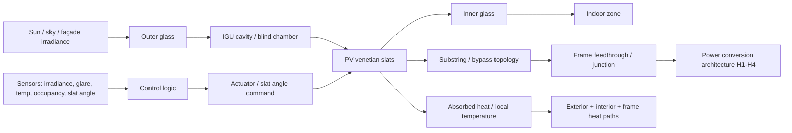
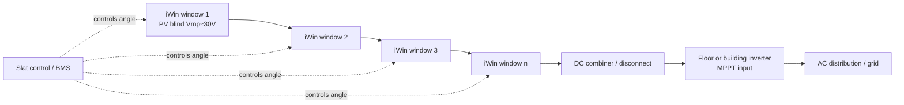
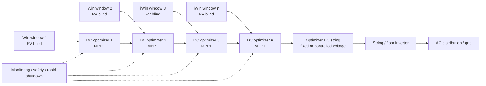
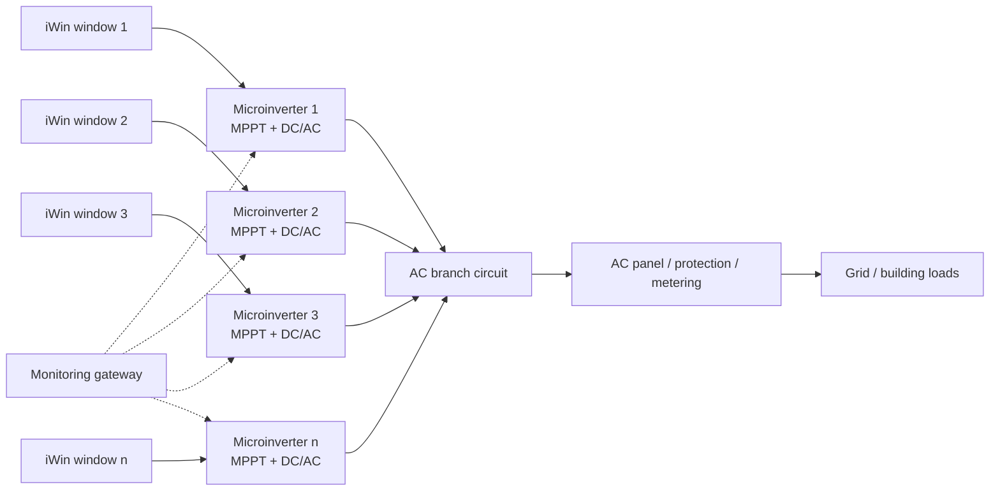
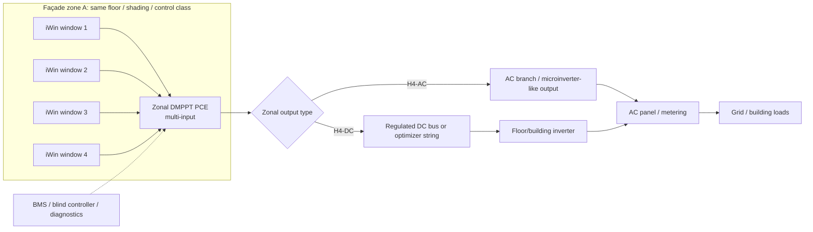
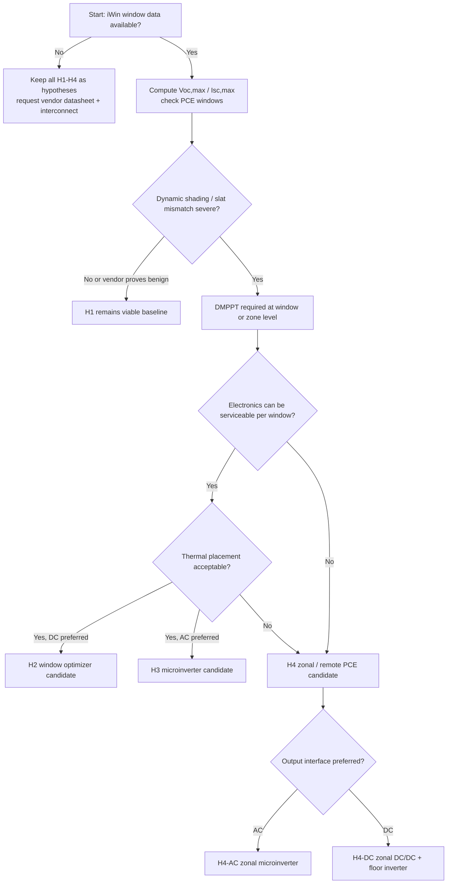

# iWin-Type BIPV PV-Blind Power Architecture Hypotheses — H1/H2/H3/H4

**Date:** 2026-05-28  
**Scope:** Pre-design architecture basis for iWin-type glazing-integrated photovoltaic venetian blinds.  
**Status:** Architecture hypotheses, not final plant design, procurement basis, or compliance sign-off.

---

## 0. Purpose

This note defines four electrical power-system hypotheses for an iWin-type BIPV PV venetian-blind subsystem and represents each one with:

1. a compact **Mermaid schematic**, and  
2. a more detailed **D2 system diagram** suitable for engineering refinement.

The goal is not to freeze a final PV plant topology. The goal is to keep the candidate architecture families legible while vendor data, electrical envelope, thermal evidence, service boundaries, and commissioning requirements are still open.

---

## 1. Corrected project data carried in this note

| Parameter | Working value | Evidence status |
|---|---:|---|
| Location / use case | Lugano office façade | Project scenario |
| Gross iWin PV-blind area per floor | `~60 m²/floor` | Project scenario |
| Number of floors | `3–5` | Project scenario |
| Total gross blind area | `180 / 240 / 300 m²` | Derived from scenario |
| Target window/blind size | `1.5 m × 2.0 m` to `1.5 m × 3.0 m` | Project-defined |
| Window/blind gross area | `3.0–4.5 m²` | Derived |
| SD-BIPV power density | `60–160 W/m²` | Project working envelope |
| Absolute per-window power range | `160–720 W` | Project-defined / derived |
| Mid per-window range | `330–495 W` | Derived at `110 W/m²` |
| ABS MID | `412.5 W` | Derived |
| PV-side target voltage | `Vmp,window ≈ 30 V` | Project working target |
| Optimizer output voltage | User/system-defined, **not automatically 30 V** | Engineering rule |

### Important correction

`60–160 W` is the approximate power density per `1 m²` of SD-BIPV. Therefore mainstream commercial MLPE power classes around `400–800 W` are relevant electrical benchmarks for one iWin window or cassette.

---

## 2. Evidence posture

Use the following labels when refining the hypotheses:

| Label | Meaning |
|---|---|
| **Verified public fact** | Stated by official public source or project-confirmed input |
| **Standards-backed framing** | Consistent with IEC / IEA scope or recognized PV design logic |
| **Public clue** | Useful public indication, not yet design-closed |
| **Engineering inference** | Technically justified but not yet vendor-confirmed |
| **Vendor-data required** | Cannot be frozen without drawings, ratings, qualification reports, or written vendor constraints |

This document intentionally keeps the architecture labels as **hypotheses**.

---

## 3. Common iWin subsystem boundary



### System-level variables that every hypothesis must carry

| Variable group | Required items |
|---|---|
| PV unit ratings | `Pmax`, `Voc`, `Vmp`, `Isc`, `Imp`, `βVoc`, `αIsc` |
| Internal topology | slat count, active slats, substrings, bypass allocation, string map |
| Aggregation | `Nseries`, `Nparallel`, window/cassette/floor grouping |
| PCE compatibility | MPPT window, startup voltage, current limits, output voltage behavior |
| Safety/interface | disconnect boundary, isolation, earthing/leakage concept, reverse-current handling |
| Physical implementation | connector, cable, feedthrough, moving conductor, bend radius, service access |
| Thermal | electronics placement, derating curve, cavity/chamber temperatures, high-temp trigger |
| Commissioning | unit map, polarity, `Voc/Isc` checks, telemetry, fail-safe tests, fault-localization drill |

---

## 4. Electrical envelope gates

Before scoring or down-selecting H1–H4, the following must be calculable or explicitly marked missing:

```text
Voc,max = Nseries × Voc,unit,STC × [1 + |βVoc| × (25°C - Tcell,min)]

Isc,max = Nparallel × Isc,unit,STC × (Gmax / 1000 W/m²) × [1 + αIsc × (Tcell - 25°C)]
```

If `Voc`, `Isc`, temperature coefficients, `Nseries`, `Nparallel`, or PCE windows are missing, the architecture can be studied but not frozen.

---

# 5. Hypothesis overview

| Hypothesis | Short name | Power architecture | DMPPT granularity | Main purpose in study |
|---|---|---|---|---|
| **H1** | Direct string / floor inverter | iWin windows directly series/parallel aggregated into floor/building inverter MPPTs | Inverter MPPT only | Reference baseline; tests whether vendor-internal slat/bypass design is enough |
| **H2** | Window-level DC optimizer / MISC | One DC/DC optimizer per window/cassette, outputs usually series-stacked into DC string | Window/cassette | Main commercial optimizer benchmark |
| **H3** | Window-level microinverter / MIPI | One microinverter per window or small group, AC aggregation | Window/cassette | Parallel-independence benchmark |
| **H4** | Zonal / multi-window DMPPT | Multiple windows grouped by zone into one serviceable PCE; may be zonal microinverter or zonal DC/DC | Zone + optional internal sub-window | Candidate architecture family for serviceable façade integration |

### H4 definition note

For this project, keep H4 explicit:

- **H4-AC:** multi-window zonal microinverter or AC PCE.  
- **H4-DC:** zonal DC/DC DMPPT feeding a floor/building inverter or DC bus.

If project convention later fixes H4 strictly as **multi-window microinverter**, keep H4-DC as a sibling branch or H2.5/H4b in the research appendix.

---

# 6. H1 — Direct string / central or floor inverter baseline

## 6.1 Definition

H1 connects multiple iWin windows/blinds directly in series/parallel groups and feeds one or more inverter MPPT inputs at floor or building level. There is no window-level active power electronics.

**Architecture family:** direct PV string / CMPPT or multi-MPPT inverter.  
**Power electronics location:** floor/building inverter only.  
**DMPPT:** absent except inverter MPPT.  
**Role in project:** baseline/reference, not preferred unless vendor data proves mismatch is benign.

## 6.2 Mermaid schematic



## 6.3 Detailed D2 diagram

```d2
direction: right

H1: {
  label: "H1 — Direct String / Floor Inverter Baseline"

  subgraph_window_stack: {
    label: "Repeated iWin window units"
    w1: "Window 1\nPV slats + bypass\nVmp ≈ 30 V"
    w2: "Window 2\nPV slats + bypass"
    w3: "Window 3\nPV slats + bypass"
    wn: "Window n\nPV slats + bypass"
  }

  dc_string: "Series / parallel DC aggregation\nNseries, Nparallel TBD"
  dc_disconnect: "DC disconnect / combiner\nprotection TBD"
  floor_inverter: "Floor/building inverter\nMPPT window TBD"
  ac_bus: "AC distribution / grid interface"

  controls: "BMS / blind controller\nangle schedule, glare, thermal logic"
  telemetry: "Limited electrical telemetry\nstring-level unless added sensors"

  w1 -> w2: "series DC"
  w2 -> w3: "series DC"
  w3 -> wn: "series DC"
  wn -> dc_string
  dc_string -> dc_disconnect
  dc_disconnect -> floor_inverter
  floor_inverter -> ac_bus

  controls -> w1: "slat angle"
  controls -> w2: "slat angle"
  controls -> w3: "slat angle"
  controls -> wn: "slat angle"
  floor_inverter -> telemetry: "string V/I, alarms"
}
```

## 6.4 Technical characteristics

| Item | H1 characteristic |
|---|---|
| PV-side voltage | Sum of windows in series; `Voc,max` grows directly with `Nseries` |
| PV-side current | Set by weakest current path in a series string |
| Converter topology | None at window level; inverter DC/AC only |
| MPPT granularity | One MPPT per string/floor input |
| Shading behavior | Sensitive to inter-window mismatch and slat-state mismatch |
| Cabling | Lower current than parallel low-voltage bus if strings are long enough |
| Safety | Potential high-voltage DC façade strings; isolation and shutdown boundary must be explicit |
| Monitoring | Coarse unless string sensors or window telemetry are added |
| Commercial maturity | Highest; uses conventional PV design logic |

## 6.5 iWin-specific assessment

| Aspect | Assessment |
|---|---|
| Match to dynamic slats | Weak unless internal bypass/substrings are excellent |
| Thermal electronics risk | Low at window level because no active MLPE in cavity |
| Serviceability | Simple electrically, but fault localization may be poor |
| Main benefit | Lowest electronics count and lowest architecture complexity |
| Main risk | Dynamic self-shading and nonuniform slat angles can collapse string current or create multi-peak behavior |
| Status | Reference baseline / suspect under dynamic shading |

## 6.6 Vendor-data blockers

- Allowed series/parallel aggregation of windows.
- Real `Voc`, `Vmp`, `Isc`, `Imp`, `βVoc`, `αIsc`.
- Slat/string/bypass topology.
- IV/PV curves under slat-angle and partial-shading cases.
- Isolation/disconnect/shutdown method.
- Connector/cable/feedthrough ratings for string voltage.

---

# 7. H2 — Window-level DC optimizer / MISC architecture

## 7.1 Definition

H2 places a DC/DC optimizer at each window, cassette, or defined PV-blind module. Each optimizer performs local MPPT and feeds either a series optimizer string or another DC aggregation layer.

**Architecture family:** Module-Integrated Series Converter / MISC.  
**Power electronics location:** window/cassette/frame/serviceable box.  
**DMPPT:** window/cassette level.  
**Role in project:** strongest commercial optimizer benchmark after corrected iWin power envelope.

## 7.2 Mermaid schematic



## 7.3 Detailed D2 diagram

```d2
direction: right

H2: {
  label: "H2 — Window-Level DC Optimizer / MISC"

  zone: {
    label: "One façade zone or floor segment"

    unit1: {
      label: "Unit 1"
      pv1: "iWin PV blind\n160–720 W\nVmp ≈ 30 V"
      opt1: "DC/DC optimizer\nlocal MPPT\nthermal placement TBD"
      pv1 -> opt1: "PV-side input"
    }

    unit2: {
      label: "Unit 2"
      pv2: "iWin PV blind"
      opt2: "DC/DC optimizer\nlocal MPPT"
      pv2 -> opt2: "PV-side input"
    }

    unitn: {
      label: "Unit n"
      pvn: "iWin PV blind"
      optn: "DC/DC optimizer\nlocal MPPT"
      pvn -> optn: "PV-side input"
    }
  }

  optimizer_string: "Series optimizer string\nVstring = Σ Vout_i\nIstring common"
  inverter: "String / floor inverter\nMPPT or fixed-string interface"
  ac: "AC distribution"
  safety: "Shutdown / isolation / arc / leakage concept"
  monitor: "Module-level telemetry\nV, I, power, alarms"

  opt1 -> opt2: "series output"
  opt2 -> optn: "series output"
  optn -> optimizer_string
  optimizer_string -> inverter
  inverter -> ac

  opt1 -> monitor
  opt2 -> monitor
  optn -> monitor
  safety -> opt1
  safety -> opt2
  safety -> optn
}
```

## 7.4 Technical characteristics

| Item | H2 characteristic |
|---|---|
| PV-side input | One iWin window/cassette; corrected power range `160–720 W`, mid `330–495 W`, `Vmp≈30 V` |
| Optimizer output | Architecture-dependent; not automatically 30 V |
| Converter topology | Usually non-isolated DC/DC; commercial examples include buck-boost or buck/current-matching families |
| MPPT granularity | Window/cassette level |
| DC aggregation | Series optimizer string, usually into string/floor inverter |
| Shading behavior | Strongly improved versus H1 at inter-window level |
| Internal slat mismatch | Not solved unless vendor internal slat/bypass design is good |
| Safety | Still DC string architecture; shutdown/isolation rules remain important |
| Monitoring | Usually window/module-level |
| Commercial maturity | High for rooftop PV; not proven for sealed moving BIPV blinds |

## 7.5 Commercial analogues

| Device family | Relevance to H2 |
|---|---|
| SolarEdge optimizers | Fixed-string-voltage series optimizer benchmark |
| Huawei SUN2000 optimizers | Smart-string optimizer benchmark; public PA0 class overlaps `720 W`, `10–80 V` MPPT |
| Tigo TS4-A-O / TS4-X-O | Selective optimizer / monitoring / shutdown benchmark; TS4-X-O class targets up to `800 W` modules |

## 7.6 iWin-specific assessment

| Aspect | Assessment |
|---|---|
| Match to corrected iWin power | Strong; modern optimizers overlap `330–495 W` mid and often `720 W` max |
| Match to `30 Vmp` | Strong if MPPT window covers 30 V |
| Thermal risk | Open; commercial products assume conventional module mounting/service conditions |
| Serviceability | Good only if optimizer is accessible without IGU destruction |
| Main benefit | Commercially realistic DMPPT benchmark |
| Main risk | Ecosystem lock-in, warranty limits, cavity temperature, feedthrough/moving conductor integration |
| Status | Strong candidate family; not design-closed |

## 7.7 Vendor-data blockers

- Allowed optimizer location: inside cavity, frame, cassette, external junction box, or service zone.
- Thermal derating at expected iWin temperatures.
- Warranty acceptance for BIPV blind use.
- Approved string length / minimum optimizer count / inverter compatibility.
- Shutdown behavior and safe voltage state per unit.
- Cable/connector/feedthrough compatibility with optimizer output.

---

# 8. H3 — Window-level microinverter / MIPI architecture

## 8.1 Definition

H3 converts each iWin window/cassette directly from PV DC to AC using a microinverter. Aggregation happens on the AC side.

**Architecture family:** Module-Integrated Parallel Inverter / MIPI.  
**Power electronics location:** window/cassette/frame/serviceable box.  
**DMPPT:** window/cassette level.  
**Role in project:** parallel-independence and fault-isolation benchmark.

## 8.2 Mermaid schematic



## 8.3 Detailed D2 diagram

```d2
direction: right

H3: {
  label: "H3 — Window-Level Microinverter / MIPI"

  unit1: {
    label: "Window unit 1"
    pv1: "PV blind\nVmp ≈ 30 V\n160–720 W"
    mi1: "Microinverter\nMPPT + DC/DC + DC/AC\ninternal DC link"
    pv1 -> mi1: "PV DC"
  }

  unit2: {
    label: "Window unit 2"
    pv2: "PV blind"
    mi2: "Microinverter\nindependent MPPT"
    pv2 -> mi2: "PV DC"
  }

  unitn: {
    label: "Window unit n"
    pvn: "PV blind"
    minv: "Microinverter\nindependent MPPT"
    pvn -> minv: "PV DC"
  }

  ac_branch: "AC branch circuit\n230 Vac or 3-phase distribution concept TBD"
  protection: "AC protection / RCD / breaker\nlocal code TBD"
  meter: "Metering / grid interface"
  monitoring: "Microinverter telemetry\nunit-level power + faults"
  thermal: "Thermal design issue\nDC-link capacitor + inverter losses"

  mi1 -> ac_branch: "AC"
  mi2 -> ac_branch: "AC"
  minv -> ac_branch: "AC"
  ac_branch -> protection
  protection -> meter

  mi1 -> monitoring
  mi2 -> monitoring
  minv -> monitoring
  mi1 -> thermal
  mi2 -> thermal
  minv -> thermal
}
```

## 8.4 Technical characteristics

| Item | H3 characteristic |
|---|---|
| PV-side input | One window/cassette or paired windows depending microinverter |
| Output | AC branch, typically 230 Vac class in Europe or equivalent microinverter AC system |
| Converter topology | DC/DC MPPT + internal DC link + DC/AC inverter |
| MPPT granularity | Window/cassette, sometimes dual-input independent MPPT |
| Shading behavior | Excellent inter-window independence |
| Fault propagation | Low; one failed microinverter usually does not collapse a DC string |
| DC hazard | Reduced external DC string length, but PV DC still exists locally |
| AC complexity | More AC branch design and grid-interface coordination |
| Thermal | More heat and capacitor/lifetime concerns near façade if placed in warm cavity/frame |
| Commercial maturity | Very high in residential PV; BIPV blind application unverified |

## 8.5 Commercial analogues

| Device family | Relevance to H3 |
|---|---|
| Enphase IQ8 family | Single-module microinverter benchmark; MPPT ranges overlap `~30–45 V` family depending model |
| APsystems DS3 family | Dual-module microinverter benchmark; two independent MPPT inputs, useful for paired-window/zonal thinking |

## 8.6 iWin-specific assessment

| Aspect | Assessment |
|---|---|
| Match to corrected iWin power | Strong for mid/high windows; dual-input units may fit paired windows |
| Match to `30 Vmp` | Often plausible; must check exact MPPT/startup voltage |
| Thermal risk | Potentially higher than H2 due DC/AC stage and DC-link ripple/capacitor stress |
| Serviceability | Excellent if externally accessible; poor if buried in IGU/cavity |
| Main benefit | Strongest independence and simple AC aggregation logic |
| Main risk | thermal density, packaging, AC branch routing, certifications, cavity placement |
| Status | Valid comparison baseline, not automatically weaker than optimizers |

## 8.7 Vendor-data blockers

- Whether microinverter can be mounted in frame/cassette service zone.
- Thermal ambient and derating compatibility.
- AC routing constraints in façade/mullion/floor boundary.
- Grid interface, monitoring, and branch circuit rules.
- Replacement procedure and recommissioning method.

---

# 9. H4 — Zonal / multi-window DMPPT architecture

## 9.1 Definition

H4 groups several iWin windows into a façade zone and assigns one serviceable power-electronic unit to that zone. The zone can be defined by floor, orientation, control group, shading class, replacement boundary, or façade bay.

**Architecture family:** hierarchical / zonal DMPPT.  
**Power electronics location:** serviceable zone box, mullion bay, floor cabinet, or accessible cassette boundary.  
**DMPPT:** zone level, optionally with internal window/slat subchannels.  
**Role in project:** strongest iWin-specific candidate family because it balances DMPPT, serviceability, electronics count, thermal management, and façade boundaries.

## 9.2 H4 variants

| Variant | Description | When attractive |
|---|---|---|
| **H4-AC** | Multi-window zonal microinverter / AC PCE | If AC aggregation, isolation, and grid compliance are easier than DC bus design |
| **H4-DC** | Multi-window zonal DC/DC DMPPT feeding floor DC bus or string inverter | If controlled DC aggregation and central inverter efficiency are preferred |
| **H4-hybrid** | Window/slat sub-MPPT inside zone PCE + zonal output | If internal mismatch is severe but per-window MLPE count is undesirable |

## 9.3 Mermaid schematic



## 9.4 Detailed D2 diagram

```d2
direction: right

H4: {
  label: "H4 — Zonal / Multi-Window DMPPT"

  facade_zone: {
    label: "Zone definition\nSame floor / orientation / shading class / service boundary"

    w1: "Window 1\nPV blind\nVmp ≈ 30 V"
    w2: "Window 2\nPV blind"
    w3: "Window 3\nPV blind"
    w4: "Window 4\nPV blind"

    junction: "Zone junction / harness\nfeedthrough aggregation\npolarity + isolation map"

    w1 -> junction: "PV DC input 1"
    w2 -> junction: "PV DC input 2"
    w3 -> junction: "PV DC input 3"
    w4 -> junction: "PV DC input 4"
  }

  zonal_pce: {
    label: "Serviceable zonal PCE"
    inputs: "Multi-input MPPT\nor grouped MPPT channels"
    power_stage: "Power stage\nOption A: DC/DC\nOption B: DC/AC"
    controller: "Local controller\ntelemetry + fault localization"
    thermal: "Heat sink / frame / cabinet thermal path"

    inputs -> power_stage
    controller -> power_stage
    power_stage -> thermal
  }

  output_select: "Output family"
  ac_output: "H4-AC\n230 Vac / 3φ branch\nmicroinverter-like"
  dc_output: "H4-DC\n120–150 Vdc sub-bus\nor 380–600 Vdc string/bus"
  floor_pce: "Floor/building inverter\nif DC output selected"
  ac_distribution: "AC distribution / metering / grid"
  bms: "BMS / blind control\nangle + fault + thermal policy"
  service: "Service action\nreplace zone PCE without IGU destruction"

  junction -> inputs
  power_stage -> output_select
  output_select -> ac_output
  output_select -> dc_output
  dc_output -> floor_pce
  floor_pce -> ac_distribution
  ac_output -> ac_distribution

  controller -> bms: "telemetry / alarms"
  service -> zonal_pce: "replace / recommission"
}
```

## 9.5 Technical characteristics

| Item | H4 characteristic |
|---|---|
| PV-side input | Multiple windows or slat groups per serviceable PCE |
| Output | Either AC branch output or regulated DC bus/string output |
| Converter topology | Multi-input DC/DC, isolated DC/DC, multi-input microinverter, or hybrid architecture |
| MPPT granularity | Zone level; optionally per input channel/window/slat group |
| Shading behavior | Strong if zones follow persistent shading/control classes |
| Electronics count | Lower than H2/H3 one-PCE-per-window |
| Serviceability | Potentially best if PCE is outside sealed cavity and zone-replaceable |
| Thermal | Potentially better because heat can be moved to serviceable frame/floor location |
| Commercial maturity | Lower than H2/H3 if custom; higher if adapted from multi-input microinverter/optimizer families |
| System complexity | Highest design burden, but best fit to iWin-specific constraints |

## 9.6 iWin-specific assessment

| Aspect | Assessment |
|---|---|
| Match to corrected iWin power | Strong if zone PCE is sized by number of windows: e.g. 2–4 windows ≈ `0.3–2.9 kW` depending assumptions |
| Match to `30 Vmp` | Good if multi-input low-voltage channels are designed for it |
| Thermal risk | Potentially controllable if electronics are placed in serviceable frame/floor zone |
| Serviceability | Strongest potential architecture if replacement boundary is designed correctly |
| Main benefit | Balances DMPPT, electronics count, thermal location, and service boundary |
| Main risk | Custom certification, protection, EMC, control complexity, lower commercial maturity |
| Status | Plausible baseline candidate family; needs vendor and PCE closure |

## 9.7 Vendor-data blockers

- Maximum windows per zone based on voltage/current/thermal/service limits.
- Allowed feedthrough and harness topology.
- Whether zone PCE can be installed outside sealed IGU.
- Multi-input MPPT requirements under slat-angle diversity.
- DC or AC output preference from safety, inverter, cabling, commissioning, and cost constraints.
- Zone replacement and recommissioning procedure.

---

# 10. H1–H4 comparison matrix

| Criterion | H1 Direct string | H2 Window DC optimizer | H3 Window microinverter | H4 Zonal / multi-window DMPPT |
|---|---|---|---|---|
| DMPPT granularity | Low | Window/cassette | Window/cassette | Zone; possibly per input channel |
| Dynamic slat-shading tolerance | Weak | Good | Good/excellent | Good/excellent if zoning is correct |
| Internal slat mismatch solved? | Only by passive bypass | Only if internal design good | Only if internal design good | Can include sub-window/slat inputs if custom |
| External DC string voltage | High possible | High possible | Minimal external DC | Depends on H4-DC vs H4-AC |
| AC branch complexity | Low | Low/medium | Higher | Medium/high depending variant |
| Electronics count | Lowest | High | High | Medium |
| Thermal electronics exposure | Lowest at window | Medium/high | High | Potentially controllable |
| Fault isolation | Weak/coarse | Medium | Strong | Strong if zone isolation is good |
| Fault localization | Coarse | Window-level | Window-level | Zone/input-channel level |
| Commercial maturity | Highest | High | High | Medium/low if custom |
| iWin subsystem fit | Weak baseline | Strong benchmark | Strong baseline | Strong candidate family |
| Main blocker | mismatch | service/thermal/ecosystem | thermal/AC integration | custom design/certification |

---

# 11. Decision logic



---

# 12. Practical next-step checklist

| Task | Why it matters | Affected hypotheses |
|---|---|---|
| Obtain actual `Pmax, Voc, Vmp, Isc, Imp, βVoc, αIsc` | Required for optimizer/microinverter compatibility | H1-H4 |
| Obtain slat/string/bypass map | Determines mismatch severity and DMPPT value | H1-H4 |
| Request shading/angle IV/PV curves | Validates H1 vs DMPPT need | H1-H4 |
| Define serviceable replacement boundary | Decides whether window-level MLPE is realistic | H2/H3/H4 |
| Measure/model cavity and frame temperatures | Decides electronics placement and derating | H2/H3/H4 |
| Compare H4-AC vs H4-DC voltage/current/cable losses | Freezes zonal direction | H4 |
| Define commissioning tests | Ensures architecture can be accepted in field | H1-H4 |

---

# 13. Source map

| ID | Source | Used for |
|---|---|---|
| S01 | IEC 63092-1:2020 public scope, IEC Webstore | BIPV module as building product framing |
| S02 | IEC 63092-2:2020 public scope, IEC Webstore | BIPV system integrated into building framing |
| S03 | IEC 62548-1:2023 + AMD1:2025 public scope, IEC Webstore | PV array design: DC wiring, protection, switching, earthing |
| S04 | IEA PVPS Task 15, *Building-Integrated Photovoltaics: A Technical Guidebook*, 2025 | BIPV design and implementation context |
| S05 | SolarEdge commercial power optimizers public page + PVsyst SolarEdge architecture note | H2 fixed-string-voltage optimizer benchmark |
| S06 | Huawei SUN2000-600W-PA0 datasheet | H2 720 W / 10–80 V MPPT commercial optimizer benchmark |
| S07 | Tigo TS4-A-O / TS4-X-O public product/datasheet pages | H2 selective optimizer / 800 W class benchmark |
| S08 | Enphase IQ8 datasheet and APsystems DS3 datasheet | H3 microinverter voltage/power benchmark |

---

# 14. Working conclusion

The corrected iWin power envelope makes commercial optimizer and microinverter classes much more relevant than earlier assumed. The project is no longer blocked by the question **“are mainstream MLPE devices in the right wattage class?”**. Many are.

The real discriminator is now:

```text
Which architecture survives iWin-specific constraints best:
sealed/moving façade subsystem, feedthroughs, thermal path,
service boundary, diagnostics, and commissioning evidence?
```

Current architecture posture:

- **H1** remains the necessary baseline but is weak under dynamic slat self-shading unless vendor evidence proves benign mismatch.
- **H2** is strengthened by corrected per-window power and commercial optimizer overlap.
- **H3** remains a valid independence/fault-isolation benchmark, especially if AC-side aggregation is acceptable.
- **H4** remains the strongest iWin-specific research candidate if zonal serviceability and thermal placement matter more than one-PCE-per-window granularity.

