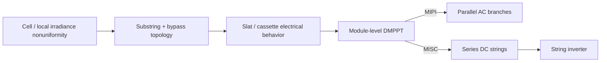

me
Document Directive (Prompt for Tailored Report): Write a highly technical, quantitative, and legislative research report comparing Microinverter (Module-Integrated Parallel Inverters - MIPI) and Power Optimizer (Module-Integrated Series Converters - MISC) architectures for BIPV dynamic and static shading devices. Structure the analysis strictly around the following four pillars:
0. Todo: System dimensioning using practical use case of an office building façade in Lugano, Switzerland,  60m2 of iwin pv blinds per piano, 3-5 pianos

1. Shading & Granularity (Quantitative System Dimensioning):
Quantify the impact of Distributed Maximum Power Point Tracking (DMPPT) at the module level under complex partial shading conditions (e.g., inter-louver self-shading).
Compare the electrical dimensioning of Microinverters (which require high DC-AC voltage step-up ratios and significant PV link capacitance to mitigate double-line frequency voltage ripples) versus Power Optimizers (which utilize DC string voltage stacking and lower conversion ratios).
Address the quantitative system reliability risks, specifically comparing the parallel independence of microinverters against the susceptibility of series-connected optimizers to single-point open-circuit failures.
2. Safety (Legislative & Normative Research):
Detail the legislative compliance requirements for both architectures using international norms, specifically IEC 63092 (BIPV products and systems), IEC 61730 (PV module safety qualification), and IEC 60364 (low-voltage electrical installations).
Examine inverter-specific grid interconnection standards including UL 1741 and IEC 62109.
Provide a deep dive into National Electrical Code (NEC) Article 690 compliance, specifically focusing on rapid shutdown requirements for emergency responders, DC ground fault protection, and the mitigation of arc flashes (contrasting the risks of series arc flashes in optimizers vs. parallel arc flashes).
3. Value (Economic Dimensioning):
Provide a quantitative framework for assessing the Life Cycle Cost (LCC) and Levelized Cost of Energy (LCOE) for both architectures.
Compare the higher initial Capital Expenditure (CAPEX) and operation and maintenance (O&M) costs associated with deploying complex module-level electronics in harsh outdoor BIPV environments against the financial benefits of an increased Performance Ratio (PR) and the reduction of mismatch power losses.

---

# Microinverter (MIPI) vs Power Optimizer (MISC) for iWin-Type BIPV Dynamic and Static Shading Devices

This report follows the project pack rule set: keep **verified facts**, **public clues**, **engineering inferences**, and **vendor-data-required** items separate; keep assumptions visible; and do not down-select an architecture before the electrical envelope, protection concept, and replacement boundary are explicit.

Publicly, the iWin family can be treated as a **photovoltaic venetian-blind shading device integrated inside an insulating/double-glazed window**, combining PV generation with light/solar/glare control, with public language around a sealed two-glass chamber and thin-film PV. The strongest product-proximate technical clue is the 2024 SUPSI/Solar RRL result that **one bypass diode per string** outperformed a **two-strings-sharing-one-diode** baseline, with **lower temperatures** and **more than 20% higher spring/summer yield**; the same abstract states that the pilot did **not** observe extreme temperature or humidity conditions. Exact chemistry, unit ratings, temperature coefficients, internal interconnect, MLPE placement, feedthrough design, and replacement procedure remain vendor-data required.

|Evidence class|Closed now|Still open|
|---|---|---|
|Verified public fact|IGU/double-glazing integration; PV + light/solar/glare control; sealed chamber language|Exact cavity/chamber section and service boundary|
|Product-proximate technical evidence|One-bypass-diode-per-string beats shared-diode topology by >20% in spring/summer and runs cooler|Whether the offered product revision uses the same internal partitioning|
|Public clue|Thin-film PV family is publicly indicated|Exact chemistry, stack, and qualification basis|
|Vendor-data required|—|Voc/Vmp/Isc/Imp, βVoc, αIsc, internal slat/string map, MLPE location, disconnect concept, connector/cable/feedthrough stack, replacement boundary|

## 0. System dimensioning — office façade in Lugano, 60 m²/floor, 3–5 floors

I interpret “3–5 pianos” as **3–5 storeys/floors**. Because façade orientation was not specified, I use a **south-facing vertical façade** as the reference case. PVGIS for Lugano gives a useful climate normalization: for a **south-facing vertical 1 kWp reference plane** with **14% generic system loss**, annual yield is **944.4 kWh/kWp·y** and annual incident irradiation on plane is **1204.12 kWh/m²·y**. This is a **climate reference**, not an iWin performance forecast. iWin’s actual yield will differ because the public technology clue is thin-film and the geometry is a slatted blind rather than a monolithic plane.

### 0.1 Explicit assumptions for a pre-design worked case

|Parameter|Value used|Status|
|---|--:|---|
|Gross blind area per floor|60 m²|User input|
|Floors|3 / 4 / 5|User input|
|Façade orientation|South, vertical|Engineering assumption|
|Gross STC power density|70 / 90 / 110 W/m²|Engineering assumption|
|Representative unit power|200 Wdc|Engineering assumption|
|Representative unit Voc / Vmp|45 V / 36 V|Engineering assumption|
|Representative unit Isc / Imp|6.0 A / 5.5 A|Engineering assumption|
|βVoc / αIsc|−0.28%/°C / +0.04%/°C|Engineering assumption|
|Tcell,min / Gmax|−10°C / 1200 W/m²|Engineering assumption|

The power-density range is intentionally gross-area based, because actual iWin unit ratings are not public and the project file rules explicitly forbid hiding that gap in prose.

### 0.2 Installed capacity by floor count

|Floors|Gross area|70 W/m²|90 W/m²|110 W/m²|
|--:|--:|--:|--:|--:|
|3|180 m²|12.6 kWp|16.2 kWp|19.8 kWp|
|4|240 m²|16.8 kWp|21.6 kWp|26.4 kWp|
|5|300 m²|21.0 kWp|27.0 kWp|33.0 kWp|

Using the PVGIS Lugano reference only as a climate-normalized ceiling, the **mid-case** 90 W/m² installations correspond to about **15.3, 20.4, and 25.5 MWh/y** for 3, 4, and 5 floors, respectively, before any blind-specific geometry, control-state, or availability derates are applied.

### 0.3 Energy model to carry forward

For this product family, the correct first-pass formulation is:

```text
Pdc,façade = A_gross × p_gross

E_y = Pdc,façade × Y_ref,vertical × k_geometry × k_control × k_availability
```

with `Y_ref,vertical = 944.4 kWh/kWp·y`.

This keeps the blind-specific losses explicit instead of burying them in a generic “PR”. For movable slats, **IEC 61853-2** matters directly because it covers **angle-of-incidence** and **operating-temperature** characterization; a dynamic blind should not be modeled using only normal-incidence data.

### 0.4 Worked 5-floor example for architecture comparison

Take the **5-floor mid-case**: `300 m² × 90 W/m² = 27.0 kWp`.

Use **135 units × 200 Wdc** as the placeholder aggregation.

The project-required design-envelope equations are:

```text
Voc,max = Nseries × Voc,unit,STC × [1 + |βVoc| × (25°C - Tcell,min)]

Isc,max = Nparallel × Isc,unit,STC × (Gmax / 1000 W/m²) × [1 + αIsc × (Tcell - 25°C)]
```

These are mandatory before any architecture ranking.

#### MISC worked stringing example

Assume **9 units in series per string** and **15 strings total**.

- `Voc,max ≈ 9 × 45 × [1 + 0.0028 × 35] = 444.7 V`
    
- `Vmp,string ≈ 9 × 36 = 324 V`
    
- `Isc,max ≈ 1 × 6 × 1.2 × [1 + 0.0004 × 25] = 7.27 A` per string
    

So the façade becomes approximately **15 strings × 9 units/string**, with cold open-circuit voltage around **445 Vdc**.

#### MIPI worked distribution example

There is no high-voltage façade string. Each 200 W module-level inverter produces about:

```text
Iac,module ≈ 200 W / 230 V = 0.87 A
```

So 135 units correspond to about **nine 230 V branch circuits of 15 units each** at roughly **13.0 A per branch**, or an equivalent three-phase distribution.

The worked example is enough to compare architectures quantitatively, but it is **not** enough to freeze design: actual unit ratings, actual internal partitioning, MPPT window, and replacement boundary are still blocked by vendor data.

## 1. Shading & Granularity — quantitative system dimensioning

The decisive technical point is that shading granularity exists at **more than one level**. In this product family, the 2024 public result already shows that **substring/slat partitioning** is first-order: one bypass diode per string outperformed a shared-diode topology by more than 20% in spring/summer and reduced temperature. That means no MLPE architecture can compensate for a poor internal slat/bypass design.



### 1.1 What module-level DMPPT is worth under partial shading

Public quantitative evidence supports three defensible claims.

First, **module-level DMPPT as a class** is valuable under partial shading: NREL measured microinverter gains over a string inverter of **3.7%**, **7.8%**, and **12.3%** under light, moderate, and heavy shading, respectively.

Second, panel-level optimizers materially recover mismatch losses: NREL’s 542-system partial-shading analysis reported average shading losses of **8.3%** for systems with optimizers versus **13%** without them, meaning roughly **36% of the shading-induced loss** was recovered. In relative delivered-energy terms, that is about **5.4% more energy** than the non-optimized case.

Third, NREL’s multi-product MLPE comparison found annual recovery of shading losses generally in the **25–35%** range, with the larger differences driven more by **array/string topology** than by the particular MLPE product. That is the key result for MIPI vs MISC: once both architectures provide **module-level MPPT**, the remaining energy gap is usually **smaller than the gap between MLPE and centralized MPPT**.

### 1.2 Microinverter vs optimizer conversion burden

For a single-phase **microinverter (MIPI)**, the inverter must take low module voltage and synthesize grid AC locally. With a representative module operating around **30–40 Vdc**, the required step-up to a **230 Vac** grid is:

```text
Mboost ≈ Vgrid,pk / Vmp,module ≈ 325 / (30 to 40) = 8.1 to 10.8
```

This is a large DC-AC voltage conversion ratio.

A single-phase microinverter must also absorb the **double-line-frequency power ripple**. The ripple-energy amplitude is:

```text
ΔE2ω = Pout / (2ωgrid)
```

A useful approximation for the needed PV-link or DC-link capacitance is:

```text
C ≈ Pout / (ωgrid × Vdc × ΔVpp)
```

For `Pout = 200 W`, `fgrid = 50 Hz`, `Vdc = 30–40 V`, and allowed ripple `ΔVpp = 10% of Vdc`, the required capacitance is approximately **4–7 mF per module**. That is exactly the kind of significant PV-link capacitance burden identified in the user prompt, and it directly drives size, ripple current, thermal stress, and lifetime pressure on capacitive buffering.

A **power optimizer (MISC)** still performs module-level MPPT, but it does **not** have to perform per-module low-voltage single-phase inversion. In the 9-module worked example, the series string nominal MPP is about **324 Vdc**, so the per-optimizer conversion ratio is typically much closer to **unity or modest buck/boost** than the 8–11× boost burden of a microinverter. The 2ω AC ripple is then handled at the **central inverter DC link**, not replicated at every module.

|Metric|MIPI|MISC|
|---|---|---|
|Module-side MPPT granularity|1 module|1 module|
|Module-side DC-AC conversion|Yes|No|
|Typical per-module conversion ratio in worked case|~8.1–10.8× boost to AC peak|Usually near-unity/modest buck-boost|
|Per-module 2ω buffer requirement|Yes|No|
|Worked per-module capacitance burden|~4–7 mF|Centralized at inverter|
|Grid-synchronized power stages in 27 kWp case|135|1 central inverter|
|High-voltage DC present in façade|No long string DC|Yes|

The energy implication is subtle but important: **both architectures recover module-level mismatch**, but **MISC usually does so with a lower per-module power-electronics burden**. The counter-advantage of MIPI is that it removes the entire **string-current coupling** domain.

### 1.3 Reliability and open-circuit risk

The topology-level reliability asymmetry is straightforward.

For the **27.0 kWp / 135-unit** worked case:

- **MIPI**: one failed unit removes **200 W**, so lost façade capacity is  
    `1 / 135 = 0.74%`.
    
- **MISC**: one optimizer or series path that fails **open** and does **not** provide fail-operate bypass collapses a whole 9-unit string, so lost façade capacity is  
    `1 / 15 = 6.67%`, or **1.8 kW**.
    

Using the Lugano climate-normalized annual yield and a **14-day outage**:

- **MIPI event loss** ≈ `0.2 kW × 944.4 × 336/8760 = 7.2 kWh`
    
- **MISC fail-open string loss** ≈ `1.8 kW × 944.4 × 336/8760 = 65.2 kWh`
    

|Failure event|Lost power|Lost array fraction|14-day energy loss|
|---|--:|--:|--:|
|1 MIPI module offline|0.2 kW|0.74%|7.2 kWh|
|1 MISC string fail-open|1.8 kW|6.67%|65.2 kWh|

This is the strongest quantitative reliability advantage of MIPI: **parallel independence**. The strongest quantitative reliability advantage of MISC is the opposite side of the same equation: **fewer grid-synchronized devices, fewer replicated DC-AC stages, and lower per-device conversion stress**.

The real pre-design risk is whether the optimizer architecture has a **proven fail-operate path** under local failure. That is vendor-data required. The project FMEA template is explicit that loss of isolation, hot-spot/fire risk, latent faults, and unsafe states must be action-gated even if a simple RPN looks moderate.

### 1.4 Dynamic vs static shading devices

For **dynamic blinds**, mismatch is more time-varying because slat angle changes geometry, self-shading, and irradiance distribution. That makes **module-level MPPT effectively mandatory**. For **static shading devices**, mismatch volatility is lower, so the relative premium for extreme segmentation is smaller.

|Use case|Dominant mismatch behavior|Better default|
|---|---|---|
|Dynamic BIPV blind|Time-varying self-shading, slat-state heterogeneity, floor-to-floor shading asymmetry|**MISC**, if fail-operate and service boundary are proven; otherwise **MIPI**|
|Static BIPV shading element|Slower, more geometry-fixed mismatch|**MISC** more strongly favored|
|Extremely heterogeneous façade with zero tolerance for shared-string dependency|Severe local independence requirement|**MIPI**|

The core conclusion of Pillar 1 is therefore:

- **MLPE is justified.**
    
- **Poor internal slat/bypass design cannot be rescued downstream.**
    
- **MIPI vs MISC is not primarily a “who has better MPPT” question; it is primarily a conversion-burden, failure-containment, and code/service-boundary question.**
    

## 2. Safety — legislative and normative research

### 2.1 Applicable legal / normative hierarchy for Lugano vs export markets

For a façade in **Lugano, Switzerland**, the primary permitting path is **Swiss/European**, not NEC. The Swiss low-voltage framework is governed by **NIV/OIBT**; Electrosuisse states **NIN 2025** is in force from **1 January 2025** and points PV installations to the PV installation chapter aligned with **HD/IEC 60364-7-712**; and parallel connection of generating units at low voltage is governed by **SN EN 50549-1**, with the **VSE NA/EEA** recommendation providing Swiss grid-connection detail. NEC Article 690 and UL 1741 remain highly relevant for **North American marketability** and as a strong comparative safety benchmark, but they do **not** drive Swiss permitting by default.

For the product/system itself, the relevant international stack is: **IEC 63092-1/-2** for BIPV product/system framing; **IEC 62548-1:2023+A1:2025** for PV array design; **IEC 60364-1:2025** and **IEC 60364-7-712:2025** for low-voltage installation practice; **IEC 61730-1/-2:2023** and **IEC 61215-1/-2:2021** for module safety and qualification; **IEC TS 63126:2025** when the deployment exceeds the base 70°C module-temperature envelope; **IEC 62109-1/-2/-3** and **IEC 62093:2022** for PCE/MLPE safety and qualification; **IEC 62790**, **IEC 62852**, and **IEC 62930** for junction/feedthroughs, connectors, and DC cables; and **IEC 62446-1/-2** plus **IEC TS 62446-3** for handover, maintenance, and thermographic inspection.

A critical correction is needed here: **IEC 62109 is not itself the grid-interconnection code**. It is a **safety standard for power conversion equipment**. In Europe/Switzerland, grid interconnection is governed by **EN 50549** and DSO rules; in the U.S., **UL 1741** is the equipment safety/interconnection standard used with **IEEE 1547/1547.1** and installed under **NEC Article 690**.

### 2.2 Architecture implications under IEC 63092 / 61730 / 60364 / 62548

|Issue|MIPI implication|MISC implication|
|---|---|---|
|IEC 63092 BIPV classification|Still a BIPV building product/system|Same|
|IEC 61730 / 61215 module baseline|Applies to PV element; stronger review if electronics are mechanically/electrically co-integrated|Same|
|IEC TS 63126 thermal trigger|More acute if dissipative MLPE is in chamber/edge zone|Also relevant, but per-device heat burden is lower|
|IEC 62548 / IEC 60364 wiring and isolation|Lower façade DC voltage exposure; more AC branch circuits|Higher façade DC voltage; stronger emphasis on string routing, isolation, and enclosure discipline|
|IEC 62109-3 integrated electronics|Potentially every unit carries integrated conversion safety scope|Optimizer still falls under integrated-electronics scope if combined with PV element|
|IEC 62790 / 62852 / 62930 interfaces|More device count, more branch interconnections|Higher DC voltage at fewer interfaces|

The safety asymmetry is therefore not “safe vs unsafe.” It is:

- **MIPI** reduces long high-voltage DC exposure in the façade but multiplies the number of grid-interactive devices and branch-circuit interfaces.
    
- **MISC** centralizes AC interconnection and usually reduces per-module electronics burden, but retains a **high-voltage DC domain** inside the façade system.
    

Because iWin public evidence does **not** prove an overheating problem in the pilot, the correct safety position is not “thermal failure is known”; it is “thermal qualification remains an explicit design trigger.” That aligns with the project pack.

### 2.3 UL 1741 and IEC 62109

**UL 1741** is the U.S. safety/interconnection standard for inverters, converters, controllers, interconnection system equipment, rapid-shutdown equipment, and AC modules. It is therefore directly relevant to **microinverters** and also to **optimizer/inverter ecosystems** serving the U.S. market.

**IEC 62109-1/-2/-3** governs safety of power converters for PV systems, with **IEC 62109-3** specifically relevant where electronic devices are mechanically or electrically incorporated with PV modules or PV system structures. That makes it directly relevant for both MIPI and MISC in a glazing-integrated blind product, particularly if electronics are close to the PV element, frame edge, or feedthrough.

The legislative/compliance consequence is straightforward:

- For **MIPI**, the grid-interactive certification burden is **replicated at module level**.
    
- For **MISC**, the grid-interactive burden is more concentrated at the **string inverter**, while optimizer safety and integration remain in scope at module level.
    

### 2.4 NEC Article 690 deep dive

This section is a **U.S. benchmark / export-market path**, not the primary Lugano permitting path.

#### NEC 690.12 — rapid shutdown

The NEC rapid-shutdown framework defines an **array boundary** extending **305 mm (1 ft)** from the array. Outside that boundary, and more than **1 m (3 ft)** inside the building from the point of entry, the required conductors must be reduced to **30 V within 30 s**. Inside the array boundary, the code provides either a **listed PV hazard control system** path or a voltage-limited path of **80 V within 30 s**, depending on the equipment/listing approach. **UL 3741** is the major system-level compliance route here.

**Architecture consequence**

- **MIPI** is usually the easier rapid-shutdown path because it avoids long high-voltage façade DC strings.
    
- **MISC** can comply, but typically needs a coordinated optimizer/inverter/rapid-shutdown ecosystem or a listed PV hazard control system.
    

#### NEC 690.41(B) — DC ground-fault protection

NEC 690.41(B) requires ground-fault detector/interrupter protection when PV DC circuits exceed **30 V** or **8 A**. The code also requires that if a DC-DC converter is not itself listed as providing that function, the identified system combination must provide it separately.

**Architecture consequence**

- **MISC** almost always leaves an exposed DC string domain where this requirement is central.
    
- **MIPI** confines most DC to listed module-integrated equipment, which usually reduces the exposed DC-fault domain, though it does not eliminate internal DC hazards inside the listed product.
    

#### NEC 690.11 — DC arc-fault protection

NEC 690.11 requires PV DC arc-fault protection for PV DC circuits operating at **80 V or greater** on or in buildings, and **UL 1699B** is the U.S. device standard for PV DC arc-fault protection.

The user’s “series arc flash vs parallel arc flash” language is better translated here as **series-arc vs branch/parallel fault exposure**. In façade PV, the dominant code-driven hazard is persistent **series DC arcing**, not classical switchgear-style arc-flash energy.

**Architecture consequence**

- **MISC** structurally increases **series-arc exposure**, because the façade contains longer, higher-voltage DC strings, multiple string connectors, and a sustained DC source.
    
- **MIPI** largely removes the long high-voltage DC string domain, so the dominant fault exposure shifts toward **many AC branch interfaces**, connector integrity, branch-circuit protection, and isolation of many small grid-tied units.
    

#### NEC 690.31 and 690.7 — wiring methods and voltage limits

NEC 690.31 imposes stricter wiring-method requirements for PV DC circuits exceeding **30 V** or **8 A** inside buildings, generally pushing them into metal raceways, metal enclosures, or equivalent protected methods unless a listed PV hazard control approach changes the boundary conditions. NEC 690.7 limits PV systems on or attached to buildings to **1000 Vdc**.

**Architecture consequence**

- **MISC** carries the more demanding in-building DC routing, enclosure, and arc-fault discipline.
    
- **MIPI** shifts the burden away from high-voltage DC routing and toward AC branch-current management, OCPD coordination, and many more interconnection points.
    

### 2.5 Safety conclusion

For a **Swiss Lugano deployment**, the local compliance backbone is **NIV/OIBT + NIN/IEC 60364 + EN 50549 + the IEC PV/BIPV standards family**. For a **North American commercialization path**, **MIPI** generally has the cleaner story on rapid shutdown and high-voltage façade DC avoidance, while **MISC** generally has the cleaner story on lower per-device conversion burden and simpler centralized grid interconnection. The decisive unknown is not the standard list; it is whether the offered product revision proves a safe **disconnect/isolation boundary** and an acceptable **replacement boundary**.

## 3. Value — quantitative LCC / LCOE framework

The right economic comparison is not “which architecture makes more kWh.” Both MIPI and MISC are **module-level DMPPT** classes. The real comparison is:

- **incremental energy capture**
    
- versus **incremental lifecycle cost**
    
- under a façade-integrated access and service model.
    

### 3.1 Core formulas

```text
LCC_j = C0,j + Σ_t [(O&M_j,t + Repl_j,t + Downtime_j,t + Compliance_j,t)/(1+r)^t] - Salvage_j/(1+r)^N
```

```text
LCOE_j = Σ_t [Cost_j,t/(1+r)^t] / Σ_t [E_j,t/(1+r)^t]
```

```text
E_j,t = Pdc × Y_ref,vertical × kgeometry,t × kmismatch,j,t × ηconv,j,t × A_j,t × (1-d)^t
```

```text
PR_j = EAC / (PSTC × HPOA / GSTC)
```

A useful decomposition is:

```text
PR_j ≈ PRoptical × PRmismatch × PRconverter × PRthermal × PRavailability
```

That decomposition is exactly what separates MIPI from MISC:

- **MIPI** tends to improve `PRavailability` under local failures and severe heterogeneity, but can be penalized in `PRconverter` because of per-module low-voltage inversion burden.
    
- **MISC** tends to improve `PRconverter` and reduce electronics burden, but can be penalized in `PRavailability` if a fail-open path takes down a full string.
    

### 3.2 Lifecycle cost drivers that actually matter here

|Cost / value driver|MIPI tendency|MISC tendency|
|---|---|---|
|Initial MLPE hardware cost|Higher|Lower per module|
|Central inverter cost|None or minimal|Required|
|AC BOS / branch complexity|Higher|Lower|
|DC façade routing / rapid shutdown / AFCI burden|Lower|Higher|
|Per-device thermal/electronic stress|Higher|Lower|
|Single-fault lost capacity|Lower|Potentially much higher|
|Grid-interactive certification replication|Higher|Lower|
|Dependence on accessible replacement boundary|Very high|High|

The project templates make the service boundary explicit for a reason: a façade-integrated system can be economically dominated by **access and recommissioning**, not by semiconductor cost. If a failed MLPE device inside a sealed or edge-inaccessible assembly forces an **L4** IGU replacement rather than an **L2** electronics swap, the architecture economics change completely.

### 3.3 Quantitative sensitivity for the Lugano 27 kWp case

Use the 5-floor mid-case:

- `Pdc = 27.0 kWp`
    
- climate-normalized annual reference energy `≈ 25.5 MWh/y`
    
- assume self-consumed electricity value `= 0.22 CHF/kWh`
    
- assume real discount rate `= 5%`
    
- assume project life `= 25 y`
    

The present-value annuity factor is about **14.09**.

#### Value of an annual energy delta

|Net annual yield advantage|Extra energy|PV of extra energy over 25 y|
|--:|--:|--:|
|5%|1.27 MWh/y|~3.7 kCHF|
|7%|1.79 MWh/y|~5.6 kCHF|
|10%|2.55 MWh/y|~7.4 kCHF|

This is the right scale. It shows why the architecture debate has to be disciplined:

- If **MIPI vs MISC** differs by only **1–3%** in annual net yield because both already have module-level MPPT, the present value of the extra energy is only about **0.79–2.37 kCHF**.
    
- That is usually **too small** to justify materially higher per-module inverter hardware, heavier replicated certification, or a worse replacement boundary.
    
- By contrast, if **MISC** exposes repeated **full-string outages** or more onerous rapid-shutdown / AFCI / DC routing costs, that penalty can erase its CAPEX advantage.
    

The correct break-even test is:

```text
ΔCAPEX + PV(ΔO&M + ΔRepl + ΔDowntime + ΔCompliance) ≤ PV(ΔEannual × V_kWh)
```

### 3.4 Why façade serviceability dominates the economics

Using the outage results from Pillar 1:

- one MIPI module failure costs only about **7.2 kWh** over 14 days;
    
- one MISC fail-open string outage costs about **65.2 kWh** over 14 days.
    

Those energy values alone are not catastrophic. The true financial risk is that façade access, replacement logistics, commissioning repetition, and misconnection prevention can dominate the kWh loss. The commissioning template explicitly requires verification of labeling, isolation boundary, measured voltage/current, telemetry, slat-angle response, fail-safe behavior, and post-fault localization. A “low maintenance” marketing claim is not economic evidence.

### 3.5 Decision-grade conclusion for the Lugano case

For the **Lugano office façade** defined here, the technically defensible ranking is:

1. **Dynamic iWin-type blinds**:  
    **MISC is the default pre-design preference only if** the vendor proves all of the following:
    
    - optimized internal slat/substring/bypass partitioning,
        
    - fail-operate or otherwise acceptable string-level fault containment,
        
    - accessible replacement boundary,
        
    - explicit disconnect/isolation concept,
        
    - acceptable DC safety concept for the target market.  
        Under those conditions, MISC usually wins on **lower conversion burden** and often on **LCC/LCOE**.
        
2. **Dynamic blinds with unproven string fault containment or strong DC-hazard constraints**:  
    **MIPI becomes preferable** if any of these dominate:
    
    - zero tolerance for shared-string dependency,
        
    - U.S.-market rapid-shutdown / high-voltage DC avoidance as a primary design driver,
        
    - strongly heterogeneous façade shading where local independence is worth more than lower electronics burden.
        
3. **Static shading devices**:  
    **MISC is more strongly favored**, because the marginal energy value of MIPI’s extra independence usually shrinks while the replicated inverter burden remains.
    

The architecture cannot be frozen yet. The project pack already identifies the blocking closure items: actual unit electrical datasheet, internal subdivision and bypass topology, MLPE location, disconnect/isolation concept, connector/cable/feedthrough stack, and replacement/recommissioning procedure. Until those are closed, the report supports a **conditional preference**, not a procurement-grade selection.

A useful next step is to convert this report directly into updated rows for the capstone memo, standards/design-envelope matrix, and vendor questionnaire.