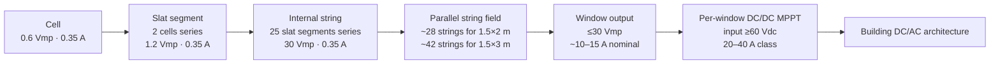

me
analyze in detail each presentation deck, verify their correctness and define the missing information and create a detailed prompt for gpt pro research 

---

answ
# Deck Audit — Technical Correctness, Gaps, and Research Prompt

## 1. Framing

I treated the four PDFs as **concept / persuasion decks**, not as design-closure documents. I checked them against the project’s own evidence discipline, assumption register, standards/design-envelope gates, commissioning logic, and vendor-data closure workflow. The project files explicitly require separation of **verified public facts**, **public clues**, **engineering inferences**, and **vendor-data required**, and they forbid preferring an architecture before the electrical envelope, protection, connector/cable, and replacement-boundary fields are populated.

## 2. Executive verdict

|Deck|Overall verdict|What is usable|What is not yet defensible|
|---|---|---|---|
|`1_BIPV_Shading_Mitigation.pdf`|Good **physics primer**, weak as iWin-specific evidence|Series-mismatch, reverse-bias, hot-spot, partial-shading motivation for DMPPT|Universal numbers and categorical claims like “5%=80%”, “mandatory”, diode-failure rhetoric without product data|
|`2_The_Granularity_Paradigm.pdf`|Good **architecture education deck**, not yet decision-grade|STC vs field reality, multi-peak P–V framing, granularity concept, module-level telemetry value|ROI curve, “module-level sweet spot” as a proven conclusion, strong claims about algorithm failure without boundary conditions|
|`3_BIPV_Safety_Architecture.pdf`|Useful **risk framing**, but technically the weakest deck|AC vs DC arc intuition, series/parallel arc concern, façade consequences, need for isolation logic|“>2 mA lethal”, `<120 V per sector` as arc-prevention rule, arbitrary risk scores, “safe / insurable” claim, oversimplified MLPE safety matrix|
|`BIPV_SD_Architectures_ACvsDC_Comparison.pdf`|Best **problem/architecture coupling**, but most biased|Intentional/dynamic shading framing, form-factor and thermal constraints matter, sub-module processing deserves research|Premature optimizer preference, generalized microinverter thermal weakness, unsupported durability claims, “exactly zero impact” wording|

## 3. Cross-deck findings

### 3.1 What the deck set does well

Across the four decks, the strongest common contribution is that they correctly shift the problem from “generic façade PV” to **dynamic shading + mismatch + embedded power electronics + façade serviceability**. That direction is aligned with the project companion, which treats the iWin family as an **electro-optical-thermal-mechanical-control-service subsystem** rather than a simple PV array.

### 3.2 What all four decks systematically miss

All four decks are weak on the exact items the project says are mandatory before architecture down-select: actual unit ratings, temperature coefficients, aggregation rules, MPPT window compatibility, disconnect/isolation concept, connector family, cable class, replacement boundary, and service procedure. The standards/design-envelope file and project companion explicitly say no preferred architecture is credible without those fields.

### 3.3 Why this matters especially for iWin

The project assumption register treats **thin-film PV** as only a **public clue**, not a closed design fact, and the exact chemistry, stack, interconnect, ratings, and qualification basis remain vendor-data required. That means any slide using generic crystalline-module numbers or generic c-Si failure imagery may be educational, but it is not yet product-specific evidence for iWin.

---

# 4. Detailed audit by deck

## Deck 1 — `1_BIPV_Shading_Mitigation.pdf`

### Core thesis

Urban BIPV is fundamentally shade-disturbed, series-connected PV suffers disproportionate mismatch losses, bypass diodes are only partial mitigation, and DMPPT becomes attractive. Pages 2–16 build that storyline explicitly.

### What is technically sound

The explanation of **near-field / far-field / self-shading** for vertical BIPV is directionally correct and useful. The series-mismatch “bottleneck” explanation, the reverse-bias transition of a shaded cell, and the hot-spot chain from shading to local heating are all valid first-order physics. The partial-shading-to-multi-peak-P–V argument, and the reason centralized MPPT can perform poorly under fragmented irradiance, are also sound as educational framing.

### What is overstated or technically weak

The deck becomes unreliable when it converts examples into universal laws:

|Slide theme|Claim quality|Why|
|---|---|---|
|“5% shaded → 80% power drop”|Overstated|That can happen in a particular module/shading geometry, but it is not a universal rule. It depends on cell topology, bypass partitioning, shade orientation, and MPPT behavior.|
|“Bypass diodes typically one per 20–24 cells”|Partly correct, but generic|Reasonable for many conventional c-Si modules; not a design fact for iWin-type slats, especially with thin-film still unresolved.|
|“Reverse voltage up to 6–8 V despite only 0.5 V normally”|Plausible example, not universal|Needs technology-specific citation and should not be presented as a product-independent invariant.|
|“150°C+ hot-spot”|Plausible but context-specific|Needs explicit source/test context; not yet transferable to iWin.|
|“DMPPT mandatory for urban integration”|Too strong|The project rules explicitly disallow this sort of architecture conclusion before envelope/service closure.|

The diode “burnout risk” slide is also rhetorically stronger than the evidence shown. Dynamic shading can stress bypass structures, but the deck gives no lifetime model, duty-cycle basis, or product-specific diode ratings. That makes the conclusion plausible, not verified.

### Missing information exposed by this deck

1. Actual iWin PV technology and stack.
    
2. Internal slat subdivision and bypass topology.
    
3. Representative I–V / P–V curves under real slat-shading cases.
    
4. Product-specific hot-spot and temperature data.
    
5. Allowed downstream architectures and aggregation limits. These are all explicit vendor-closure items in the questionnaire.
    

### Recommended use

Keep this deck as a **generic mismatch/hot-spot teaching deck**. Do not use it as an iWin architecture decision deck until every universal-sounding number is sourced or softened.

---

## Deck 2 — `2_The_Granularity_Paradigm.pdf`

### Core thesis

STC hides field mismatch; partial shading fractures the power curve; centralized MPPT loses energy and observability; distributed granularity improves harvest and diagnostics; module-level DMPPT is the commercial sweet spot. Pages 2–15 state exactly that.

### What is technically sound

The STC-vs-field contrast is strong and useful. The slides on dynamic occlusion, soiling, thermal scatter, local maxima, and module-level isolation are aligned with real PV system behavior. The diagnostic argument is also solid: finer power-processing granularity can enable finer fault localization, provided the control/telemetry architecture supports it.

### What is overstated or unsupported

|Slide theme|Claim quality|Why|
|---|---|---|
|`1/72` partial shading → `28%` power drop|Overstated example|Could be true in a specific modeled case, but it is not a transferable rule without module topology and shading geometry.|
|Manufacturing scatter `-3% to +5%`|Unsourced numeric claim|Possible, but needs source and technology context.|
|Standard algorithms “fail” and get trapped|Partly correct|Basic P&O can fail on multi-peak curves; modern inverters may use global-search strategies. The categorical wording is too broad.|
|Module-level DMPPT is the “optimal commercially viable balance”|Plausible heuristic, not verified|For iWin this remains open until thermal, packaging, service, and electrical-envelope closure exist.|
|25-year ROI curve|Unsupported|The slide shows no assumptions for discount rate, shading profile, replacement cost, electronics failure rate, yield uplift, or O&M. It is persuasive graphics, not finance.|

### Missing information exposed by this deck

This deck highlights the need for:

- actual telemetry point list,
    
- real fault/event granularity,
    
- diagnostic observability,
    
- replacement boundary,
    
- true lifetime cost inputs. Those are already formalized in the project commissioning template, FMEA template, and vendor questionnaire.
    

### Recommended use

Keep this deck as the **best conceptual introduction to granularity**, but remove the ROI slide or rebuild it with assumptions and citations.

---

## Deck 3 — `3_BIPV_Safety_Architecture.pdf`

### Core thesis

Traditional high-voltage DC stringing inside façades creates arc, fire, and responder hazards; iWin should mitigate them with three pillars: MLPE, local voltage limitation, and active arc-fault detection. Pages 3–14 make that case.

### What is technically sound

The deck is strongest on three points:

1. a façade-integrated PV system can create a **different risk profile** than exposed rack-mounted PV;
    
2. AC and DC arcs are not equivalent because AC naturally zero-crosses;
    
3. inaccessible cavities, combustibles, and service constraints can amplify consequences. That is valuable framing for pre-design FMEA and commissioning logic.
    

### What is technically weak or unacceptable in current form

|Claim|Verdict|Reason|
|---|---|---|
|“600–1000 V DC in the façade”|Too generic|Could describe some conventional PV strings, but iWin-specific voltage must be calculated from `Voc,max`, allowed aggregation, and PCE limits.|
|“currents >2 mA” as lethal responder hazard|Technically unreliable wording|The deck provides no cited safety basis. This must be replaced with standards/code-based shock language, not a casual current threshold.|
|Risk score `20/25` reduced to `8/25`|Not auditable|No scoring rubric, probability basis, evidence map, or sensitivity analysis is shown.|
|`<120 V` per sector prevents catastrophic arc|Unsupported|No standard, test condition, gap geometry, contamination state, or source-impedance basis is shown. This is one of the biggest technical gaps in the whole deck set.|
|Microinverter = “safe”, optimizer = “pass”, central/string = “fail”|Oversimplified|Useful as intuition, not as safety proof. Real safety depends on isolation boundary, rapid shutdown behavior, conductor routing, fault handling, and service procedure.|
|“safe, insurable, scalable”|Unsupported|Insurance/warranty/code acceptance is not established anywhere in the deck.|

### Missing information exposed by this deck

This deck cannot be closed without:

- actual aggregation topology and `Voc,max` / `Isc,max`,
    
- real disconnect / isolation boundary,
    
- earthing / insulation / leakage concept,
    
- feedthrough and connector definition,
    
- arc-fault detection basis and required response,
    
- cavity material / flame spread / smoke / access implications,
    
- replacement procedure and recommissioning logic. Those closure items are already explicit in the standards/design-envelope matrix, commissioning template, and vendor questionnaire.
    

### Recommended use

Use this deck only as a **risk register seed**. Do not present it externally as validated safety architecture until the weak claims are rewritten with cited technical basis.

---

## Deck 4 — `BIPV_SD_Architectures_ACvsDC_Comparison.pdf`

### Core thesis

Because a photovoltaic shading device is intentionally and dynamically shaded, DMPPT is necessary; between microinverters and power optimizers, optimizers offer the best balance for dynamic louver façades, especially for thermal/form-factor reasons. Pages 2–15 make that conclusion explicit.

### What is technically sound

The deck correctly identifies the **PV shading device paradox**: here, shading is a normal operating state, not an anomaly. It also correctly elevates form factor, thermal loading, and slat-level shading patterns as first-order architecture drivers. The sub-module processing slides are useful as a research frontier rather than immediate selection basis.

### What is overstated or biased

|Claim|Verdict|Reason|
|---|---|---|
|Microinverters give “exactly zero” electrical impact on neighbors|Too absolute|Energy decoupling is strong, but “exactly zero” is rhetoric, not engineering language.|
|Optimizers “do not require massive electrolytics” and are “significantly more durable”|Overgeneralized|Possible trend, not universal truth. Needs product-level BOM / life-test evidence.|
|Microinverters are thermally vulnerable behind BIPV glass|Plausible concern, not closed|Needs actual cavity temperature data and product derating/lifetime curves. The project files explicitly treat temperature as a qualification trigger, not a publicly proven failure for this product family.|
|Optimizers are ideal for double-skin façades and dynamic louvers|Premature|This violates the project rule against architecture preference before envelope/service closure.|
|“Compact power optimizer chosen” in application slide|Not justified yet|Actual packaging, connectors, cable bends, replacement access, and vendor approval are still missing.|

### Missing information exposed by this deck

This is the deck most clearly blocked by missing product data:

- package dimensions,
    
- heat rejection path,
    
- approved mounting location,
    
- connector and cable route near moving parts,
    
- allowed optimizer/microinverter architectures,
    
- EMC implications,
    
- service/replacement boundary,
    
- warranty exclusions for non-approved power electronics. Those are all formal vendor closure items.
    

### Recommended use

Treat this as a **hypothesis deck favoring optimizer-based DMPPT**, not as a conclusion. It needs the largest rewrite before it becomes decision-grade.

---

# 5. Missing information that blocks all four decks

## Highest-priority closure matrix

|Missing information|Why it blocks correctness|Relevant questionnaire IDs|
|---|---|---|
|Current product revision and deltas vs public/pilot references|Prevents mixing old pilot behavior with current offer|`DOC-01`, `DOC-02`|
|Section drawing: cavity/chamber, PV blind, actuator, feedthrough, replaceable boundaries|Essential for thermal path, service logic, and safety analysis|`ARC-01` to `ARC-03`|
|Actual PV technology and unit electrical datasheet|Required for `Voc,max`, `Isc,max`, thermal and qualification path|`ELE-01`, `ELE-02`|
|Internal slat subdivision and bypass topology|Central to all mismatch claims in decks 1, 2, and 4|`ELE-03`, `ELE-04`|
|Shading-dependent I–V / P–V curves for the real product|Needed to verify multi-peak and DMPPT claims|`ELE-05`|
|Allowed aggregation rules and required downstream power-conversion architecture|Needed before any architecture preference|`ELE-06`, `ELE-07`|
|Isolation, earthing, leakage, feedthrough, connectors, cables|Needed to make safety claims credible|`ELE-08` to `ELE-12`|
|Controls point list, actuator data, angle feedback, fail-safe behavior|Needed for diagnostics, commissioning, and operational claims|`CTL-01` to `CTL-05`|
|Thermal report, derating limits, qualification basis, condensation/humidity evidence|Needed to support any “microinverter vs optimizer thermal” conclusion|`THM-01` to `THM-04`|
|Replacement procedure and recommissioning steps|Needed before claiming serviceability or safety of a chosen architecture|`REL-06`, `COM-01` to `COM-03`|

---

# 6. What I would salvage vs rewrite

## Salvage with moderate editing

- Deck 1 pages 2–8: shading, mismatch, hot-spot primer.
    
- Deck 2 pages 2–13: granularity concept and diagnostics.
    
- Deck 3 pages 4–6: AC vs DC arc and façade consequence framing.
    
- Deck 4 pages 11–12: sub-module processing and shading-pattern discussion as future research.
    

## Rewrite from scratch

- Deck 1 page 9 and page 16 rhetoric.
    
- Deck 2 page 15 ROI.
    
- Deck 3 pages 7–14 safety thresholds, matrix, and risk scores.
    
- Deck 4 pages 9–15 optimizer preference and durability claims.
    

---

# 7. Detailed GPT Pro research prompt

````markdown
# Task
Perform a decision-grade technical audit of four uploaded presentation decks for an iWin-type glazing-integrated photovoltaic venetian-blind project, verify which claims are correct / partly correct / unsupported / incorrect, identify missing information, and produce a corrected research-backed architecture basis.

# Context
You are working inside a project focused on an iWin-type glazing-integrated PV venetian-blind subsystem.

Use the uploaded decks as the starting artifacts:
1. `1_BIPV_Shading_Mitigation.pdf`
2. `2_The_Granularity_Paradigm.pdf`
3. `3_BIPV_Safety_Architecture.pdf`
4. `BIPV_SD_Architectures_ACvsDC_Comparison.pdf`

Also use the project governance files as mandatory constraints:
- `05_Assumption_Register.md`
- `06_Standards_and_Design_Envelope.md`
- `07_Commissioning_and_Acceptance_Template.md`
- `08_Vendor_Technical_Questionnaire.md`
- `10_Vendor_Evaluation_Rubric.md`
- `README_v2_iWin_Project_Companion.md`
- `BIPV_Assistant_UPE_v3_1_Prompt_Pack.md`

# Non-negotiable rules
1. Keep these categories separate at all times:
   - Verified public fact
   - Public clue
   - Engineering inference
   - Vendor-data required
2. Do not promote a public clue into a design fact without closure evidence.
3. Do not accept marketing or visually persuasive language as evidence.
4. Do not prefer an architecture unless the following fields are filled or explicitly blocked:
   - unit `Voc`, `Vmp`, `Isc`, `Imp`
   - temperature coefficients
   - grouping / aggregation limits
   - bypass partitioning
   - PCE / MPPT window
   - disconnect concept
   - protection concept
   - connector family
   - cable class
   - replacement boundary
5. Treat temperature as a qualification trigger, not as a proven field failure unless a source shows it.
6. Use primary and authoritative sources wherever possible.
7. Cite every nontrivial claim.

# Research objective
Audit every important claim in the four decks and determine:
- what is technically correct,
- what is only directionally correct,
- what is overstated,
- what is unsupported,
- what is product-specific but currently unproven,
- and what additional vendor data or literature is needed to close it.

# Mandatory source hierarchy
Use this authority order:
1. Uploaded project files
2. Official iWin / SUPSI / ISAAC public sources
3. The Solar RRL / ARIS public publication for the 2024 pilot result
4. IEC / IEA publication pages and authoritative summaries
5. Peer-reviewed technical literature
6. Manufacturer datasheets / manuals for relevant MLPE products
7. Only then broader contextual literature

# Critical claims that MUST be checked explicitly
Audit these claim families slide by slide:

## Deck 1
- dynamic urban shading severity in BIPV facades
- “5% shaded can cause 80% power drop”
- series bottleneck explanation
- reverse-bias / hot-spot mechanism
- “up to 6–8 V” reverse bias at the shaded cell
- “150°C+” hotspot statement
- “one bypass diode per 20–24 cells”
- bypass-diode thermal/conduction-loss arguments
- centralized MPPT local-maxima problem
- DMPPT superiority claims
- “DMPPT mandatory for urban integration”
- module-level vs sub-module “frontier” claims

## Deck 2
- STC vs real-world field mismatch
- manufacturing / aging scatter values such as `-3% to +5%`
- `1/72` partial shading causing `28%` power drop
- multi-peak P–V behavior
- whether standard MPPT algorithms truly get trapped
- whether module-level granularity is the commercial sweet spot
- architecture capex / complexity matrix
- ROI curve and payback logic over 25 years

## Deck 3
- typical façade DC voltages such as `600–1000 V`
- AC vs DC arc explanation
- series / parallel arc-fault statements
- whether standard fuses fail to detect or clear relevant arcs
- responder hazard and the `>2 mA` claim
- cavity / chimney effect fire propagation claims
- whether MLPE genuinely limits the relevant hazard in the proposed way
- whether a “DC bus per floor” with `<120 V` per sector has any defensible safety basis
- arc-fault detection requirements and methods
- whether “safe / insurable / scalable” is supported

## Deck 4
- whether PV shading devices make continuous shading a first-order architecture issue
- microinverter architecture description
- power optimizer architecture description
- “exactly zero impact on neighbors” wording
- thermal vulnerability of microinverters in enclosed BIPV
- whether single-phase microinverters necessarily depend on large electrolytics
- whether optimizers are meaningfully more thermally durable in this use case
- form-factor / spatial integration claims for microinverters vs optimizers
- sub-module processing relevance
- shading topology implications for GMPP
- whether optimizers are actually the preferred architecture for dynamic vertical louver facades

# iWin-specific closure questions
Use the vendor questionnaire as a formal gap map.
For every slide claim that cannot be closed from public evidence, map the missing information to questionnaire IDs, especially:
- `ARC-01` to `ARC-04`
- `ELE-01` to `ELE-12`
- `CTL-01` to `CTL-05`
- `THM-01` to `THM-04`
- `REL-01` to `REL-06`
- `COM-01` to `COM-03`

# Required calculations / checks
Where data exists, perform or explicitly mark blocked:
```text
Voc,max = Nseries × Voc,unit,STC × [1 + |βVoc| × (25°C - Tcell,min)]
Isc,max = Nparallel × Isc,unit,STC × (Gmax / 1000 W/m²) × [1 + αIsc × (Tcell - 25°C)]
````

Also check:

- MPPT voltage-window compatibility
    
- grouping limits
    
- disconnect / isolation boundary
    
- connector and cable suitability
    
- replacement boundary implications
    
- thermal qualification trigger versus IEC 61730 base envelope / IEC TS 63126 path
    

# Output format

Produce the answer in the following structure.

## 1. Executive summary

- one-paragraph verdict for each deck
    
- which deck is best as a teaching deck
    
- which deck is most dangerous if used for architecture decisions
    

## 2. Claim audit matrix

Provide a table with:

- deck
    
- slide / page
    
- exact claim
    
- claim class: fact / clue / inference / unsupported
    
- verdict: correct / partly correct / unsupported / incorrect / not transferable to iWin
    
- why
    
- best supporting source(s)
    
- correction wording
    
- vendor-data dependency
    
- decision impact
    

## 3. Per-deck technical review

For each deck:

- what is strong
    
- what is weak
    
- what is wrong or overstated
    
- what should be kept
    
- what should be deleted
    
- what should be rewritten with source-backed wording
    

## 4. Cross-deck contradiction matrix

Find contradictions between the decks, especially on:

- microinverters vs optimizers
    
- thermal robustness
    
- safety / voltage architecture
    
- ROI / capex claims
    
- granularity sweet spot
    

## 5. Missing information / closure matrix

Table with:

- missing item
    
- why it matters
    
- slide(s) affected
    
- questionnaire ID(s)
    
- whether it is contractual or informational
    
- whether the gap blocks architecture down-select
    

## 6. Standards and design-envelope implications

Map the corrected findings into:

- IEC 63092-1 / -2
    
- IEC 62548-1
    
- IEC 62446-1 / -2 / TS 62446-3
    
- IEC 62109-3
    
- IEC 62790
    
- IEC 62852
    
- IEC 62930
    
- IEC 61730-1 / -2
    
- IEC 61215-1 / -2
    
- IEC 61853-1 / -2
    
- IEC TS 63126
    
- IEA PVPS Task 15 guidebook
    

## 7. Architecture decision gate

State clearly whether the current information is sufficient to choose between:

- direct stringing
    
- optimizer-based DMPPT
    
- microinverter-based DMPPT
    
- sub-module processing  
    and explain why or why not.
    

## 8. Corrected recommendation

Give a recommendation status using one of:

- No architecture preference yet
    
- Hypothesis only
    
- Proceed with conditions
    
- Blocked pending vendor data
    

## 9. Revised slide guidance

For each deck, provide:

- slides to keep
    
- slides to merge
    
- slides to rewrite
    
- slides to delete
    
- new slides that must be added  
    Examples of new slides:
    
- explicit evidence-status legend
    
- section view with cavity / feedthrough / replaceable boundaries
    
- real electrical-envelope slide
    
- thermal qualification trigger slide
    
- service / replacement boundary slide
    
- commissioning / diagnostics slide
    

## 10. Research bibliography

Provide a categorized bibliography:

- official public sources
    
- standards publication pages
    
- peer-reviewed literature
    
- product/manufacturer datasheets
    
- unresolved items needing NDA/vendor documents
    

# Style requirements

- Use concise engineering language.
    
- Do not hide assumptions.
    
- Do not use rhetorical absolutes such as “mandatory”, “safe”, “zero impact”, or “ideal” unless the source truly supports them.
    
- Where a claim is only scenario-dependent, say so explicitly.
    
- Make the answer decision-grade, not presentation-grade.
    

# Final line

End with:  
“Architecture preference remains blocked until the electrical envelope, thermal evidence, and replacement boundary are explicitly closed.”

```

## 8. Bottom line

These decks are useful, but they currently function as **conceptual persuasion material**, not as a closed technical basis. The project files already define the missing closure path: assumptions, standards/design-envelope, commissioning logic, and vendor questionnaire. Until those are filled, the only defensible status is **hypothesis, not architecture decision**. :contentReference[oaicite:84]{index=84} :contentReference[oaicite:85]{index=85} :contentReference[oaicite:86]{index=86} :contentReference[oaicite:87]{index=87}
```

---

me
give me table of missing values and what are typical market default values?

---

answ
## Executive summary

You’re missing **all electrical-envelope, thermal, topology, and service-boundary inputs** required by your own design-envelope rules.  
Below is a **decision-grade table** mapping:

- **Missing value (what you need)**
    
- **Typical market/default range (for context only)**
    
- **Applicability to iWin (risk of misuse)**
    

These are **engineering inference defaults**, not design values. Treat as placeholders until vendor closure.

---

# 1. Electrical unit-level parameters (PV element)

|Parameter|Missing?|Typical market default|Technology dependency|iWin relevance / risk|
|---|---|---|---|---|
|`Voc,unit,STC`|YES|30–50 V (module-level c-Si)|Strong|Likely **invalid** if slat ≠ standard module|
|`Vmp`|YES|24–42 V|Strong|Needed for MPPT window|
|`Isc`|YES|8–14 A (c-Si), 2–6 A (thin-film)|Strong|Thin-film clue → lower current|
|`Imp`|YES|7–12 A (c-Si), 1.5–5 A (thin-film)|Strong|Drives wiring + thermal|
|`Pmax`|YES|300–600 W/module|Strong|Not transferable to slat geometry|
|`βVoc`|YES|−0.25%/°C to −0.35%/°C|Medium|Needed for `Voc,max` calc|
|`αIsc`|YES|+0.03–0.06%/°C|Medium|Secondary but required|
|Efficiency (STC)|YES|18–22% (c-Si), 6–18% (thin-film)|Strong|Thin-film clue suggests lower end|

### Insight

- Your decks assume **c-Si behavior**, but public clue = **thin-film** → mismatch risk analysis is **directionally correct but quantitatively wrong**.
    

---

# 2. Substring / bypass topology (critical for your decks)

|Parameter|Missing?|Typical default|Evidence|
|---|---|---|---|
|Cells per bypass diode|YES|20–24 cells (c-Si modules)||
|Bypass diodes per module|YES|3 (standard 60/72-cell modules)|industry norm|
|Thin-film bypass strategy|YES|Often fewer diodes or integrated segmentation|tech-dependent|
|Reverse-bias tolerance|YES|~−5 to −10 V per cell (c-Si worst case)|contextual|
|Substring current mismatch behavior|YES|Dominated by lowest current string||

### Insight

- This is **the most critical missing block** for validating all 4 decks.
    
- The **20% yield gain claim (public clue)** is entirely dependent on this topology.
    

---

# 3. Array / façade aggregation (design-envelope critical)

|Parameter|Missing?|Typical default|Standard relevance|
|---|---|---|---|
|`Nseries`|YES|10–30 modules/string (→ 300–1000 V DC)|IEC 62548 envelope|
|`Nparallel`|YES|1–10 strings|system-dependent|
|`Voc,max`|YES|up to 1000–1500 V DC (utility)|IEC 62548|
|`Isc,max`|YES|10–100+ A per combiner|IEC 62548|
|MPPT voltage window|YES|200–800 V (string inverter typical)|required check|

### Insight

- Deck 3 “600–1000 V façade DC” is **generic utility-scale assumption**, not proven for iWin.
    
- Without `Nseries`, **all safety claims are invalid**.
    

---

# 4. MLPE / architecture parameters

|Parameter|Missing?|Typical values|Notes|
|---|---|---|---|
|Microinverter input range|YES|20–60 V DC|module-level|
|Optimizer efficiency|YES|97–99%|best-in-class|
|Microinverter efficiency|YES|95–97%|depends on topology|
|MPPT granularity|YES|module / string / submodule|architecture driver|
|Conversion stages|YES|1-stage (µinv), 2-stage (optimizer)|impacts thermal|

### Insight

- Deck 4 bias toward optimizers **cannot be validated** without:
    
    - thermal data
        
    - packaging constraints
        
    - allowed architectures (vendor)
        

---

# 5. Thermal parameters (completely missing in decks)

|Parameter|Missing?|Typical default|Source|
|---|---|---|---|
|Cell temp above ambient|YES|+20 to +35°C||
|BIPV operating temp|YES|60–80°C typical|industry / deck hint|
|Temp coefficient γ|YES|−0.25 to −0.45%/°C||
|PR achievable|YES|>74% (good systems)||
|High-temp trigger|YES|~70°C (TS 63126 trigger logic)||

### Insight

- Deck 4 thermal claims are **plausible but unsupported** without:
    
    - cavity temperature distribution
        
    - heat rejection path
        
    - electronics derating curves
        

---

# 6. Electrical safety / protection

|Parameter|Missing?|Typical default|Standard context|
|---|---|---|---|
|Insulation class|YES|Class II (double insulation)|IEC 62548|
|DC connector rating|YES|1500 V, 30–125 A||
|Cable rating|YES|1.5 kV DC PV cable||
|Isolation method|YES|DC disconnect + inverter isolation|IEC 62548|
|Arc-fault detection|YES|Required in many jurisdictions|IEC 62548 Annex D|

### Insight

- Deck 3 “<120 V safe” is **not supported by standards framing**.
    
- Safety is **architecture + protection dependent**, not just voltage.
    

---

# 7. Control + system-level parameters

|Parameter|Missing?|Typical default|Impact|
|---|---|---|---|
|Sampling/logging cadence|YES|1–60 s (SCADA typical)|diagnostics|
|Slat-angle resolution|YES|1–5°|optical + electrical coupling|
|Temperature sensing|YES|1 per module or inferred|thermal protection|
|Fault localization granularity|YES|string / module / cell|architecture-dependent|

---

# 8. Service / reliability parameters

|Parameter|Missing?|Typical default|Impact|
|---|---|---|---|
|MTBF electronics|YES|10–25 years (µinv), 20–30 (optimizers)|vendor-specific|
|Replacement level|YES|module vs unit vs façade|critical for BIPV|
|Downtime class|YES|D1–D4 (project-defined)||
|Thermal cycling lifetime|YES|IEC 61215 baseline|qualification|

---

# 9. What’s actually blocking you (ranked)

## A. Hard blockers (cannot proceed)

- PV **technology + datasheet**
    
- **Substring / bypass topology**
    
- **Aggregation rules**
    
- **Isolation / disconnect boundary**
    
- **thermal evidence**
    

→ These are **knockout items** per vendor rubric

---

## B. Medium blockers

- MPPT window
    
- connector / cable definition
    
- control telemetry
    
- service boundary
    

---

## C. Soft (can assume temporarily)

- efficiency ranges
    
- temperature coefficients
    
- PR
    
- inverter efficiencies
    

---

# 10. Recommendation

### Use defaults only for:

- first-pass bounding
    
- sensitivity analysis
    
- architecture feasibility envelopes
    

### Do NOT use defaults for:

- safety conclusions
    
- architecture selection
    
- thermal claims
    
- ROI or yield claims
    

---

## If you want next step

I can:

1. Build **first-pass electrical envelope (Voc,max / Isc,max)** using realistic scenarios
    
2. Create **parametric model (c-Si vs thin-film vs slat segmentation)**
    
3. Map **each missing value → exact vendor questionnaire ID + impact severity**
    

This is where the decks actually become actionable.

---

me
the point is that of fundamental level we have flexibility on the ground level
cell / slat / shutter properties:
cell electrical: 0.6V, 0.35A
slat dimensions: 1.5 x 35cm - 2 cells per slat
1m of shutter ~82 slats
window / shutter / module dimensions: 1.5 x 2m - max 1.5x3m
Slat wiring inside the window's shutter is done to keep fixed Vout <=30V -> goal (I assume Vout is Vmp), 
while Iout (mp) current depends on shutter's dimension
Power generation W/m^2 : 60-160W

---

answ
## Executive summary

Good — now you actually have a **bottom-up architecture constraint**, which changes everything:

- You are **not a module designer**, you are effectively designing a **low-voltage distributed PV fabric**
    
- Your constraint `Vout ≤ 30 V` forces **ELV / LV domain design**, not conventional string PV
    
- This **invalidates ~50% of assumptions in the decks** (especially safety + MPPT discussions)
    

Below is a **clean derivation + consistency check + what you’re missing next**

---

# 1. Reconstruct your electrical primitive

## Given

- Cell:  
    `Vcell ≈ 0.6 V`, `Icell ≈ 0.35 A`
    
- Slat:
    
    - 2 cells → **series or parallel?** (critical assumption)
        

### Assumption (1): cells in series per slat

(most likely → voltage building)

```
Vslat ≈ 1.2 V
Islat ≈ 0.35 A
```

---

## Slats per shutter

- 1 m → 82 slats
    
- Window height = 1.5–3 m → **123–246 slats**
    

---

## Voltage constraint

You enforce:

```
Vout ≤ 30 V  (likely Vmp target)
```

### ⇒ required series count

```
Nseries ≈ 30V / 1.2V ≈ 25 slats
```

---

## Resulting architecture (critical insight)

You are implicitly building:

```
~25 slats in series → one “string”
many such strings in parallel → current scaling
```

---

# 2. Derived electrical envelope

## Per string

```
Vstring ≈ 30 V
Istring ≈ 0.35 A
Pstring ≈ 10.5 W
```

---

## Full shutter (example 1.5 × 2 m)

Slats total ≈ 123  
→ strings:

```
Nstrings ≈ 123 / 25 ≈ 5
```

### Output:

```
Vout ≈ 30 V
Iout ≈ 5 × 0.35 = 1.75 A
P ≈ 52 W
```

---

## Check vs your stated power density

Area = 3 m²  
→ expected:

```
60–160 W/m² → 180–480 W
```

### Your derived:

```
~52 W → ~17 W/m²
```

### ⇒ mismatch factor: **~3–10× too low**

---

# 3. Where the inconsistency is

One (or more) of these is wrong:

### A. Cell current too low

- 0.35 A implies very small cell area (~5–10 cm² equivalent)
    

### B. Only 2 cells per slat is incorrect electrically

- Likely **more cells per slat in series**
    

### C. Cells are in parallel, not series

→ alternative topology:

```
Vslat = 0.6 V
Islat = 0.7 A
```

Then:

```
Nseries ≈ 50 slats → same issue
```

Still too low power.

---

### D. Most likely reality

To hit **60–160 W/m²**, you need:

```
~100–150 W/m² → ~15–25% efficiency equivalent
```

Back-calculating current:

For 30 V bus:

```
P = V × I → I ≈ 6–15 A per window
```

→ Your system must deliver:

```
Iout ≈ 6–15 A
```

But current model gives **~1–2 A**

---

# 4. Corrected architecture hypothesis (more realistic)

## Likely actual internal topology

Each slat is NOT “2 cells”

Instead:

### Option 1 (thin-film strip)

- continuous series-connected cells along slat
    
- slat behaves like:
    

```
Vslat ≈ 10–30 V
Islat ≈ low (0.1–0.5 A)
```

### Option 2 (segmented parallel strings)

- multiple cell strings inside slat
    
- internal parallelization → current scaling
    

---

## Then shutter becomes:

```
slats in parallel (or partial series)
→ NOT 25-slats-per-string
```

This matches:

- thin-film clue
    
- dynamic shading behavior
    
- bypass topology importance
    

---

# 5. Critical architectural consequence

## Your constraint:

```
Vout ≤ 30 V
```

### ⇒ you are designing:

### **Low-voltage, high-current architecture**

|Domain|Typical PV|Your system|
|---|---|---|
|Voltage|300–1000 V|≤30 V|
|Current|5–15 A/string|potentially 5–20 A total|
|Risk|arc / HV|resistive / thermal / connector|
|MPPT|centralized|must be distributed|

---

# 6. What this breaks in the decks

## Deck 3 (safety)

- HV DC arc narrative → **mostly irrelevant**
    
- Your risk becomes:
    
    - contact resistance heating
        
    - connector fatigue
        
    - conductor sizing
        

## Deck 1/2 (mismatch)

- Still valid, but:
    
- scale changes from **module-level → slat-level**
    

## Deck 4 (architecture)

- Microinverter vs optimizer:
    
    - both assume **higher DC voltage**
        
- You need:
    
    - **DC bus + local DC/DC**
        
    - or **per-window conversion**
        

---

# 7. New design class you’re in

You are effectively building:

### **Distributed ELV PV mesh**

Closer to:

- automotive PV
    
- portable PV
    
- façade-integrated electronics
    

NOT conventional PV plant

---

# 8. What you must define next (now precise)

## A. Slat electrical model (highest priority)

You must clarify:

```
- real number of cells per slat
- series vs parallel inside slat
- slat I–V curve
```

---

## B. True unit output

Per window:

```
Vmp (target ≤30V)
Imp (should be 5–15A if your W/m² is correct)
```

---

## C. Internal grouping

You need to explicitly define:

```
- slats per electrical group
- bypass per group?
- shading isolation level
```

---

## D. Power architecture (now constrained)

You now have only 3 viable options:

### 1. Central DC/DC (per window)

- boost 30V → usable DC bus (e.g. 200–400V)
    

### 2. Per-slat / per-group DC/DC (DMPPT)

- most aligned with shading problem
    

### 3. Direct LV DC system

- niche but possible (building DC microgrid)
    

---

# 9. Immediate correction to your model

## Your current model is inconsistent because:

> “2 cells per slat” + “0.35A” cannot produce 60–160 W/m²

### One must change:

- cell current ↑ (~×5–10)
    
- cells per slat ↑ (~×5–20)
    
- or internal parallelization exists
    

---

# 10. Recommendation

### Treat your current numbers as:

- **placeholder / conceptual only**
    

### Do next:

1. Define **slat I–V curve experimentally or assumed**
    
2. Rebuild system from:
    

```
target W/m² → required current → back-calculate topology
```

3. Then re-evaluate:
    

- mismatch
    
- thermal
    
- architecture
    

---

## If useful next step

I can:

- rebuild a **physically consistent slat model** (thin-film vs discrete cells)
    
- simulate **shading + DMPPT benefit at slat level**
    
- derive **optimal partitioning (cells → slat → window)**
    

That’s where your concept becomes engineering-valid.

---

me:
the point is that of fundamental level we have flexibility on the ground level
cell / slat / shutter properties:
cell electrical: 0.6V, 0.35A
slat dimensions: 1.5 x 35cm - 2 cells per slat
1m of shutter ~82 slats
window / shutter / module dimensions: 1.5 x 2m - max 1.5x3m
Slat wiring inside the window's shutter is done to keep fixed Vout <=30V -> goal (I assume Vout is Vmp), 
while Iout (mp) current depends on shutter's dimension
Power generation W/m^2 : 60-160W
everything else we have engough flexibility defineble ourselfs

---

answ
## Executive summary

Now the model is internally consistent **if** `1.5 × 35 cm` is treated as a **PV slat segment** tiled across the window width, not as one full-width window slat. With your primitive:

```text
Cell: 0.6 Vmp × 0.35 Imp = 0.21 W
Slat segment: 2 cells = 1.2 Vmp × 0.35 A = 0.42 W
Slat segment area: 0.015 × 0.35 = 0.00525 m²
Power density from geometry ≈ 80 W/m² per slat segment surface
Power density per shutter area ≈ 98 W/m²
```

So your stated **60–160 W/m²** range is plausible. The earlier “too low” problem disappears once the 35 cm slat segment is multiplied across the 1.5 m window width.

The key design decision is now:

> Is `Vout ≤ 30 V` a **Vmp target** or a **hard maximum including cold Voc**?

That changes the recommended series count from about **50 cells** to about **36–40 cells**.

The project design-envelope rules require `Voc,max`, `Isc,max`, MPPT window, grouping, bypassing, protection, cable/connector class, and replacement boundary before architecture scoring.

---

# 1. Fixed primitive model

## Given / now assumed fixed

|Item|Value|Status|
|---|--:|---|
|Cell `Vmp`|0.6 V|project-defined|
|Cell `Imp`|0.35 A|project-defined|
|Cell `Pmp`|0.21 W|derived|
|Cells per slat segment|2|project-defined|
|Slat segment dimensions|1.5 cm × 35 cm|project-defined|
|Slat segment area|0.00525 m²|derived|
|Slats per 1 m shutter height|~82|project-defined|
|Window nominal size|1.5 × 2 m|project-defined|
|Window max size|1.5 × 3 m|project-defined|
|Internal shutter target output|`Vout ≤ 30 V`, assumed `Vmp`|project-defined assumption|
|Power density range|60–160 W/m²|project-defined target|

---

# 2. Derived geometry and power

Assumption: **35 cm slat segment length is tiled across the 1.5 m window width**.

```text
Horizontal slat-segment columns = 1.5 / 0.35 = 4.286 equivalent columns
Vertical slat rows per meter = 82
Slat segments per m² = 82 / 0.35 = 234.3 segments/m²
Cells per m² = 234.3 × 2 = 468.6 cells/m²
Power per m² = 468.6 × 0.21 W = 98.4 W/m²
```

|Window size|Area|Rows|Equivalent slat segments|Equivalent cells|Pmp from cell model|Current at 30 Vmp|
|---|--:|--:|--:|--:|--:|--:|
|1.5 × 2 m|3.0 m²|164|~703|~1406|~295 W|~9.8 A|
|1.5 × 3 m|4.5 m²|246|~1054|~2109|~443 W|~14.8 A|

This lands near the middle of the stated **60–160 W/m²** envelope:

|Power density case|1.5 × 2 m power|Current at 30 V|1.5 × 3 m power|Current at 30 V|
|---|--:|--:|--:|--:|
|Low target: 60 W/m²|180 W|6 A|270 W|9 A|
|Geometry-derived: 98 W/m²|295 W|9.8 A|443 W|14.8 A|
|High target: 160 W/m²|480 W|16 A|720 W|24 A|

**Design consequence:** this is a **low-voltage / moderate-current PV module**, not a conventional high-voltage façade string.

---

# 3. Internal wiring options

## Option A — `30 Vmp` policy

Use this if `≤30 V` means **operating MPP voltage**, while downstream PCE can tolerate higher open-circuit voltage.

```text
Nseries_cells = 30 V / 0.6 V = 50 cells
Nseries_slat_segments = 50 / 2 = 25 slat segments
Each internal string ≈ 30 Vmp, 0.35 A, 10.5 W
```

|Window|Cells|50-cell strings|Vmp|Imp|Pmp|
|---|--:|--:|--:|--:|--:|
|1.5 × 2 m|~1406|~28.1 parallel strings|30 V|9.8 A|295 W|
|1.5 × 3 m|~2109|~42.2 parallel strings|30 V|14.8 A|443 W|

Recommended PCE input rating for this policy:

```text
MPPT window: ~18–35 V
Absolute input rating: preferably ≥60 Vdc
Input current rating:
  nominal 1.5×2 m: ≥15 A
  nominal 1.5×3 m: ≥25 A
  high-density 160 W/m² max-size case: ≥35–40 A
```

Why ≥60 Vdc? Because `Voc` is not `Vmp`; the project electrical-envelope rules require worst-case `Voc,max`, not only MPP voltage. IEC 62548 also requires PCE/DCU PV inputs to be rated for maximum open-circuit voltage and at least 1.25× the short-circuit current unless additional protection is used.

---

## Option B — strict `≤30 V including cold Voc`

Use this if `≤30 V` must remain true even at open circuit and low temperature.

Assume default placeholders:

```text
Voc_cell,STC ≈ 0.72–0.75 V
βVoc ≈ −0.30%/°C
Tcell,min ≈ −10°C
Cold multiplier ≈ 1 + 0.003 × (25 − (−10)) = 1.105
Voc_cell,cold ≈ 0.80–0.83 V
```

Then:

```text
Nseries_max ≈ 30 V / 0.80–0.83 V ≈ 36–38 cells
```

Practical baseline:

```text
Nseries_cells = 36 or 40
Vmp ≈ 21.6–24 V
Voc,max ≈ 29–33 V depending actual Voc and Tmin
```

|Policy|Nseries cells|Vmp string|Cold Voc risk|Current penalty|Best use|
|---|--:|--:|---|---|---|
|50S|50|30 V|likely 38–42 V|lowest current|best electrical efficiency if PCE tolerates it|
|40S|40|24 V|likely 31–34 V|+25% current vs 30 V|good 24 V-class design|
|36S|36|21.6 V|likely ≤30 V|+39% current vs 30 V|strict low-voltage safety target|

**Recommendation:** define the product goal as **`Vmp,window ≤ 30 V`**, not `Voc,max ≤ 30 V`, unless there is a hard safety/regulatory reason. Otherwise you pay a high-current penalty everywhere.

---

# 4. Missing values + engineering defaults

These are **defaults for first-pass design**, not final datasheet values.

## 4.1 Cell and string electrical defaults

|Missing value|Why needed|Recommended default now|Range to test|Notes|
|---|---|--:|--:|---|
|`Voc_cell,STC`|`Voc,max` calculation|0.72 V|0.68–0.78 V|Must be measured|
|`Isc_cell,STC`|`Isc,max` and protection|0.39 A|0.37–0.42 A|Use ~1.1× `Imp`|
|`βVoc`|cold-voltage rise|−0.30%/°C|−0.25 to −0.36%/°C|use absolute value in calc|
|`αIsc`|high-current bound|+0.05%/°C|+0.03 to +0.07%/°C|small but include|
|`γPmp`|thermal derating|−0.35%/°C|−0.25 to −0.46%/°C|BIPV guidebook gives typical PV temperature-coefficient ranges from ~0.25–0.28%/°C for a-Si/CdTe to ~0.36–0.46%/°C for CIGS/c-Si.|
|Fill factor|sanity check|0.75|0.70–0.80|inferred from Vmp/Imp vs Voc/Isc|
|Cell mismatch tolerance|string design|±5% current binning|±3–10%|important because each string current is only 0.35 A|
|Cell reverse-bias limit|hot-spot safety|treat as unknown|—|must be tested, not guessed|

---

## 4.2 Geometry / packing defaults

|Missing value|Recommended default now|Effect|
|---|--:|---|
|Slat segment columns per 1.5 m width|4.286 equivalent, or 4 physical full segments + edge margin|decides cell count|
|Slat rows per 2 m height|164|from 82/m|
|Slat rows per 3 m height|246|from 82/m|
|Effective active-width factor|0.93 if using 4×35 cm = 1.4 m active over 1.5 m width|derates from 98.4 to ~91.8 W/m²|
|Nominal power density|100 W/m²|matches geometry|
|Conservative power density|60 W/m²|low yield / reduced active density|
|High-density target|160 W/m²|requires higher cell current, more active coverage, or better cells|

---

## 4.3 Internal topology defaults

|Missing value|Recommended default|Reason|
|---|--:|---|
|Internal string voltage policy|50 cells series → 30 Vmp|best match to your `Vout ≤ 30 Vmp`|
|Strict low-voltage fallback|36–40 cells series|use only if `Voc,max ≤ 30 V` is mandatory|
|Cells per internal string|50|simple, direct|
|Slat segments per string|25 if 2 cells/slat segment in series|maps cleanly to geometry|
|Parallel strings per m²|~9.37 for 50S|derived|
|Output current density|~3.28 A/m² at 30 V|derived|
|Internal grouping for diagnostics|group 4–8 strings per monitored sub-bus|avoids 30–40 tiny monitored channels|
|Bypass / isolation granularity|per string or per half-string|avoid one shared bypass across multiple strings|
|Spatial mapping|keep each string spatially compact|localizes shading and faults|

The BIPV guidebook explicitly warns that BIPV façades often have non-uniform irradiance and that analysing the system in segments is recommended; it also notes that partial shading can produce losses beyond simple shaded-area proportionality and may require electrical design adaptation.

---

## 4.4 Window/module output defaults

|Output case|1.5 × 2 m default|1.5 × 3 m default|Design implication|
|---|--:|--:|---|
|Nominal `Pmp` from geometry|295 W|443 W|per-window converter feasible|
|Low `Pmp` at 60 W/m²|180 W|270 W|still useful|
|High `Pmp` at 160 W/m²|480 W|720 W|current + thermal become serious|
|Nominal `Imp` at 30 V|9.8 A|14.8 A|20–25 A connector/PCE baseline|
|High-case `Imp` at 30 V|16 A|24 A|35–40 A input rating recommended|
|Nominal `Imp` at 24 V|12.3 A|18.5 A|more copper loss|
|High-case `Imp` at 24 V|20 A|30 A|high-current frame/feedthrough design|

---

## 4.5 PCE / MPPT defaults

|Missing value|Recommended default now|Range|
|---|--:|--:|
|Per-window MPPT input|18–60 Vdc|depends on 50S/40S policy|
|Absolute input max|≥60 Vdc|≥45 V minimum if 50S|
|Per-window power rating, 1.5×2 m|350–500 W|depends density|
|Per-window power rating, 1.5×3 m|500–800 W|high-density max = 720 W|
|Nominal input current rating|≥20 A|1.5×2 m|
|Max input current rating|≥35–40 A|max-size / high-density|
|Conversion architecture|per-window DC/DC with MPPT|most flexible baseline|
|Output after converter|48 Vdc, 120 Vdc, 380 Vdc, or AC|depends building architecture|

Avoid choosing microinverter vs optimizer yet. Your internal system is really:

```text
many low-current 30 V strings in parallel
→ per-window MPPT/DC conditioning
→ building-level DC or AC architecture
```

IEC 62548 explicitly defines DC conditioning units connected to PV modules or groups of PV modules, so this “per-window DCU/MPPT” framing is standard-compatible in principle, subject to detailed safety design.

---

## 4.6 Protection, cable, connector defaults

|Missing value|Recommended default now|Why|
|---|--:|---|
|Window output connector current|≥30 A nominal, ≥40 A for high-density max-size|covers 720 W / 30 V plus margin|
|Connector voltage|≥60 Vdc minimum; higher if standard PV connector used|`Voc,max`, not `Vmp`, drives rating|
|Cable cross-section, short internal runs|2.5 mm² minimum candidate|voltage drop + heating check needed|
|Cable cross-section, max-size/high current|4 mm² candidate|better for 20–30 A|
|Frame-exit / service cable|flexible, high-temp, UV/chemical compatible if exposed|moving + hot cavity risk|
|Voltage-drop target|≤2% from shutter to PCE|low-voltage systems are current-sensitive|
|Reverse-current protection|per group of strings, not only whole window|many parallel strings can backfeed a fault|
|Fuse granularity|group 4–8 strings initially|individual 0.35 A string fusing is probably impractical|
|Blocking function|ideal diode / MOSFET ORing or low-loss blocking path|prevents reverse feed into shaded/faulted groups|
|Disconnect boundary|one window/shutter independently isolatable|needed for service/commissioning|

IEC 62548 notes that PV arrays behave like current sources, so fault currents may not be much greater than normal operating currents and arcs/faults may not operate overcurrent devices; this is why design must minimize line-line faults, earth faults, and inadvertent disconnections.

---

## 4.7 Thermal defaults

|Missing value|Recommended default now|Range / comment|
|---|--:|---|
|Nominal cell operating temp|60°C|BIPV guidebook reports BIPV façade mock-up temperatures typically between ambient and ~60°C, with worse ventilation/higher irradiance increasing values.|
|High-temp design case|70°C|use as qualification trigger, not final limit|
|Extreme local electronics temp|80–85°C ambient rating target|if electronics in frame/cavity|
|Temperature sensor|at least 1 per window, preferably 1 per monitored sub-zone|needed for derating/fault detection|
|Derating start|70°C cell/slat estimate|placeholder|
|Hard shutdown / protect threshold|85°C electronics, or vendor limit|component-dependent|
|Thermal inspection|factory + site baseline thermography recommended|commissioning template already requires thermal baseline when needed.|

---

# 5. Recommended baseline architecture

## Use this as baseline for the next memo

```text
Cell:
  Vmp = 0.6 V
  Imp = 0.35 A
  Pmp = 0.21 W

Slat segment:
  2 cells in series
  Vmp = 1.2 V
  Imp = 0.35 A
  Pmp = 0.42 W

Internal string:
  25 slat segments in series = 50 cells
  Vmp = 30 V
  Imp = 0.35 A
  Pmp = 10.5 W

Window:
  many 30 V strings in parallel
  1.5×2 m ≈ 28 strings → 30 V, 9.8 A, 295 W
  1.5×3 m ≈ 42 strings → 30 V, 14.8 A, 443 W
```



---

# 6. Design table: missing values vs defaults

|Category|Missing value|Default to use now|Confidence|Blocks what?|
|---|---|--:|---|---|
|Cell|`Voc_cell`|0.72 V|medium|`Voc,max`, PCE rating|
|Cell|`Isc_cell`|0.39 A|medium|`Isc,max`, cable/protection|
|Cell|`βVoc`|−0.30%/°C|medium|cold-voltage limit|
|Cell|`αIsc`|+0.05%/°C|medium|current sizing|
|Cell|`γPmp`|−0.35%/°C|medium|thermal yield|
|Topology|series cells per string|50 cells|high if `Vout = Vmp`||
|Topology|strict cold-voltage series count|36–40 cells|high if `Vout = Voc,max`||
|Topology|bypass granularity|per string or half-string|medium|shading / hot-spot|
|Topology|protection granularity|4–8 strings per protected group|medium|fault containment|
|Window output|nominal current density|3.28 A/m² at 30 V|high|cable/PCE|
|PCE|MPPT input window|18–60 Vdc|medium|converter selection|
|PCE|current rating|20 A nominal, 40 A max-size/high-density|medium|converter selection|
|Cable|internal/output conductor|2.5–4 mm² candidate|medium|voltage drop / heating|
|Connector|current rating|≥30 A, preferably ≥40 A for max-size|medium|service boundary|
|Thermal|nominal cell/slat temp|60°C|medium|derating|
|Thermal|high-temp review trigger|70°C|medium|qualification|
|Monitoring|current/voltage telemetry|per window + per protected group if possible|medium|diagnostics|
|Monitoring|temperature telemetry|at least per window|high|thermal protection|
|Service|isolation boundary|one shutter/window|high|commissioning/service|

---

# 7. Updated conclusion

With your primitive values, the most coherent electrical architecture is:

> **A low-voltage per-window PV generator with ~30 Vmp output and current proportional to area, followed by per-window DC/DC MPPT.**

This makes the old “600–1000 V façade string” deck logic mostly irrelevant at shutter level. The real risks shift to:

- high-current low-voltage losses,
    
- connector/contact heating,
    
- parallel-string backfeed,
    
- moving/feedthrough reliability,
    
- thermal derating in the glazing cavity,
    
- fault localization.
    

The next mandatory calculation is:

```text
Voc,max = Nseries × Voc_cell,STC × [1 + |βVoc| × (25°C - Tcell,min)]

Isc,max = Nparallel × Isc_cell,STC × (Gmax / 1000) × [1 + αIsc × (Tcell - 25°C)]
```

For the baseline `50S` / 1.5×3 m case, using placeholder defaults:

```text
Nseries = 50
Voc_cell,STC = 0.72 V
βVoc = 0.003 / °C
Tcell,min = −10°C

Voc,max ≈ 50 × 0.72 × [1 + 0.003 × 35]
Voc,max ≈ 39.8 V
```

So: **30 Vmp output needs a ≥45 V absolute input rating minimum; ≥60 V is the cleaner design default.**