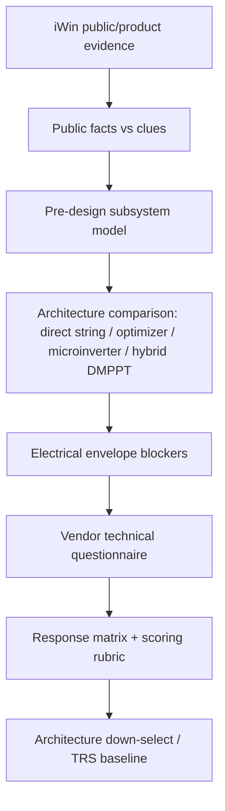

me:
remind me where we stopped? what are last decisions and conclusions, in what direction were we conducting the last researchs?

---

answ
## Where we stopped

We stopped at the **pre-design architecture + vendor-data closure stage**, not at final design.

The project had already shifted from “generic BIPV” to an **iWin-specific subsystem model**: window stack + PV slats + dynamic shading + thermal path + feedthrough/service + DMPPT electrical architecture. The project companion explicitly frames iWin-type work around **window-stack physics, dynamic slat-angle control, electrical mismatch inside moving glazing-integrated elements, feedthrough/seal/service architecture, and commissioning diagnostics**.

## Last main conclusions

|Area|Last conclusion|Status|
|---|---|---|
|Product framing|Treat iWin as an **electro-optical-thermal-mechanical-control-service façade subsystem**, not as normal façade PV.|Fixed project framing|
|Architecture direction|**DMPPT is the correct direction**. Working preference was hierarchical DMPPT: slat/string-level partitioning → local/zonal DC-DC DMPPT or optimizer stage → floor/building-level inverter.|Working recommendation, not frozen|
|Microinverter vs optimizer|Microinverters remain valid for parallel independence and fault isolation, but for 60–160 W window/blind units the better research direction became **optimizer/DMPPT granularity with serviceable electronics**, unless electrical-envelope data proves otherwise.|Conditional|
|Direct stringing|Not suitable as the main architecture under dynamic slat self-shading unless vendor data proves very benign mismatch behavior.|Deprioritized|
|Bypass topology|The strongest public technical clue is that **one bypass diode per string** outperformed **two strings sharing one bypass diode**, with lower temperature and >20% higher spring/summer yield in the cited pilot context.|High-priority design clue|
|Thermal|Temperature is a **qualification trigger / design unknown**, not a publicly proven overheating failure. The pilot clue does not justify claiming extreme thermal problems.|Open engineering task|
|Standards|IEC 62548-1 became the electrical-design backbone; IEC 62446 is handover/commissioning/O&M, not a substitute for array design.|Fixed standards framing|
|Vendor closure|The next phase is controlled vendor-data acquisition, not more loose web research.|Active next step|

## Last important design gate

We explicitly decided **not to freeze or honestly score an architecture** until the electrical and service boundary fields are populated:

```text
Voc,max = Nseries × Voc,unit,STC × [1 + |βVoc| × (25°C - Tcell,min)]

Isc,max = Nparallel × Isc,unit,STC × (Gmax / 1000 W/m²) × [1 + αIsc × (Tcell - 25°C)]
```

Blocked inputs:

- `Voc`, `Vmp`, `Isc`, `Imp`
    
- temperature coefficients
    
- actual PV chemistry / stack
    
- slat/string/sub-string map
    
- bypass allocation
    
- allowed series/parallel aggregation
    
- MPPT/PCE voltage window
    
- disconnect/isolation boundary
    
- connector/cable/feedthrough definition
    
- replacement boundary
    

The standards/design-envelope file says these calculations and fields are mandatory before architecture scoring.

## Last open assumptions

The assumption register still has only two items closed as public facts:

1. PV blind integrated inside insulating double-glazed window.
    
2. Product combines PV generation, light/solar control, and glare protection.
    

Everything else relevant to design freeze is still open: thin-film exact technology, cavity/chamber position, feedthrough route, local actuation concept, isolation boundary, temperature sensing, connector/cable class, and replacement/maintenance proof.

## Direction of the last research

The last research direction was:



So the current best continuation is:

**Phase 1:** fill vendor-data gaps.  
**Phase 2:** calculate `Voc,max`, `Isc,max`, MPPT windows, grouping limits.  
**Phase 3:** compare architectures quantitatively for Lugano office façade, 60 m²/floor, 3–5 floors, 60–160 W per blind/unit.  
**Phase 4:** produce capstone memo / architecture recommendation with explicit blockers.

## Most useful next action

Continue with the **vendor-response workflow**: use the questionnaire to request revision-controlled datasheets, section drawings, electrical interconnect/bypass topology, control architecture, thermal qualification evidence, replacement procedure, and commissioning limits. The questionnaire was created exactly to close the vendor-data items blocking architecture down-select and TRS baselining.

---

([Past chat][1])([Past chat][2])([Past chat][3])([Past chat][4])([Past chat][5])([Past chat][6])([Past chat][7])([Past chat][8])([Past chat][9])([Past chat][10])([Past chat][11])([Past chat][12])([Past chat][13])([Past chat][14])([Past chat][15])

## Executive summary

We currently have **many numeric placeholders / reference values**, but **almost no vendor-closed electrical values** for the actual iWin product revision. The useful split is:

1. **Input values** — scenario, public anchors, standard/model constants, reference assumptions.
2. **Derived values** — façade area totals, installed-power ranges, rough annual-yield placeholders, architecture-gating formulas.

The hard blocker remains: **no final `Voc,max`, `Isc,max`, MPPT-window validation, string count, cable/connector rating, or protection design can be closed until the vendor gives `Pmax, Voc, Vmp, Isc, Imp, βVoc, αIsc`, subdivision, bypass topology, and aggregation rules.** The standards/design-envelope file explicitly keeps these as required architecture fields before scoring. 

---

me
list numerical values that we have:

1. input
    
2. derived

---

answ
# 1. Input numerical values we have

## A. Project scenario inputs

|                                  Value | Meaning                                                                            | Status                 |
| -------------------------------------: | ---------------------------------------------------------------------------------- | ---------------------- |
|                **Lugano, Switzerland** | Reference climate / location                                                       | Project scenario input |
| **South / south-west vertical façade** | Reference façade orientation                                                       | Project scenario input |
|                    **60 m² per floor** | Gross iWin PV-blind façade area per floor                                          | Project scenario input |
|                         **3–5 floors** | Scenario range                                                                     | Project scenario input |
|                 **180 / 240 / 300 m²** | Total blind area for 3 / 4 / 5 floors                                              | Derived from scenario  |
|     **60–160 W per blind/window unit** | Typical unit/blind `Pmax` working assumption                                       | Not vendor-closed      |
|                           **60–160 W** | Also used as the expected low-power range that makes architecture choice sensitive | Engineering input      |

## B. Power-density assumptions used earlier

|        Value | Meaning                                  | Status                 |
| -----------: | ---------------------------------------- | ---------------------- |
|  **70 W/m²** | Low gross STC power-density placeholder  | Engineering assumption |
|  **90 W/m²** | Mid gross STC power-density placeholder  | Engineering assumption |
| **110 W/m²** | High gross STC power-density placeholder | Engineering assumption |

These are **not vendor data**. They are useful for order-of-magnitude façade sizing only.

## C. Reference electrical unit assumption used in one earlier dimensioning pass

|             Value | Meaning                                                 | Status                                                 |
| ----------------: | ------------------------------------------------------- | ------------------------------------------------------ |
|       **200 Wdc** | Representative PV unit power used in an earlier example | Placeholder; now weaker than 60–160 W/blind assumption |
|   **45 V / 36 V** | Example `Voc / Vmp`                                     | Placeholder only                                       |
| **6.0 A / 5.5 A** | Example `Isc / Imp`                                     | Placeholder only                                       |
|    **−0.28 %/°C** | Example `βVoc`                                          | Placeholder only                                       |
|    **+0.04 %/°C** | Example `αIsc`                                          | Placeholder only                                       |

I would keep this older **200 Wdc example** only as a calculation demo, not as the baseline, because the newer working range is **60–160 W per blind/window unit**.

## D. Public / product-proximate performance clue

|                                Value | Meaning                                             | Status                 |
| -----------------------------------: | --------------------------------------------------- | ---------------------- |
|                             **2024** | SUPSI/Solar RRL product-proximate pilot result year | Public technical clue  |
|        **1 bypass diode per string** | Optimized slat design                               | Public technical clue  |
| **2 strings sharing 1 bypass diode** | Standard/reference design                           | Public technical clue  |
|  **>20% higher spring/summer yield** | Reported optimized-vs-standard gain                 | Product-proximate clue |
|         **lower module temperature** | Reported qualitative thermal improvement            | Product-proximate clue |

This is currently the strongest architecture-relevant public numerical clue: one bypass diode per string outperformed two strings sharing one bypass diode, with **>20% higher spring/summer yield** and lower module temperature under the reported pilot conditions. 

## E. STC / modeling constants

|                          Value | Meaning                                              | Status                     |
| -----------------------------: | ---------------------------------------------------- | -------------------------- |
|                  **1000 W/m²** | STC irradiance / reference irradiance in formulas    | Standard PV modeling input |
|                      **25 °C** | STC cell temperature                                 | Standard PV modeling input |
|                     **AM1.5G** | STC reference spectrum                               | Standard PV modeling input |
| **1 year hourly weather file** | Solar access simulation input granularity            | Design-process input       |
|                     **0–23 h** | Daily profile resolution shown in guidebook examples | Contextual reference       |

The project formulas also use **1000 W/m²** and **25 °C** directly in the `Voc,max` and `Isc,max` checks. 

## F. BIPV guidebook reference values useful for sanity checks

|                                  Value | Meaning                                        | Use                  |
| -------------------------------------: | ---------------------------------------------- | -------------------- |
|                             **19–22%** | Typical mono-Si module efficiency range        | Contextual benchmark |
|                             **18–20%** | Typical multi-Si module efficiency range       | Contextual benchmark |
|                             **18–22%** | Typical SHJ module efficiency range            | Contextual benchmark |
|                               **6–8%** | Typical amorphous-Si module efficiency range   | Thin-film benchmark  |
|                             **17–19%** | Typical CdTe module efficiency range           | Thin-film benchmark  |
|                             **16–18%** | Typical CIGS module efficiency range           | Thin-film benchmark  |
|                     **0.25–0.28 %/°C** | Typical power temp coefficient for a-Si / CdTe | Modeling reference   |
|                     **0.36–0.46 %/°C** | Typical power temp coefficient for CIGS / c-Si | Modeling reference   |
|                         **~0.45 %/°C** | Typical crystalline-Si sensitivity cited       | Modeling reference   |
|                            **PR >74%** | Achievable PR with good system design          | Sanity check         |
|                         **20–25% SSI** | Typical self-sufficiency without storage       | Contextual           |
| **>40% SSI difficult without storage** | Self-sufficiency threshold                     | Contextual           |

These are **not iWin-specific**. They are guidebook-level sanity-check values. The guidebook also explicitly warns that BIPV façades have uneven irradiance and frequent partial shading, so a single façade-wide irradiance assumption is weak unless segmented/time-series analysis is done. 

## G. Thermal model inputs / reference values

|                                 Value | Meaning                                                                                           | Status                            |
| ------------------------------------: | ------------------------------------------------------------------------------------------------- | --------------------------------- |
|                             **70 °C** | 98th-percentile module operating-temperature threshold in project thermal trigger                 | Standards/design-envelope trigger |
|                     **60 °C approx.** | Typical upper module temperature region in ventilated BIPV façade mock-ups from guidebook context | Contextual                        |
|                             **15 °C** | Reported difference between ventilated and insulated modules                                      | Contextual                        |
|  **a = −3.47, b = −0.0594, ΔT = 3 K** | Sandia-style model values: open rack / good ventilation                                           | Contextual model input            |
|  **a = −2.98, b = −0.0471, ΔT = 1 K** | Medium rear ventilation                                                                           | Contextual model input            |
|  **a = −2.81, b = −0.0455, ΔT = 0 K** | Poor rear ventilation                                                                             | Contextual model input            |
|  **a = −2.85, b = −0.0351, ΔT = 9 K** | Double-glazed BIPV window with one low-e coating                                                  | Relevant contextual model input   |
| **a = −2.88, b = −0.0319, ΔT = 11 K** | Triple-glazed BIPV window with two low-e coatings                                                 | Contextual model input            |

For iWin, the **double-glazed BIPV window row** is the most relevant among these, but still not automatically valid because the actual cavity/chamber, blind position, gas fill, slat angle, and thermal coupling are vendor-data gaps. 

## H. Standard/component limits already noted

|                 Value | Meaning                                            | Status                                 |
| --------------------: | -------------------------------------------------- | -------------------------------------- |
|          **1500 Vdc** | IEC 62852 connector limit noted in reading tracker | Standards reference, not design target |
| **125 A per contact** | IEC 62852 connector limit noted in reading tracker | Standards reference, not design target |
|          **1.5 kVdc** | IEC 62930 PV DC cable rating note                  | Standards reference, not design target |

These are **component-standard ceiling/context values**, not recommended operating values for the iWin façade.

## I. FMEA / scoring inputs

|                        Value | Meaning                                             | Status         |
| ---------------------------: | --------------------------------------------------- | -------------- |
|                     **1–10** | Severity / occurrence / detectability scoring scale | FMEA rule      |
|          **RPN = S × O × D** | Risk priority number                                | FMEA formula   |
|                    **S ≥ 9** | Mandatory action gate                               | FMEA rule      |
|     **Top 10 failure modes** | Week-4 FMEA seed target                             | Planning value |
| **Top 5 actions / unknowns** | Later-stage summary targets                         | Planning value |

The project explicitly says not to let a moderate RPN hide high-severity failures, especially electrical isolation, fire/hot-spot, latent faults, or unsafe mechanical states. 

## J. Vendor-screening numerical rules

|                       Value | Meaning                                    | Status      |
| --------------------------: | ------------------------------------------ | ----------- |
|   **Priority A weight = 5** | Vendor scoring weight                      | Rubric rule |
|   **Priority B weight = 3** | Vendor scoring weight                      | Rubric rule |
|               **Score 0–5** | Completeness / evidence / adequacy scoring | Rubric rule |
|       **Residual risk 0–5** | Penalty field, higher is worse             | Rubric rule |
| **Technical adequacy <3.0** | Mandatory review flag                      | Rubric rule |
|        **Residual risk ≥4** | Mandatory review flag                      | Rubric rule |

Formula:

```text
Weighted Score = Weight × MAX(0, AVERAGE(Completeness, Evidence, Adequacy) - 0.5 × ResidualRisk)
```

This is for vendor screening, not physical design. 

---

# 2. Derived numerical values we have

## A. Total façade blind area

From:

```text
Afloor = 60 m²/floor
Nfloors = 3…5
```

| Floors |       Area |
| -----: | ---------: |
|      3 | **180 m²** |
|      4 | **240 m²** |
|      5 | **300 m²** |

## B. Installed DC capacity from gross power-density scenarios

Formula:

```text
Pdc,kWp = Area × PowerDensity / 1000
```

| Floors |   Area |      70 W/m² |      90 W/m² |     110 W/m² |
| -----: | -----: | -----------: | -----------: | -----------: |
|      3 | 180 m² | **12.6 kWp** | **16.2 kWp** | **19.8 kWp** |
|      4 | 240 m² | **16.8 kWp** | **21.6 kWp** | **26.4 kWp** |
|      5 | 300 m² | **21.0 kWp** | **27.0 kWp** | **33.0 kWp** |

## C. Rough annual energy placeholder

Earlier placeholder:

```text
Eannual ≈ 1020 kWh/kWp·yr × Pinstalled,kWp
```

| Floors |          70 W/m² |          90 W/m² |         110 W/m² |
| -----: | ---------------: | ---------------: | ---------------: |
|      3 | **12.85 MWh/yr** | **16.52 MWh/yr** | **20.20 MWh/yr** |
|      4 | **17.14 MWh/yr** | **22.03 MWh/yr** | **26.93 MWh/yr** |
|      5 | **21.42 MWh/yr** | **27.54 MWh/yr** | **33.66 MWh/yr** |

Use this only as a **sanity placeholder**. It does not include dynamic slat angle, self-shading, thermal derating, control priority, façade obstruction, partial shading, or actual iWin IV curves.

## D. Mid-case installed capacity

Using the preferred mid placeholder:

```text
90 W/m² × 60 m²/floor = 5.4 kWp/floor
```

| Floors | Mid-case capacity |
| -----: | ----------------: |
|      3 |      **16.2 kWp** |
|      4 |      **21.6 kWp** |
|      5 |      **27.0 kWp** |

## E. Possible unit-count range — only weakly derivable

Using only installed power and assumed **60–160 W/unit**, possible unit count is:

```text
Nunits ≈ Pinstalled / Punit
```

For the full power-density/floor range:

| Case                        | Capacity | With 160 W/unit | With 60 W/unit |
| --------------------------- | -------: | --------------: | -------------: |
| Smallest: 3 floors, 70 W/m² | 12.6 kWp |   **~79 units** | **~210 units** |
| Mid: 3 floors, 90 W/m²      | 16.2 kWp |  **~101 units** | **~270 units** |
| Mid: 5 floors, 90 W/m²      | 27.0 kWp |  **~169 units** | **~450 units** |
| Largest: 5 floors, 110 W/m² | 33.0 kWp |  **~206 units** | **~550 units** |

This is **not strong enough for layout** because unit area/window module geometry is missing.

## F. Mandatory derived electrical values — still blocked

These are the two required outputs, but we **cannot calculate numeric results yet**:

```text
Voc,max = Nseries × Voc,unit,STC × [1 + |βVoc| × (25°C - Tcell,min)]
```

```text
Isc,max = Nparallel × Isc,unit,STC × (Gmax / 1000 W/m²) × [1 + αIsc × (Tcell - 25°C)]
```

Required missing inputs:

| Input                    | Status                              |
| ------------------------ | ----------------------------------- |
| `Voc,unit,STC`           | Vendor-data required                |
| `Vmp,unit,STC`           | Vendor-data required                |
| `Isc,unit,STC`           | Vendor-data required                |
| `Imp,unit,STC`           | Vendor-data required                |
| `βVoc`                   | Vendor-data required                |
| `αIsc`                   | Vendor-data required                |
| `Nseries`                | Architecture-dependent              |
| `Nparallel`              | Architecture-dependent              |
| `Tcell,min`              | Site + product + mounting dependent |
| `Gmax`                   | Site/design criterion dependent     |
| MPPT/PCE voltage window  | Vendor/PCE dependent                |
| Maximum aggregation rule | Vendor-data required                |

The project file explicitly states that these calculations must exist before architecture scoring. 

---

# 3. Current numerical state table

| Category                      |  Have usable numbers? | Quality                          |
| ----------------------------- | --------------------: | -------------------------------- |
| Scenario geometry             |                   Yes | Good enough for pre-design       |
| Area totals                   |                   Yes | Derived, solid                   |
| Installed capacity            |                   Yes | Placeholder only                 |
| Annual yield                  |                   Yes | Rough placeholder only           |
| Unit power                    |                   Yes | Assumed range, not vendor-closed |
| Unit `Voc/Vmp/Isc/Imp`        |                    No | Blocked                          |
| Temp coefficients             |     Only placeholders | Blocked                          |
| Slat/string/sub-string counts |                    No | Blocked                          |
| Bypass topology               |      Public clue only | Needs vendor schematic           |
| `Voc,max`                     |          Formula only | Blocked                          |
| `Isc,max`                     |          Formula only | Blocked                          |
| MPPT compatibility            |                    No | Blocked                          |
| Thermal max / guardband       | Reference values only | Needs thermal evidence           |
| FMEA scoring                  |                   Yes | Methodological                   |
| Vendor scoring                |                   Yes | Methodological                   |

## Bottom line

Numerically, we are here:

```text
Scenario sizing:        usable
Architecture scoring:   not yet legitimate
Electrical envelope:    blocked
Thermal qualification:  trigger logic exists, product values missing
Vendor screening:       workflow ready
```

The next useful numerical closure is **vendor ELE-01 to ELE-06 + THM-01 to THM-03**: electrical datasheet, PV stack, subdivision, bypass allocation, IV/PV curves, allowed aggregation, and thermal evidence. The questionnaire asks exactly for those fields. 

[1]: https://chatgpt.com/c/69de4525-6078-832f-ac9b-cc28aafcd1eb "iWin BIPV Roadmap"
[2]: https://chatgpt.com/c/69dcb545-d2a0-838f-92de-262e08cd620d "iWin Project Companion"
[3]: https://chatgpt.com/c/69d8aa62-59b0-8388-b3fd-1128a514b446 "BIPV Shading Device Comparison"
[4]: https://chatgpt.com/c/6a046959-2808-8328-93c0-065bb785e275 "Project research status"
[5]: https://chatgpt.com/c/6a0470b6-64ec-832b-9345-1f1f65dca838 "UPE Prompt for BIPV Update"
[6]: https://chatgpt.com/c/69de3c1f-92e8-832a-bb39-50200a17b836 "BIPV Inverter Architecture Comparison"
[7]: https://chatgpt.com/c/69a592e8-7d40-8384-911f-237a4c94b9ae "KNX Photovoltaic Expert Persona"
[8]: https://chatgpt.com/c/69de22aa-0fc4-8327-ab86-0d4797848794 "BIPV Assistant Prompt"
[9]: https://chatgpt.com/c/69dd09cf-6658-8331-8668-41d5bf73a804 "GPT Pro vs GPT Plus"
[10]: https://chatgpt.com/c/69f3fe3a-2304-8332-acff-23b42d44e6d0 "One‑page project summary template for engineers"
[11]: https://chatgpt.com/c/69de5e07-8b68-832d-905a-37d36d63bc8a "Norms and Pass Conditions"
[12]: https://chatgpt.com/c/69ef23b9-0a1c-8385-b0d2-156c30210606 "Formal Mail Composer Update"
[13]: https://chatgpt.com/c/69fc0eef-ff04-832e-a4eb-e038fd4e8cf3 "UPE — Spec persona pronta all’uso"
[14]: https://chatgpt.com/c/69a70037-4c84-838b-a770-8616ec5b9628 "Improved KNX-BCS Diagram"
[15]: https://chatgpt.com/c/69ec840d-7704-8385-907e-84a6b7791f0f "30+ KNX Blind Control System"
