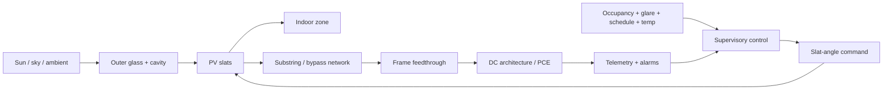

me: Specialized roadmap for iWin-type products and practical use case of an office building façade in Lugano, Switzerland, 60m2 of iwin pv blinds per piano, 3-5 pianos.
What changes versus generic BIPV

For generic BIPV, the first lessons are usually façade orientation, shading, strings, and standards.
For iWin-type products, the highest-value lessons shift to window-stack physics + dynamic shading + electrical mismatch inside a glazing-integrated moving element. That shift is justified by the product architecture itself and by recent SUPSI-linked work on a dynamic, vertically oriented BIPV shading device, where slat/string electrical design measurably affected both temperature and yield. In that 2024 study, an “optimized” slat design with one bypass diode per string outperformed a “standard” design where two strings shared one bypass diode, achieving more than 20% energy gain in spring and summer while also lowering module temperature.

The six Pareto lessons for iWin
1. Treat it as an electro-optical-thermal window subsystem

Do not model it as “just PV on a façade.” It is simultaneously:

an insulating glazing unit component,
a solar-shading device,
a daylight/glare control element,
and a PV generator.
2. Blind angle / control strategy matters almost as much as PV efficiency

Because the product is fundamentally a photovoltaic venetian blind, performance depends on how you schedule shading state against sun angle, glare, cooling load, and power generation. This is a design inference from the product function claims and the dynamic-shading research context; it is the correct first-order learning target for this architecture.

3. Thermal behavior inside/around the glazing unit is first-order

BIPV standards and guidebook work emphasize that BIPV must be treated as both a building product and a building-integrated PV system, and current high-temperature qualification guidance exists specifically because some PV deployments run outside the temperature envelope assumed in base qualification. For iWin-type systems, that risk is structurally important because PV is embedded in a glazing/shading assembly rather than freely rear-ventilated like a rooftop module.

4. String partitioning and bypass design are not details

The 2024 dynamic BIPV shading paper is the strongest public clue here: electrical subdivision at the slat/string level changed both temperature and yield materially. For iWin-type products, mismatch learning is therefore not optional.

5. Frame/feedthrough/seal reliability is a core design topic

Once PV and shading are enclosed in an insulating window, wiring exits, moving interfaces, sealing, and long-term environmental robustness become central. This is an engineering inference from the public architecture and from the fact that IEC 63092 splits requirements between BIPV modules as building products and BIPV systems integrated into buildings.

6. Design serviceability and commissioning from day 1

Even if the sealed environment reduces dirt/weather exposure, commissioning and documentation remain essential, and inaccessible façade-integrated hardware always raises replacement/diagnostics stakes. IEC 62446-1 is the baseline framework for documentation, inspection, and commissioning tests. The “almost no maintenance” wording on the iWin site should be treated as a vendor claim, not as permission to defer access strategy.

Architecture sketch to keep in mind
Solar radiation
      ↓
[Outer glass pane]
      ↓
[Sealed glazing cavity / insulating unit]
      ↓
[PV venetian blind slats]
      ├─ optical function: shading / glare / daylight modulation
      ├─ electrical function: PV generation
      └─ thermal effect: absorbs + redistributes solar load
      ↓
[Inner glass pane]
      ↓
Indoor space

Electrical path:
PV slats → string partition / bypass network → frame feedthrough → local DC wiring / MLPE / inverter path

Control path:
sun / glare / temperature / occupancy logic → slat-angle command → optical + electrical operating point

---

answ: [](https://www.gettyimages.com/)

# iWin-type roadmap for a Lugano office façade

For this case, the sequence should shift from generic BIPV’s `orientation → yield → stringing → standards` to `section → control states → slat mismatch → thermal qualification → feedthrough/service → downstream architecture`. That is not stylistic; it follows the public product definition itself. iWin is described as a photovoltaic venetian blind integrated inside an insulating double-glazed window, combining renewable generation with light/solar control and glare protection in a sealed chamber, with thin-film PV indicated publicly as a clue and multi-story glazed buildings named as a target market. SUPSI/ISAAC ties iWin to the research lineage, and the 2024 Solar RRL paper reports that one bypass diode per string delivered lower module temperatures and more than 20% higher spring/summer yield than a design where two strings shared one diode. ([iWin](https://iwin.ch/product/?utm_source=chatgpt.com "Product - iWin"))

This also matches the project pack: the weekly checklist, assumption register, standards/design-envelope matrix, FMEA template, capstone memo, commissioning skeleton, and vendor questionnaire already push the work toward section physics, control logic, mismatch, serviceability, and vendor-data closure rather than generic façade-PV sequencing.

## 1. What changes versus generic BIPV

|Topic|Generic BIPV first question|iWin-type first question|
|---|---|---|
|Unit of analysis|façade PV field|IGU/cavity + PV slats + actuator + feedthrough + control zone|
|Main objective|kWh, PR, façade orientation|kWh + glare/daylight + solar-gain control + temperature margin + serviceability|
|First model|irradiance/yield model|section thermal/optical model + slat-state table|
|Early electrical work|string length, MPPT, protection|slat substring/bypass partitioning, grouping by control/shading class|
|Early thermal work|rear ventilation, façade temperature|cavity/chamber heat path, frame-edge temperatures, electronics hot spots, T98 review|
|Early reliability work|modules, connectors, inverter|seals, feedthroughs, moving conductors, actuator integration, replacement boundary|
|Commissioning focus|polarity, continuity, string checks|polarity + angle accuracy + fail-safe states + telemetry + fault localization|
|Early KPI set|kWh/kWp, PR, payback|kWh + glare events + daylight acceptability + slat temperature margin + actuator cycles + MTTR|

The standards stack changes emphasis too. For this architecture, the module/system split from IEC 63092-1/-2 matters immediately; IEC 62548-1 remains the electrical backbone; IEC 62446-1 remains the handover/commissioning baseline; and the IEC 61730-1 / IEC TS 63126 temperature trigger has to stay visible because glazing-integrated PV can live in a different thermal regime from open-back modules. The IEA PVPS BIPV guidebook is also explicitly framed as a step-by-step deployment roadmap, which fits this kind of gated workflow. ([IEC Webstore](https://webstore.iec.ch/en/publication/32158 "https://webstore.iec.ch/en/publication/32158"))

## 2. Lugano office use case — scenario and first-pass numbers

For a practical base case, use a **south or south-west glazed office façade in Lugano** as the reference scenario and treat east/west as the harsher glare variant. With **60 m² of iWin per floor**, the gross installed area is:

|Floors|Gross iWin area|
|--:|--:|
|3|180 m²|
|4|240 m²|
|5|300 m²|

Lugano is a strong comfort-critical test case. MeteoSwiss identifies Lugano as the warmest location in Switzerland in the 1991–2020 normals, with an annual average temperature of 13.0°C, and notes that the south side of the Alps averages roughly 10–20 days per year at 30°C or above. A recent Swiss Federal Office of Energy report also uses a **south-facing vertical façade in Lugano at about 1,020 kWh/kW**, while noting that façade PV often shows slightly lower performance ratios than rooftop PV because partial shading is more common. ([MeteoSwiss](https://www.meteoswiss.admin.ch/climate/the-climate-of-switzerland/records-and-extremes.html?utm_source=chatgpt.com "Records and extremes"))

A useful geometry consequence at Lugano’s latitude is that a **south-vertical façade shifts useful beam capture toward winter and the shoulder seasons**. A simple solar-geometry check gives solar-noon beam factors on a south-vertical plane of about **0.94 at winter solstice, 0.72 at equinox, and 0.38 at summer solstice**. That means summer is still critical, but more because of **glare, cooling-load moderation, and temperature control** than because a south-vertical plane is electrically strongest at noon.

For a first-pass Lugano energy placeholder, keep the Swiss façade benchmark explicit:

```text
Eannual ≈ 1,020 × Pinstalled,kWp
Eannual ≈ 1.02 × A × Pdens,gross
```

Where:

- `A` = iWin area in m²
    
- `Pdens,gross` = gross rated power density in Wp/m²
    

That gives:

|Floors|Annual energy placeholder|
|--:|--:|
|3|`183.6 × Pdens,gross` kWh/yr|
|4|`244.8 × Pdens,gross` kWh/yr|
|5|`306.0 × Pdens,gross` kWh/yr|

This is only a **contextual south-façade placeholder**, not an iWin guarantee. Rated Wp/m², active-area fraction, slat spacing, actual bypass topology, allowed aggregation, and control-state losses remain vendor-data required. Lower floors also should not be assumed to scale linearly with upper floors; the 2024 SUPSI paper explicitly reports lower specific yield on the first floor because of partial shading. ([pubdb.bfe.admin.ch](https://pubdb.bfe.admin.ch/de/publication/download/12458 "Vorlage Skript/Bericht mit Titelbild zweispaltig (de)"))

## 3. Practical operating concept for the office façade

Treat each floor as both a **comfort zone** and an **electrical heterogeneity zone**. The minimum practical granularity is not “one façade, one PV field.” It is “one electrical/control group per persistent shading and occupancy class.” On a 60 m² office façade, that usually means **2–4 zones per floor**, not one monolithic group.



A practical state table for Lugano offices is:

|Condition|Preferred iWin posture|Building priority|Electrical note|
|---|---|---|---|
|Summer clear sky, occupied, south façade|Hybrid comfort-first tilt; avoid all-open noon state|glare + cooling-load control|accept some off-optimum PV angle to control heat and glare|
|Summer clear sky, occupied, east/west façade|Stronger comfort-first closure during low-angle sun|glare suppression|morning/afternoon mismatch risk increases at edge zones|
|Winter clear sky, occupied|More open daylight/yield hybrid|daylight + useful winter generation|south-vertical plane is seasonally more favorable than in summer noon|
|Overcast occupied hours|Daylight-first, low-motion strategy|visual comfort and actuator life|PV yield is secondary; avoid unnecessary cycling|
|Fault, loss of comms, sensor loss|Defined fail-safe angle + intended isolation boundary|safe state + diagnosability|this must be testable, not narrative-only|

That logic is consistent with the project control/fail-safe structure and with the FMEA and commissioning templates, which already require angle-response verification, fallback behavior on sensor/communication loss, telemetry checks, and fault-localization drills.

## 4. Specialized roadmap for this Lugano case

This is the iWin-specific roadmap I would use for a 3–5 floor Lugano office stack:

|Phase|Required output|Hard gate|Why it matters more here|
|---|---|---|---|
|1. Scenario freeze|façade orientation, floor-by-floor shading classes, occupancy schedule|no hidden assumptions|lower floors and edge bays will not scale like upper floors|
|2. Section + service boundary|section drawing, cavity/chamber definition, feedthrough route, replaceable boundary|section assumptions visible|iWin is a window-stack subsystem, not just façade PV|
|3. Control-state model|comfort-first, yield-first, hybrid tables; fail-safe angle|control no longer narrative-only|slat angle changes optics, thermal loading, and electrical mismatch simultaneously|
|4. Slat mismatch study|one-diode/string vs shared-diode cases; edge-shade and floor-shade cases|grouping respects heterogeneity|public evidence already shows material temperature and yield differences|
|5. Thermal qualification screen|slat/cavity/frame/electronics temperature paths; T98 review|high-temperature trigger answered explicitly|glazing integration can move the product outside the base qualification envelope|
|6. Electrical envelope|unit datasheet, grouping, MPPT window, disconnect, protection, `Voc,max`, `Isc,max`|no architecture scoring until filled|IEC 62548 discipline must be visible before down-select|
|7. Diagnostics + service|unit ID map, telemetry, top FMEA actions, replacement levels|plausible fault-localization route exists|inaccessible façade hardware raises MTTR and replacement stakes|
|8. Commissioning + handover|single-line, point list, acceptance limits, recommissioning procedure|handover evidence structure exists|wrong replacement or bad recommissioning can create latent faults|

This is a Lugano-specific adaptation of the project’s weekly checklist and standards/design-envelope rules, and it should pull directly from the vendor questionnaire because four of the gates above are blocked without vendor evidence.

## 5. Electrical envelope — explicitly blocked today

The project rule remains correct here: **no preferred downstream architecture yet**. Public sources do not provide the minimum fields needed to choose between direct stringing, optimizer-based grouping, or more modular partitioning. What is still missing is exactly what the project files already flag as vendor-data required: unit `Voc`, `Vmp`, `Isc`, `Imp`; temperature coefficients; actual slat subdivision; bypass allocation; allowed series/parallel aggregation; PCE window; connector/cable/feedthrough definition; and the intended isolation and replacement boundaries.

The required calculations are therefore still **blocked**, not waived:

```text
Voc,max = Nseries × Voc,unit,STC × [1 + |βVoc| × (25°C - Tcell,min)]

Isc,max = Nparallel × Isc,unit,STC × (Gmax / 1000 W/m²) × [1 + αIsc × (Tcell - 25°C)]
```

That is exactly the right discipline under IEC 62548-1, whose scope covers PV array design requirements including DC wiring, protection, switching, and earthing. ([IEC Webstore](https://webstore.iec.ch/en/publication/64171?utm_source=chatgpt.com "IEC 62548-1:2023"))

The only defensible interim electrical rule is this: **do not group across persistent shading classes, independent slat-control zones, or replacement boundaries**. In a 3–5 floor urban façade, lower floors, edge bays, and differently operated zones are not electrically homogeneous enough to assume they belong on one shared architecture by default. The pilot paper’s first-floor shading penalty is the warning sign. ([ARIS](https://aris.supsi.ch/entities/publication/ccbac461-bea4-4f82-a19d-b8eccefeda95?utm_source=chatgpt.com "Performance Analysis of Dynamic Building-Integrated ..."))

## 6. Service and risk consequence

Do not let the public “almost no maintenance” claim collapse the service design. For iWin-type products, feedthrough isolation, conductor fatigue at moving interfaces, commanded-angle mismatch, actuator stall, local overtemperature, and wrong reconnection after replacement remain first-order risks. The project FMEA template already treats loss of isolation, hot-spot risk, latent faults, and unsafe mechanical states as mandatory-action items, and the commissioning template requires the replacement/recommissioning path to be explicit. ([iWin](https://iwin.ch/product/?utm_source=chatgpt.com "Product - iWin"))

## 7. Recommendation

For this Lugano scenario, the cleanest pre-design stance is:

- **Use a south-façade office stack as the baseline case.**
    
- **Zone each floor by shading/control homogeneity rather than treating 60 m² as one electrical blind field.**
    
- **Keep the first design loop focused on section, control, mismatch, thermal review, and service boundary.**
    
- **Do not down-select the DC architecture until vendor data closes the blocked electrical-envelope fields.**
    

A **3-floor stack** is the cleaner validation case; **5 floors** becomes reasonable once floor-specific shading, thermal margins, and replacement boundaries are evidenced. Confidence is **medium** on the roadmap and **low-to-medium** on the final architecture because the critical vendor closures are still open. Those closures are the same ones already called out in the assumption register, standards/design-envelope matrix, and vendor questionnaire.

Immediate project-artifact updates for this scenario are: add a Lugano office case to the capstone memo, add orientation and floor-shading assumptions to the assumption register, mark `Voc,max` and `Isc,max` as blocked in the standards/design-envelope matrix, and open FMEA rows for feedthrough isolation, motion-conductor fatigue, commanded-angle mismatch, and replacement reconnection error.

---

me: ## in sources i added:  
IEC 62548-2016 - Photovoltaic (PV) arrays - Design requirements  
Building-Integrated Photovoltaics -- A Technical Guidebook - 2025 -Nuria Martín Chivelet

I don't need 1% precision, my goal is to research best suitable architecture (clearly a DMPPT) and to perform system dimensioning for iWin blinds which produce Pmax from 60W to 160W, under typical climate conditions and space: office building façade in Lugano, Switzerland, 60m2 of iWin pv venetian SD per piano, 3-5 pianos.

---

answ:
## Architecture call

Yes on **DMPPT**, but not necessarily **microinverter-per-unit**.

The strongest **pre-design** choice for this iWin-type Lugano office case is a **hierarchical DMPPT architecture**:

```text
slat strings
  → internal bypass partitioning inside the blind/module
  → window / cassette junction
  → zonal DC-DC DMPPT (serviceable frame/mullion/electrical zone)
  → floor DC section
  → floor-level or multi-floor multi-MPPT string inverter
  → building AC board
```

That recommendation is grounded in four points:

**Standards-backed.** IEC 62548 is the array-design backbone for DC wiring, protection, switching, and earthing, and it explicitly supports PV sections feeding **multiple MPPT/DC inputs**. Where those MPPT inputs are separate, each section may be treated as a separate PV array, with its own isolation requirements.

**Guidebook-backed.** The 2025 BIPV guidebook says that BIPV often faces **non-homogeneous irradiance** and more frequent **partial shading** than rooftop PV, and therefore central-inverter treatment is often not advisable; the system should be electrically divided into segments with similar operating conditions and then use string/multi-string inverters, microinverters, or DC-DC optimizers as appropriate. Its louver/shading section also states that when shading is unavoidable, **power optimizers or microinverters** can help.

**Product-proximate evidence.** The SUPSI-linked 2024 result for a dynamic vertically oriented BIPV shading device reports that a finer internal slat electrical design, with **one bypass diode per string** instead of two strings sharing one diode, produced **lower module temperatures** and **more than 20% higher spring/summer yield**. That means internal partitioning is not cosmetic; it materially changes energy and temperature. ([repository.supsi.ch](https://repository.supsi.ch/16074/?utm_source=chatgpt.com "Dynamic BIPV Shading Systems: Performance Analysis for ..."))

**Engineering inference.** Because this is glazing-integrated, moving, and service-sensitive hardware, I would keep external power electronics in **accessible frame/mullion/service zones**, not inside the sealed chamber, unless vendor evidence proves thermal and replacement viability. That inference is reinforced by the guidebook’s note that BIPV modules often run hotter than open-rack PV, plus IEC 62548’s explicit attention to wiring protection, tension relief, IP integrity, and condensation in combiner/wiring spaces.

## Why this beats the alternatives

|Option|Verdict|Technical read|
|---|---|---|
|**Direct strings only** into one central/floor inverter|**Too coarse** for first choice|Acceptable only if each electrical section is genuinely homogeneous in irradiance and control state. That is the opposite of an iWin-type moving louver façade.|
|**Microinverter per unit**|**Technically valid, second choice**|Best electrical independence, but more field electronics, more AC distribution at façade level, and worse service/thermal exposure if electronics end up buried in inaccessible façade regions.|
|**Zonal DC-DC DMPPT + floor multi-MPPT inverter**|**Best fit**|Keeps DMPPT granularity where mismatch actually lives, while limiting electronics count and keeping DC/AC conversion in a more serviceable location. It also maps cleanly onto IEC 62548’s sectioned-array / multi-input-PCE logic.|

So the practical answer is:

- **Do not** string 3–5 floors into one MPPT.
    
- **Do not** mix windows with different slat-control schedules on one MPPT by default.
    
- **Do** keep fine internal bypass partitioning as a first-loop design variable.
    
- **Do** use external DMPPT at the **zone** level, then aggregate to **floor-level multi-MPPT inversion**.
    

## Lugano first-pass dimensioning

For an **office/commercial** building, the correct baseline façade is **near south vertical**, because the guidebook recommends near-south BIPV where load peaks around noon. A recent Swiss federal benchmark gives about **1,020 kWh/kW per year** for a **south-facing vertical façade in Lugano**, and notes façade PV usually has a slightly lower PR than rooftop PV because partial shading is more common. Lugano/Ticino is also a warm Swiss climate, with roughly **10–20 days per year at or above 30°C** on the south side of the Alps, so temperature margin cannot be treated as a secondary issue. ([pubdb.bfe.admin.ch](https://pubdb.bfe.admin.ch/de/publication/download/12458 "Vorlage Skript/Bericht mit Titelbild zweispaltig (de)"))

### Parametric sizing

Let:

```text
Afacade,floor = 60 m²
Aunit = gross active blind/window unit area [m²]
Punit = unit Pmax at STC [W]
Nfloors = 3…5
```

Then:

```text
Nunit,floor = 60 / Aunit

Pfloor,kWp = Nunit,floor × Punit / 1000
           = 0.06 × Punit / Aunit

Ptotal,kWp = Nfloors × Pfloor,kWp

Eannual,baseline ≈ 1020 × Ptotal,kWp   [kWh/year]
```

That **1,020 kWh/kW·yr** number is a **generic south-vertical Lugano façade benchmark**, not an iWin guarantee. Real output will move with slat-angle policy, lower-floor shading, inter-louver shading, and the actual internal electrical topology. ([pubdb.bfe.admin.ch](https://pubdb.bfe.admin.ch/de/publication/download/12458 "Vorlage Skript/Bericht mit Titelbild zweispaltig (de)")) ([repository.supsi.ch](https://repository.supsi.ch/16074/?utm_source=chatgpt.com "Dynamic BIPV Shading Systems: Performance Analysis for ..."))

### One explicit illustrative assumption

Assumption, stated explicitly: **average gross unit area = 1.5 m²**.

Then:

```text
Nunit,floor = 60 / 1.5 = 40 units/floor
```

### Installed power and annual energy envelope

Using that assumption:

|Punit|Pfloor|3 floors|4 floors|5 floors|
|--:|--:|--:|--:|--:|
|60 W|2.4 kWp|7.2 kWp|9.6 kWp|12.0 kWp|
|100 W|4.0 kWp|12.0 kWp|16.0 kWp|20.0 kWp|
|160 W|6.4 kWp|19.2 kWp|25.6 kWp|32.0 kWp|

Annual energy from the Lugano south-vertical benchmark:

|Punit|Efloor|3 floors|4 floors|5 floors|
|--:|--:|--:|--:|--:|
|60 W|2.45 MWh/yr|7.34 MWh/yr|9.79 MWh/yr|12.24 MWh/yr|
|100 W|4.08 MWh/yr|12.24 MWh/yr|16.32 MWh/yr|20.40 MWh/yr|
|160 W|6.53 MWh/yr|19.58 MWh/yr|26.11 MWh/yr|32.64 MWh/yr|

This gives a useful pre-design envelope:

- **3 floors:** about **7.2–19.2 kWp**
    
- **4 floors:** about **9.6–25.6 kWp**
    
- **5 floors:** about **12.0–32.0 kWp**
    

For a mid-case of **100 W/unit** and **4 floors**, the system is roughly **16 kWp** and **16.3 MWh/year** before iWin-specific corrections.

## Electrical zoning I would start with

With the same 1.5 m²/unit assumption, each floor has **40 units**. I would not treat that as one electrical blind field.

### Starting point

- **3 zones per floor** on a clean south façade
    
- **4 zones per floor** on lower floors, corners, or urban-obstructed façades
    
- **1 floor = 1 isolation boundary minimum**
    
- **1 zone = 1 control/irradiance class**
    

That gives:

|Zones/floor|Units/zone|Zone power at 60 W|Zone power at 100 W|Zone power at 160 W|
|--:|--:|--:|--:|--:|
|2|20|1.2 kWp|2.0 kWp|3.2 kWp|
|3|13.3 avg|0.8 kWp|1.33 kWp|2.13 kWp|
|4|10|0.6 kWp|1.0 kWp|1.6 kWp|

That is why **zonal DMPPT + floor multi-MPPT inverter** is the right pre-design level. It preserves useful granularity without exploding electronics count.

## One nuance about “thin-film”

Public iWin material points toward **thin-film** as a clue, and the guidebook notes that thin-film modules are generally **less sensitive to partial shading** than crystalline silicon because of cell geometry/configuration and lower currents. That is directionally useful, but it is **not enough** to freeze architecture, ratings, or string rules. Exact chemistry, stack, `Voc/Vmp/Isc/Imp`, temperature coefficients, and interconnect topology remain vendor-data required.

## What is still blocked

The architecture preference is now clear. The **final electrical design is not**.

Per the project design-envelope rule, the following still block final string counts and component ratings:

- actual **unit area**
    
- actual **`Voc`, `Vmp`, `Isc`, `Imp`**
    
- **`βVoc`** and **`αIsc`**
    
- allowed **series/parallel aggregation**
    
- actual **internal bypass topology**
    
- PCE **input window**
    
- **feedthrough / connector / cable** definition
    
- **replacement boundary** and isolation concept.
    

The mandatory first-pass checks remain:

```text
Voc,max = Nseries × Voc,unit,STC × [1 + |βVoc| × (25°C - Tcell,min)]

Isc,max = Nparallel × Isc,unit,STC × (Gmax / 1000 W/m²) × [1 + αIsc × (Tcell - 25°C)]
```

And because BIPV can operate hotter than open-rack PV, the project’s thermal trigger remains live: base module qualification assumes the IEC 61730 temperature envelope, and beyond that the high-temperature review path should be opened instead of buried in a generic thermal-risk sentence.

## Bottom line

For your stated goal, the best research and pre-design target is:

**internal optimized slat partitioning + zonal DC-DC DMPPT + floor-level multi-MPPT string inversion**, with **south-facing Lugano office façade** as the baseline case and **3 electrical zones per floor** as the first sizing pass.

That gives a credible first-pass system size of roughly **7–32 kWp** for **3–5 floors**, depending on whether the blinds land near **60 W** or **160 W** per unit, with a generic south-vertical Lugano yield envelope of about **7–33 MWh/year** under the stated area assumption. The next highest-value artifact is a **floor-by-floor single-line + MPPT-zone matrix** tied to one explicit unit-area assumption and the vendor-data gaps above.