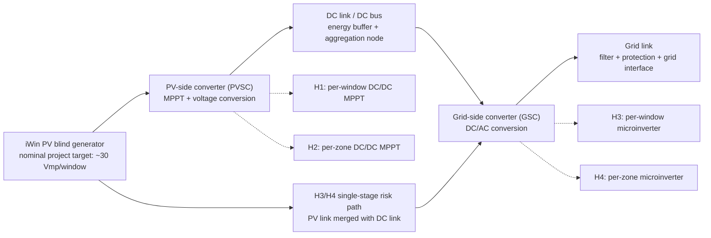

# Literature Review - Chapter 5, Power Conditioning

Source under review: `C:\Users\Denys\Documents\Projects\PVplant\PV_books\chapter 5.pdf`  
Date: 2026-05-27  
Project context: iWin-type BIPV venetian-blind PV power-system topology selection

## Executive Summary

Chapter 5 is immediately useful for the iWin topology work because it gives a clean engineering decomposition of PV power conditioning into PV link, PV-side converter (PVSC), DC link, grid-side converter (GSC), and grid link. That maps directly to the active iWin hypotheses: H1/H2 use PVSC granularity before aggregation; H3/H4 place DC/AC conversion closer to the window or zone.

The strongest short-term value is not a final topology ranking. It is the converter preselection logic: choose buck only when the output voltage is below the PV MPP range, boost when the output is above the PV MPP range, tapped-inductor boost or isolated conversion when high step-up is required, and flyback/full-bridge isolated stages when galvanic isolation or service-boundary requirements dominate. For the current project nominal `Vmp,module ~= 30 V`, raw aggregation to a floor bus remains electrically unattractive because one floor at 60 m2 and 60-160 W/m2 implies `P = 3.6-9.6 kWp` and `I = 120-320 A` at 30 V. Chapter 5 therefore supports local voltage conversion before floor-level collection for H1/H2, unless the final vendor product supports a different voltage/current envelope.

Chapter 5 also makes the single-phase microinverter issue explicit: single-phase DC/AC conversion needs a DC-link energy buffer for double-line-frequency power ripple. In a single-stage architecture the DC link becomes the PV link, so that ripple directly perturbs MPPT. This is a direct risk for H3 and H4 unless the microinverter design provides enough buffering, ripple rejection, and thermal margin in the blind/window environment.

Conclusion: use Chapter 5 to build the converter decision matrix and first-order stress calculations, but do not use it alone to select H1-H4. The missing gates remain `Voc,max`, `Isc,max`, allowed series/parallel grouping, PCE MPPT window, isolation/shutdown boundary, connector/feedthrough rating, electronics location, thermal limit, replacement boundary, and applicable grid-code requirements.

Personal suggestion: treat H1 as the current electrical baseline and H2 as the reduced-converter-count alternative. Keep H3/H4 alive only if a qualified microinverter or zone inverter can prove acceptable MPPT ripple behavior, startup voltage, thermal design, serviceability, and code compliance for window-integrated hardware.

## Source Handling

| ID | Source | Use |
|---|---|---|
| S1 | `C:\Users\Denys\Documents\Projects\PVplant\PV_books\chapter 5.pdf` | Requested file. `pdfinfo` reports 69 pages. The file is an image-only Microsoft Print to PDF export; `pdftotext` produced only page breaks, so it was not usable as a text source. Page 1 is Chapter 5 printed p. 103. |
| S2 | `C:\Users\Denys\Documents\Projects\PVplant\PV_books\Photovoltaic power system -- modelling, design, and control 2017 - Weidong Xiao.pdf` | Same book with text layer. Full-book PDF pages 117-185 correspond to S1 pages 1-69 and printed pp. 103-171. Used for text extraction, equations, and section/page references. |
| S3 | `C:\Users\Denys\Documents\Projects\PVplant\PVplant_iWin_BIPV_Knowledge_v1.md` | Current project assumptions: `Vmp,module ~= 30 V`, `Vmp,cell = 0.6 V`, `Imp,cell = 0.35 A`, corrected 60-70 slats/m default, 60 m2/floor, 3-5 floors, 60-160 W/m2 design range. |

No cloud parsing was used. No current standards verification was run; any standards statements below are treated as claims made by the 2017 chapter, not as current compliance guidance.

## Think Checkpoint

The chapter is a converter-design source, not an iWin product-validation source. It can support topology preselection, ripple/energy-buffer reasoning, and efficiency-test criteria. It cannot determine the final iWin architecture until the product electrical envelope and integration/service limits are known.

Do not rank H1-H4 as final. Use the chapter to populate hard gates and reject obviously poor electrical forms, especially raw 30 V floor aggregation and unbuffered single-phase MPPT interfaces.

## Chapter 5 Map

| S1 page | S2 page | Printed page | Section | Relevance |
|---:|---:|---:|---|---|
| 1 | 117 | 103 | Chapter 5 introduction | Defines PVSC, GSC, DC link, grid link; single-stage vs two-stage conversion. |
| 2 | 118 | 104 | 5.1 PV-side Converters | Lists buck, boost, buck-boost, flyback, tapped-inductor, full-bridge isolated DC/DC converters. |
| 3 | 119 | 105 | 5.1.1 PV Module for Case Study | Reference module: 72 cells, `Isc = 8.34 A`, `Voc = 44.17 V`, MPP at `37.0 V`, `7.79 A`, `288.3 W`. Not an iWin module. |
| 3-28 | 119-144 | 105-130 | 5.1.2-5.1.7 | PVSC topologies and sizing examples. |
| 28-40 | 144-156 | 130-142 | 5.2 Battery-side Converter | Dual active bridge (DAB) for bidirectional battery/DC bus interface. Relevant only if storage or DC microgrid is added. |
| 40-44 | 156-160 | 142-146 | 5.3 DC Link | DC-link capacitance, ripple, single-phase vs three-phase energy buffering. |
| 45-52 | 161-168 | 147-154 | 5.4 Grid-side Converter | Single-phase H bridge, current unfolding, three-phase CSI, reactive power. |
| 52-58 | 168-174 | 154-160 | 5.5 Grid Link | L, LCL, LC filters; THD and filter design. |
| 58-63 | 174-179 | 160-165 | 5.6 Loss Analysis | Conduction, switching, magnetic loss. |
| 63-65 | 179-181 | 165-167 | 5.7-5.8 Efficiency and WBG | Weighted efficiency, SiC/GaN, MIPI efficiency range. |
| 65-69 | 181-185 | 167-171 | 5.9 Summary and references | Topology summary tables and references. |

## Functional Architecture Extracted from Chapter 5



Chapter 5 separates the PV-side control task from the grid-side injection task. In a two-stage system, the PVSC regulates PV operation and the GSC regulates grid current through a DC link. In a single-stage system, the PV link is effectively merged with the DC link, reducing component count but coupling grid-side ripple directly into PV operation. For iWin this distinction is central: H1/H2 can use local MPPT and a higher-voltage collection stage, while H3/H4 must prove that microinverter energy buffering does not disturb low-power, shade-dynamic slat strings.

## PV-Side Converter Implications

Table 5.6 in Chapter 5 is the highest-value near-term artifact for iWin. The selection rule is voltage-profile driven:

| Converter | Isolation | Chapter selection criterion | iWin interpretation |
|---|---:|---|---|
| Buck | No | Use when `VO(max) <= VMPP(min)` | Not useful for stepping a 30 V iWin source to a higher bus. Could apply only to a lower-voltage local load/storage node. |
| Boost | No | Use when `VO(min) >= VMPP(max)` and moderate conversion ratio | Candidate for 30 V to 48/60 V local bus. Weak for 30 V to 380 V because ratio is about 12.7. |
| Tapped-inductor boost | No | High step-up, `VO/VMPP > 3` | Candidate if H1/H2 need high-voltage DC aggregation without isolation. Needs EMI, leakage, stress, and service-boundary review. |
| Buck-boost | No | Use when PV MPP can be above or below output; no common ground | Flexible but penalized by chopped input/output currents and filtering burden. |
| Flyback | Yes | High conversion ratio, low power, galvanic isolation | Candidate for small per-window or sub-window isolated supplies if power remains low. Less attractive as power rises. |
| Full-bridge isolated DC/DC | Yes | Higher power capacity, galvanic isolation, flexible transformer ratio | Candidate when isolation and service boundary are hard requirements for window modules. More components and control complexity. |

The chapter's own case-study module is a standard 72-cell PV module with MPP at `37.0 V`, `7.79 A`, and `288.3 W` (printed p. 105). That is close enough in voltage to the iWin working target to make the formulas useful, but it is not evidence that an iWin blind behaves like a 72-cell module. The iWin current range is different because the project target is driven by many small slat/cell segments and facade-area power density.

### Useful Chapter 5 Design Equations

For a boost PVSC, the chapter gives the steady-state duty relation:

```text
D0 = 1 - VMPP / VO_NOM
```

For a tapped-inductor boost converter in continuous conduction mode:

```text
VO / VPV = [1 + (N2 / N1) * d] / (1 - d)
D0 = (VO_NOM / VMPP - 1) / (N2 / N1 + VO_NOM / VMPP)
```

For a flyback converter:

```text
VO / VPV = n * D / (1 - D)
```

The formulas are useful for first-pass duty-cycle screening. They are not sufficient for component selection because the iWin design still lacks vendor values for `Voc`, `Isc`, temperature coefficients, allowed grouping, ripple tolerance, and PCE input windows.

## iWin First-Order Electrical Stress

Project assumptions from S3:

```text
Vmp,module ~= 30 V
Cell Vmp = 0.6 V
Cell Imp = 0.35 A
Voc/Vmp ~= 1.25
Power-density envelope = 60-160 W/m2
Active area per floor = 60 m2
Floors = 3-5
Corrected slat density default = 60-70 slats/m
```

Derived values:

```text
Cells in series for 30 Vmp = 30 V / 0.6 V = 50 cells
50S Voc,STC ~= 30 V * 1.25 = 37.5 V
One 50S string power ~= 30 V * 0.35 A = 10.5 W
Two-cell segment Vmp = 2 * 0.6 V = 1.2 V
Segments in series for 30 Vmp = 50 / 2 = 25 two-cell segments
```

Window and floor stress:

| Boundary | Area | Power at 60 W/m2 | Power at 160 W/m2 | Current at 30 V |
|---|---:|---:|---:|---:|
| Nominal window | 3.0 m2 | 180 W | 480 W | 6-16 A |
| Max window | 4.5 m2 | 270 W | 720 W | 9-24 A |
| One floor | 60 m2 | 3.6 kW | 9.6 kW | 120-320 A |
| 3 floors | 180 m2 | 10.8 kW | 28.8 kW | Not suitable as raw 30 V bus |
| 5 floors | 300 m2 | 18.0 kW | 48.0 kW | Not suitable as raw 30 V bus |

This reinforces the current project rule: raw 30 V floor aggregation should be rejected except for very short, protected demo segments. If H1 or H2 collect many windows/floors, local DC/DC conversion is not optional; it is the mechanism that prevents excessive current, conductor size, voltage drop, connector stress, feedthrough heating, and protection complexity.

Slat-density sensitivity using the corrected 60-70 slats/m default:

```text
2.0 m high blind: 120-140 slats
3.0 m high blind: 180-210 slats

If one slat carries one two-cell segment:
  25 segments/string needed for 30 Vmp
  2.0 m blind: 120-140 / 25 = 4.8-5.6 possible 30 V strings before layout losses
  3.0 m blind: 180-210 / 25 = 7.2-8.4 possible 30 V strings before layout losses
```

This is a geometry sensitivity, not a product claim. The actual segment count depends on cell placement, bypass layout, slat wiring, tilt-motion cable routing, and manufacturer limits.

## DC-Link and Ripple Implications

Chapter 5 gives the single-phase DC-link capacitance relation:

```text
Cdc = Pdc / (omega_b * Vdc * DeltaVdc)
```

The important point for iWin is qualitative but hard-gated: in single-phase systems, the DC link must buffer double-line-frequency power ripple. For single-stage conversion, the chapter states that the DC link becomes the PV link and ripple directly affects deviation from MPP. That is a direct evaluation item for H3 and H4.

Example stress using the chapter's formula at 50 Hz, `omega_b = 2*pi*50 rad/s`, and `DeltaVdc = 1 V`:

```text
H3 nominal window at 480 W, 380 V DC link:
Cdc = 480 W / (314.16 rad/s * 380 V * 1 V) = 0.00402 F = 4.0 mF

H3 max window at 720 W, 380 V DC link:
Cdc = 720 W / (314.16 rad/s * 380 V * 1 V) = 0.00603 F = 6.0 mF

H4 zone at 4 windows * 480 W = 1.92 kW, 380 V DC link:
Cdc = 1920 W / (314.16 rad/s * 380 V * 1 V) = 0.0161 F = 16.1 mF
```

These values are illustrative because the allowed ripple, control strategy, DC-link voltage, topology, and grid frequency must come from the actual PCE. But they show why single-phase per-window or per-zone AC conversion has a real energy-storage and thermal-packaging burden. A product datasheet that lists only peak efficiency and nominal AC rating is insufficient for iWin selection.

Three-phase conversion is less exposed to double-line-frequency ripple in the balanced case, but iWin building/floor integration is likely to aggregate many small generators before a three-phase inverter. That favors H1/H2 if floor-level or plant-level three-phase conversion is acceptable.

## Grid-Side and Filter Implications

For single-phase grid conversion, Chapter 5 uses an H bridge and discusses hysteresis, sine-triangle, and current-unfolding methods. The chapter's examples show that loose hysteresis current control can produce high THD, while a tighter band reduces THD at the cost of higher switching frequency and filter demands. It also states a 5% THD reference from IEEE 1547 and uses 4% in one example, but that is a 2017 textbook statement and must not be used as current code compliance for iWin.

For topology selection, the actionable points are:

| Issue | Chapter 5 evidence | iWin implication |
|---|---|---|
| Single-phase H bridge | Table 5.7: H bridge for single-phase grid connection | H3/H4 map cleanly to microinverter-like AC conversion, but need energy buffering and thermal proof. |
| Current unfolding | Discussed as common in MIPIs | Useful for reduced high-frequency AC switching, but it moves buffering burden upstream. |
| L filter | Simple grid-link option | May be insufficient at low switching frequency or strict harmonic limits. |
| LCL filter | Common for grid connection, needs damping | Adds components, resonance risk, and qualification effort. |
| LC filter | More relevant for standalone AC loads | Lower priority for grid-tied iWin unless local AC load mode is added. |

## Battery-Side Converter / DAB Relevance

Section 5.2 covers dual active bridge conversion for a battery-side DC/DC stage. It is useful if the iWin architecture later includes storage, a DC microgrid, or a bidirectional facade energy interface. It is not a primary source for choosing between H1-H4 as currently framed.

The DAB advantages listed by the chapter are bidirectional power flow, galvanic isolation, high power density, and soft-switching potential. The chapter also identifies loss of zero-voltage switching and circulating current as concerns. For iWin, that means DAB belongs in a later storage/DC-bus branch, not in the first topology down-select unless storage is promoted to a core requirement.

## Efficiency and Wide-Bandgap Devices

Chapter 5 explicitly rejects peak efficiency as the only metric and gives weighted European and CEC efficiency formulas:

```text
eta_eu  = 0.03*eta_5% + 0.06*eta_10% + 0.13*eta_20% + 0.10*eta_30% + 0.48*eta_50% + 0.20*eta_100%
eta_cec = 0.04*eta_10% + 0.05*eta_20% + 0.12*eta_30% + 0.21*eta_50% + 0.53*eta_75% + 0.05*eta_100%
```

This is valuable for iWin because blinds will spend much of their operating life under partial irradiance, tilt variation, and shading. The evaluation metric should require a part-load efficiency curve, not only peak efficiency.

The chapter states typical efficiency ranges: string/array DC/AC converters around 97% or higher, PV-side DC/DC converters usually above 98%, and MIPIs around 94-97% due to high DC-to-single-phase-AC conversion ratio. This supports a practical expectation: H3/H4 may buy modularity and independence at the cost of lower conversion efficiency, more electronics, and harder thermal packaging.

SiC and GaN are relevant but not decisive. Chapter 5 points to SiC/GaN advantages in switching loss, frequency, size, and efficiency, including a GaN submodule DC/DC example rated at 100 W per converter and intended for junction-box integration. For iWin, WBG devices can improve feasibility of compact local electronics, but they do not remove the need for temperature, service, fire/shutdown, and compliance validation.

## H1-H4 Implications

| Hypothesis | Chapter 5 support | Main risk exposed by Chapter 5 | Short-term action |
|---|---|---|---|
| H1: per-window DC/DC MPPT + floor aggregation | Strong. PVSC + DC link architecture matches Chapter 5 two-stage model. Local conversion avoids raw 30 V floor current. | Converter topology must handle 30 V source, 180-720 W/window, isolation/service limits, and thermal location. | Build per-window PVSC decision matrix: boost vs tapped boost vs isolated full-bridge/flyback; include MPPT window and ripple tolerance. |
| H2: per-zone DC/DC MPPT + floor multi-MPPT inverter | Strong if zones are electrically homogeneous. Chapter 5 supports PVSC sizing and floor-level inverter link. | Zone grouping can hide mismatch from slat tilt/shading. Higher zone current and DC-link ripple stress than H1. | Define allowable zone by measured or simulated persistent irradiance/tilt similarity, not by floorplan convenience. |
| H3: per-window DC/AC microinverter | Valid but exposed. Maps to MIPI/single-phase conversion. | Double-line-frequency ripple, energy-buffer volume, startup voltage, thermal/service packaging, and 94-97% efficiency expectation. | Require microinverter datasheet fields: MPPT input range, startup voltage, ripple handling, DC-link capacitor life, ambient derating, AC branch limits. |
| H4: per-zone DC/AC microinverter | Valid compromise but not proven. Reduces converter count vs H3. | Combines H3 ripple/thermal issues with coarser mismatch handling and higher zone DC current. | Keep as contender only if zone homogeneity is proven and PCE accepts the zone voltage/current range. |

## Evidence Gaps to Close Before Topology Down-Select

| Gate | Needed data | Why Chapter 5 makes it mandatory |
|---|---|---|
| Electrical envelope | Actual `Pmax`, `Voc`, `Vmp`, `Isc`, `Imp`, temperature coefficients | Converter duty, inductor/capacitor sizing, semiconductor stress, `Voc,max`, and `Isc,max` cannot be signed off from nominal 30 V alone. |
| Grouping rules | Allowed series/parallel slat, segment, window, and zone aggregation | Determines whether boost, tapped boost, flyback, or isolated full-bridge is viable. |
| MPPT window | PCE start voltage, MPPT min/max, max current, allowed source capacitance | Chapter 5 topologies are selected by source/load voltage profiles. |
| Ripple tolerance | Allowed PV-link voltage ripple and MPP deviation | Single-stage and microinverter cases directly perturb MPPT through DC-link ripple. |
| Isolation/grounding | Required galvanic isolation, accessible voltage class, shutdown boundary | Selects non-isolated boost/tapped vs isolated flyback/full-bridge. |
| Thermal design | Electronics location, max ambient, enclosure, capacitor lifetime | Chapter 5 repeatedly ties ripple current and switching loss to thermal stress. |
| Grid interface | Current harmonic limits, anti-islanding, AC branch rating, disconnects | Chapter 5 GSC/filter examples are not a current compliance design. |
| Service boundary | Replaceable unit: slat, blind, window, zone converter, floor inverter | Determines whether electronics can be per-window or must be moved to accessible floor-level equipment. |

## Short-Term Useful Outputs From This Chapter

1. PVSC preselection matrix for H1/H2:

```text
Input: iWin source Vmp/Voc/Isc/Imp range
Output target: 48 V, 60 V, 120 V, 380 V, or inverter MPPT input range
Isolation required: yes/no
Power level: 180-720 W/window or zone aggregate
Screen:
  if VO < VMPP_min: buck
  if VO moderately > VMPP_max: boost
  if VO/VMPP > 3 and no isolation: tapped-inductor boost or alternative high-gain DC/DC
  if isolation + low power: flyback candidate
  if isolation + higher power: full-bridge isolated DC/DC candidate
Reject:
  raw 30 V floor bus
  any topology with unavailable MPPT window or unqualified thermal/ripple margin
```

2. Microinverter evaluation checklist for H3/H4:

```text
Minimum DC input voltage
MPPT voltage range and MPPT count
Maximum DC input current
Startup behavior under partial slat illumination
Allowed source capacitance / PV-link ripple
DC-link capacitor type, lifetime, ripple current, and temperature rating
European/CEC or full part-load efficiency curve
Derating at window/blind ambient temperature
AC branch quantity and protection
Anti-islanding and regional certification
Replacement boundary and connector system
```

3. First-pass DC-link burden estimate for any single-phase AC option:

```text
Cdc = Pdc / (2*pi*f_grid*Vdc*DeltaVdc)
Run at:
  Pdc = 180, 480, 720 W per window
  Pdc = zone aggregate powers
  Vdc = candidate DC-link voltage
  DeltaVdc = vendor allowed ripple
Then compare capacitance volume, ripple-current rating, lifetime, and service temperature.
```

## Candidate Artifact Updates

Do not overwrite active project artifacts automatically; these are proposed additions.

| Artifact | Proposed update |
|---|---|
| Reading tracker | Add Chapter 5 as a converter-design source: PVSC topologies, DC-link ripple, grid-side converter/filter, efficiency metrics. |
| Design-envelope table | Add required fields: PCE MPPT voltage/current window, startup voltage, PV-link ripple tolerance, DC-link capacitance/energy-buffer design, isolation requirement. |
| H1-H4 decision matrix | Add Chapter 5 topology screen: raw 30 V floor bus reject, boost/tapped/flyback/full-bridge candidates by bus ratio and isolation. |
| Standards/evidence matrix | Add placeholder for current grid-code verification. Do not rely on Chapter 5's 2017 IEEE 1547 THD wording as current compliance evidence. |

## Bottom Line

Chapter 5 strengthens the case for a two-stage iWin architecture with local MPPT and voltage conversion before floor-level collection. It does not eliminate H3/H4, but it raises the proof burden for microinverter options: the energy buffer, ripple control, thermal design, and service boundary must be demonstrated with vendor data.
