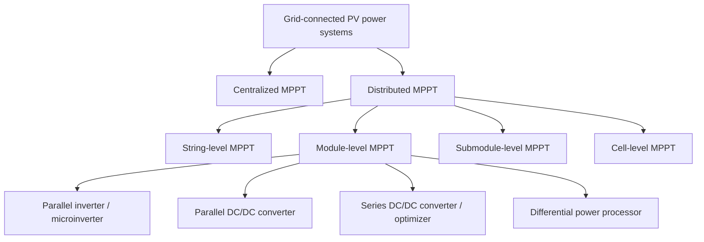

# Literature Review: Classification of PV Power Systems

Source reviewed: `PV_books/2 Classification of PV Power Systems - PV PS -- modelling design control.pdf`

## Executive Summary

This chapter is useful for the iWin BIPV topology work because it gives a clean power-electronics classification axis: centralized MPPT versus distributed MPPT, then DMPPT by granularity at string, module, submodule, and cell level. The chapter does not decide an iWin topology by itself. Its value is as a taxonomy and mismatch argument that can structure H1, H2, and H3 without pretending that conventional rooftop/module assumptions transfer directly to PV venetian blinds.

The most decision-relevant finding is the mismatch example. With two 72-cell BP350 modules in series, the chapter reports only 0.31% power loss for slight module-to-module variation, but 22% power loss when one cell in one module is shaded and the shaded/unshaded modules are series-connected. For iWin, where slat angle, facade self-shading, frame shadows, and zone heterogeneity are normal operating states rather than rare faults, this supports evaluating DMPPT seriously. It does not prove the correct granularity.

My current engineering opinion: for iWin, use this chapter to reject raw CMPPT-like aggregation as the baseline hypothesis and to frame the comparison as "which DMPPT granularity is enough?" H1 per-window MPPT and H2 zonal/floor multi-MPPT remain the near-term practical branches. H3 per-window microinverter is technically aligned with the chapter's module-integrated parallel inverter class, and the 30 V project source voltage sits inside the chapter's cited 22-45 V module-voltage range, but the chapter's own limits on cost, efficiency, high step-up ratio, double-line ripple, and outdoor electronics reliability are directly relevant.

## Conclusions

The source supports a topology taxonomy, not a final down-select. It strengthens the rationale for distributed MPPT under mismatch and partial shading, but it does not close `Voc,max`, `Isc,max`, MPPT input window, isolation boundary, protection concept, connector/cable family, electronics placement, or replacement boundary.

For iWin, the most useful short-term extraction is:

| Chapter concept | iWin use |
|---|---|
| CMPPT | Baseline to quantify losses, monitoring needs, and why one global MPPT is weak under slat/facade mismatch. |
| String-level DMPPT | Maps to floor/zone MPPT or multi-MPPT inverter grouping. |
| Module-level MIPC/MISC | Maps to per-window DC/DC MPPT or optimizer-like approaches. |
| Module-level MIPI | Maps to per-window microinverter / AC modular branch. |
| Submodule DMPPT/DPP | Maps conceptually to slat-group or substring-level electronics, but practical integration and wiring remain hard. |
| Cell-level MPPT | Useful as a limiting case; likely too complex/costly for near-term iWin architecture unless the PV blind product already embeds electronics. |

Personal suggestion: convert this chapter into a controlled taxonomy note for the project and use it as the first page of the architecture comparison. Do not let it become an argument for "more granular is always better." The chapter itself repeatedly ties finer MPPT to higher cost, wiring, reliability, and coordination burden.

## Method And Source Handling

The requested PDF is image-only. `pdftotext` produced no usable text from it. I rendered the requested PDF and verified that it starts at printed book page 25 with Chapter 2, "Classification of Photovoltaic Power Systems." I then extracted the same chapter text from the full local book PDF:

`PV_books/Photovoltaic power system -- modelling, design, and control 2017 - Weidong Xiao.pdf`

Page mapping used in this review:

| Requested PDF page | Printed book page | Full book PDF page |
|---:|---:|---:|
| 1 | 25 | 41 |
| 2 | 26 | 42 |
| 3 | 27 | 43 |
| ... | ... | ... |
| 23 | 47 | 63 |

Temporary extraction was used for review and then removed. The durable artifact is this derived review; the original source PDFs remain in `PV_books/`.

Evidence status: **Contextual literature** for PV topology taxonomy and power-electronics architecture. **PVplant-derived technical resource** for the local extraction and page mapping. Not vendor evidence, not standards evidence, not compliance closure.

## Source Map

| ID | Source | Scope | Pages used | Evidence class | Limits |
|---|---|---|---|---|---|
| S1 | Requested chapter PDF | Visual source target | requested PDF pp. 1-23 / printed pp. 25-47 | PVplant-derived technical resource | Image-only; text extracted from S2. |
| S2 | Full local book PDF, same chapter | Searchable text layer for the reviewed chapter | full PDF pp. 41-63 / printed pp. 25-47 | Contextual literature | Textbook chapter, 2017; not BIPV-specific; cited references not re-verified here. |
| S3 | `BIPV_Codex_Edition/companion/06_Standards_and_Design_Envelope.md` | Project gating for architecture scoring | standards matrix and minimum calculations | PVplant-derived technical resource | Project control artifact, not external authority. |
| S4 | root `AGENTS.md` | iWin assumptions and architecture-policy constraints | project assumptions and H1/H2/H3 definitions | Project-defined assumption | Applies to this repository study scope only. |

## Technical Synthesis

### 1. Classification Frame

The chapter moves away from capacity-only classification and focuses on where MPPT is applied. It first notes conventional capacity classes: small systems below 50 kW, intermediate systems from 50 kW to 1 MW, and large or utility-scale systems above 1 MW. It then says such boundaries are often unclear because modular PV can be aggregated from many small or intermediate systems. For this project, that matters because an iWin facade can be electrically modular while still accumulating meaningful building capacity.

The chapter's controlling taxonomy is:

For iWin, "module" should not automatically mean a framed rooftop PV module. The analogous unit may be a window, cassette, blind assembly, electrical group, slat group, or vendor-defined replaceable subsystem. That unit definition must be closed before scoring H1/H2/H3.

### 2. CMPPT Baseline And Mismatch Problem

CMPPT is described as array-level MPPT using a centralized inverter. The chapter covers galvanically isolated and non-isolated centralized topologies with one-stage, two-stage, and three-stage conversion variants. Its main relevance to iWin is not the converter topologies themselves; it is the mismatch penalty when many cells/modules are forced through shared current paths.

The chapter's mismatch experiment is the strongest quantitative evidence:

| Case | Page | Extracted result | Interpretation |
|---|---:|---|---|
| Two healthy 72-cell modules in series | printed p. 30 | combined MPP 42.88 W versus 43.01 W sum of individual MPPs, 0.31% loss | Slight module variation is measurable but small. |
| One cell shaded in one 72-cell module | printed pp. 31-32 | shaded module MPP 15.44 W at 17.19 V, 0.90 A | Single-cell shading produces large module-level loss. |
| Shaded and unshaded modules in series | printed p. 32 | series MPP 32.65 W at 35.10 V, 0.93 A; 22% power loss | Shared string current amplifies local shading into larger system loss. |

This supports the iWin concern that slat/facade mismatch is not a secondary detail. It is central to topology. It also supports tracking hidden MPPs and bypass/subdivision behavior in vendor data requests.

### 3. Monitoring Does Not Fix Mismatch

The chapter distinguishes monitoring from mitigation. CMPPT systems can use inverter, string, and site monitoring, including wired and wireless communication, to identify faults and mismatch conditions. The chapter then states that monitoring reports operation but does not directly minimize mismatch losses. That is important for iWin: a rich BMS/diagnostics layer is not a substitute for the right electrical granularity.

For the project, this maps to commissioning and diagnostics:

| Needed iWin item | Why this chapter supports it |
|---|---|
| Unit/string/group telemetry | Needed to localize mismatch and faults. |
| Slat-angle response logging | iWin mismatch depends on control state. |
| MPPT trace or equivalent operating-state evidence | Needed to distinguish normal slat shading from fault. |
| Replacement-level boundary | Monitoring only helps if the failed/mismatched unit can be isolated and replaced. |

### 4. String-Level DMPPT

String-level DMPPT is described as commercial and widely adopted. In one example, a 42 kW Huawei inverter connects up to eight PV strings and includes four independent MPPT units. The chapter's architecture examples include string inverters sharing an AC link and DC/DC string converters sharing a DC bus.

iWin implication: H2, defined as per-zone DC/DC MPPT plus floor-level multi-MPPT inverter, is closest to string-level DMPPT. It can reduce electronics count, but it only works if zones are grouped by persistent shading and slat-control homogeneity. If one zone mixes facade orientations, floors, edge bays, or slat states, the chapter's mismatch argument still applies.

### 5. Module-Level DMPPT

The chapter divides module-level DMPPT into several classes.

**Module-integrated parallel inverters (MIPI)** are microinverter/AC module-like systems. The chapter gives a typical module DC voltage range of 22-45 V and describes direct conversion to low-voltage AC. Advantages include modularity, easy expansion, no single series-current bottleneck, and simpler AC wiring. Drawbacks include higher cost per watt, lower conversion efficiency than string systems, high voltage boost ratio, double-line frequency ripple in single-phase systems, and harsh outdoor electronics reliability.

This maps directly to H3. The project-defined 30 Vmp window-level source sits inside the chapter's 22-45 V range. That is a useful fit signal, but not a closure item. H3 still needs actual microinverter input range, start voltage, MPPT window, power rating, temperature rating, AC trunking, isolation, and replacement method.

**Module-integrated parallel converters (MIPC)** are DC/DC units feeding a common DC bus. The chapter presents them as strong for DC microgrids and better than single-phase AC integration regarding double-line ripple, but still challenged by high conversion ratio, efficiency, and outdoor environment. This class is relevant to H1 if each iWin window or cassette acts as one DC generator feeding a higher-voltage DC collection bus.

**Module-integrated series converters (MISC)** are optimizer-like DC/DC units whose outputs are series-connected to form a DC string. The chapter notes potential high efficiency because each converter can operate at a lower conversion ratio, but also flags modularity and reliability limits due to series connection and single-point failures. This is relevant if iWin windows are arranged into optimizer strings.

**Module-integrated differential power processors (MIDPP)** process mismatch current instead of all module power. The concept is attractive for iWin because many slat conditions may be partial mismatch events, not full-power conversion needs. The chapter also flags complex wiring, lower practical reliability than parallel structures, and communication requirements. For iWin, DPP should be kept as an advanced hypothesis unless a vendor or integrator already has an implementation path.

**Module-integrated series inverters (MISI)** stack AC outputs. The chapter notes efficiency and low-voltage component benefits, but also coordination complexity, series-output control difficulty, single-point effects, and the need for a central unit. For iWin, this is less attractive than H3 parallel AC unless a specific product architecture supports it.

### 6. Submodule And Cell-Level DMPPT

The chapter describes crystalline modules as commonly having 60 or 72 cells arranged in three or four submodules, with each submodule often having 15-24 cells in series. It states that submodule output voltage is usually below 15 V and that submodule-level DMPPT can provide better output than module-level approaches under mismatch.

This is conceptually important for iWin because PV blinds may behave more like many small submodules than like one conventional panel. However, the chapter also says submodule-integrated series converters may require panel manufacturers to revise electrical layout before lamination. For iWin, the equivalent closure item is not "lamination" alone, but whether slat/string/bypass connections are accessible, replaceable, and qualified.

For cell-level MPPT, the chapter gives a limiting example: a six-inch crystalline cell may produce about 4 W at 0.5 V and 8 A. It states that low input voltage, high output current, cost, complexity, and lifetime make cell-level MPPT difficult. For iWin, cell-level electronics should be treated as a research branch unless vendor evidence shows embedded cell/slat-level power management.

## iWin Calculations From Project Assumptions

These calculations use project assumptions from root `AGENTS.md`, not values from the chapter.

| Quantity | Calculation | Result | Design meaning |
|---|---:|---:|---|
| Nominal window area | 1.5 m x 2 m | 3.0 m2 | One window/cassette scale. |
| Nominal window power | 3.0 m2 x 60-160 W/m2 | 180-480 W | Plausible per-window PCE sizing range. |
| Nominal window current at 30 Vmp | 180-480 W / 30 V | 6-16 A | Low-voltage current is already non-trivial per window. |
| Maximum window area | 1.5 m x 3 m | 4.5 m2 | Upper window/cassette scale. |
| Maximum window power | 4.5 m2 x 60-160 W/m2 | 270-720 W | Requires careful device rating and thermal check. |
| Maximum window current at 30 Vmp | 270-720 W / 30 V | 9-24 A | Connector/cable/feedthrough limits become early design gates. |
| Floor power | 60 m2 x 60-160 W/m2 | 3.6-9.6 kW | Chapter capacity class: small-scale per floor. |
| Building power | 3-5 floors x floor power | 10.8-48 kW | Still below the chapter's 50 kW small-scale threshold under current assumptions. |
| Raw floor current at 30 V | 3.6-9.6 kW / 30 V | 120-320 A | Direct 30 V floor aggregation is unattractive without voltage elevation or subdivision. |

The raw 30 V floor-current result supports H1/H2 architectures that raise voltage before floor aggregation or distribute conversion closer to the windows. It also weakens any concept that treats all blinds on a floor as one low-voltage DC source without a serious busbar/protection argument.

Blocked calculations:

| Calculation | Status | Missing input |
|---|---|---|
| `Voc,max` | Blocked | `Voc,unit,STC`, series count, temperature coefficient, `Tcell,min`. |
| `Isc,max` | Blocked | `Isc,unit,STC`, parallel count, irradiance maximum, current temperature coefficient. |
| MPPT compatibility | Blocked | Candidate PCE input voltage/current/power window and start behavior. |
| Protection/device ratings | Blocked | Connector, cable, feedthrough, fuse/disconnect, grounding/isolation concept. |

## Architecture Implications

| iWin branch | Chapter mapping | Support from chapter | Main risk from chapter |
|---|---|---|---|
| H1: per-window DC/DC MPPT + floor aggregation | Module-level MIPC or MISC, depending on bus topology | Good fit to mismatch handling and 30 V class source; can boost before aggregation. | Outdoor electronics, converter count, voltage/current rating, service boundary. |
| H2: per-zone DC/DC MPPT + floor multi-MPPT inverter | String-level DMPPT | Lower electronics count; commercial precedent for multi-string MPPT. | Weak if zones mix different slat/facade states; may under-handle dynamic mismatch. |
| H3: per-window microinverter / AC modular | MIPI / AC module | Parallel AC collection and per-window independence; 22-45 V cited range overlaps 30 Vmp project assumption. | Higher cost per watt, high step-up ratio, ripple, thermal lifetime, AC service and trunking complexity. |
| Advanced H4: slat/submodule DPP | Submodule DPP or isolated-port DPP | Theoretically efficient under mismatch because only mismatch power is processed. | Wiring, communication, isolation, enclosure, and practical implementation burden. |
| Research H5: cell/slat-cell MPPT | Cell-level MPPT | Maximum granularity. | Low voltage/high current, cost, complexity, lifetime; poor near-term practicality without embedded vendor tech. |

## Evidence Gaps And Vendor-Data-Required Items

The chapter points toward DMPPT, but iWin architecture scoring remains blocked until these are closed:

| Closure item | Why it matters |
|---|---|
| Unit electrical datasheet: `Pmax`, `Voc`, `Vmp`, `Isc`, `Imp`, coefficients | Required for `Voc,max`, `Isc,max`, and PCE compatibility. |
| Slat/string/submodule/bypass topology | Determines true MPPT granularity and mismatch behavior. |
| I-V and P-V curves under slat angle, temperature, and partial shading | Needed to separate normal dynamic shading from fault states. |
| Allowed aggregation rules | Determines whether H1/H2/H3 are vendor-supported or speculative. |
| Electronics location and thermal rating | Chapter repeatedly flags harsh outdoor electronics reliability. |
| Connector, cable, feedthrough, and replacement boundary | Required before any serviceable architecture claim. |
| Grounding/isolation/disconnect concept | Required before safety and compliance framing. |
| Commissioning telemetry and acceptance limits | Monitoring only has value if measurable checks exist. |

## Risks, Contradictions, And Limits

The chapter is not BIPV-specific and does not address IGU cavities, moving slats, feedthroughs, facade fire/construction requirements, optical/thermal coupling, or replacement inside a building envelope. Its topology taxonomy is transferable; its practical module examples are only analogies.

The chapter favors finer MPPT under mismatch, but also documents rising cost, wiring, communication, conversion, and reliability burden as granularity increases. That creates the core iWin trade-off: improve energy capture under dynamic slat mismatch without moving the power-electronics boundary into a place that is thermally harsh, inaccessible, or unserviceable.

The chapter's module-level voltage range for MIPI systems is useful because it overlaps the project 30 Vmp assumption, but it does not validate any particular microinverter. It only says the voltage class is plausible enough to investigate.

## Artifact Updates Needed

Do not mark the source as "closed" yet. Proposed row for `BIPV_Codex_Edition/companion/01_Reading_Tracker.md`:

| ID | Source | Type | URL / DOI | Edition / revision / date | Why it matters | Pages / clauses used | Numerical values extracted | 3 key takeaways | Contradictions / limits | Decision impacted | Evidence class | Status |
|---|---|---|---|---|---|---|---|---|---|---|---|---|
| R22 | Xiao, Chapter 2, Classification of Photovoltaic Power Systems | Textbook chapter | Local: `PV_books/2 Classification of PV Power Systems - PV PS -- modelling design control.pdf` | 2017; local image-only chapter extracted via full local book text layer | Provides CMPPT/DMPPT taxonomy and mismatch-driven rationale for distributed MPPT | Printed pp. 25-47 | Small <50 kW; intermediate 50 kW-1 MW; large >1 MW; module MIPI voltage 22-45 V; one-cell shading case gives 22% series loss; MIPI efficiency example >96%; cell-level example ~4 W at 0.5 V, 8 A | MPPT granularity is the main classification axis; mismatch strongly penalizes shared series current; finer MPPT improves mismatch handling but raises cost, wiring, control, and reliability burden | Not BIPV-specific; not vendor evidence; does not close standards or product data | H1/H2/H3 topology taxonomy, mismatch rationale, vendor questionnaire | Contextual literature | Draft reviewed |

Recommended additions to `06_Standards_and_Design_Envelope.md` later:

| Field | Proposed note |
|---|---|
| MPPT compatibility | Add check for MPPT granularity: floor, zone, window, slat/submodule. |
| Performance parameter basis | Require I-V/P-V evidence for slat angle and partial shading, not only STC module points. |
| Commissioning docs and tests | Add acceptance for unit/group MPPT telemetry and fault-localization drill. |

## Next Action

Use this review as the taxonomy input for a one-page H1/H2/H3 architecture matrix. The next source to pair with it should be the 2020 MPPT classification paper already in `PV_books/NEW/Maximum power point tracking -- background, implementation and classification - 2020 - Maurice Hebert.pdf`, because it can update or challenge the 2017 chapter's MPPT taxonomy before iWin scoring.
