# 2 Classification of PV Power Systems - PV PS -- modelling design control

## Summary

No generated overview. This staged note contains Docling extraction output only.

## Key claims

No key claims extracted deterministically in Phase 11.2.

## Action items

No action items extracted deterministically in Phase 11.2.

## Open questions

Review extraction quality, page ordering, tables, figures, and units before promotion.

## Generated sidecars

- Structured JSON: [docling_1.json](docling_1.json)
- Tables: [tables_1.json](tables_1.json)
- Figure, page 2: [Figure 2.1  Classification of grid-connected PV power systems with centralized maximum power point tracking.](assets/page-002-figure-001_1.png)
- Figure, page 3: [Figure 2.2  Classification of grid-connected PV power systems with distributed maximum power point tracking.](assets/page-003-figure-002_1.png)
- Figure, page 3: [Figure 2.3  Topology of centralized maximum power point tracker with galvanic isolation and three-stage power conversion.](assets/page-003-figure-003_1.png)
- Figure, page 4: [Figure 2.4  Topology of centralized maximum power point tracker with galvanic isolation and two-stage power conversion.](assets/page-004-figure-004_1.png)
- Figure, page 4: [Figure 2.5  Topology of centralized maximum power g . os -. point tracker with galvanic isolation and single-stage power conversion.](assets/page-004-figure-005_1.png)
- Figure, page 5: [Figure 2.6  Centralized maximum power point tracker without galvanic isolation: (a) with two-stage conversion; (b) with single-stage conversion.](assets/page-005-figure-006_1.png)
- Figure, page 6: [Figure 2.7  Two PV modules installed on the same frame for a partial shading study.](assets/page-006-figure-007_1.png)
- Figure, page 7: [Figure 2.8  Plots of data acquired by |-V  tracer without PV partial shading.](assets/page-007-figure-008_1.png)
- Figure, page 7: [Figure 2.9  Plots of data acquired by |-V tracer without partial shading of PV.](assets/page-007-figure-009_1.png)
- Figure, page 8: [Figure 2.10  Plots of data acquired by I-V tracer with one cell shaded.](assets/page-008-figure-010_1.png)
- Figure, page 8: [Figure 2.11  Plots of data acquired by I-V tracer with one cell shaded when two modules are connected in series.](assets/page-008-figure-011_1.png)
- Figure, page 9: [Figure 2.12  Data acquisition and monitoring for centralized MPPT photovoltaic power systems.](assets/page-009-figure-012_1.png)
- Figure, page 11: [Figure 2.13  Three-level monitoring of photovoltaic power systems using wireless communication technologies.](assets/page-011-figure-013_1.png)
- Figure, page 12: [Figure 2.14  Trend towards distributed maximum power point tracking systems.](assets/page-012-figure-014_1.png)
- Figure, page 12: [Figure 2.15  Distributed maximum power point trackers at PV string level sharing AC link.](assets/page-012-figure-015_1.png)
- Figure, page 13: [Figure 2.16  Distributed maximum power point trackers at PV string level sharing DC link.](assets/page-013-figure-016_1.png)
- Figure, page 13: [Figure 2.17  Configurations of module-integrated parallel inverters for grid interconnections.](assets/page-013-figure-017_1.png)
- Figure, page 14: [Figure 2.18  Two types of module-integrated parallel inverter: (a) DC link for steady voltage (b) current-unfolding approach.](assets/page-014-figure-018_1.png)
- Figure, page 15: [Figure 2.19  System configurations of module-integrated parallel converters for: (a) DC grid connection; (b) AC grid connection.](assets/page-015-figure-019_1.png)
- Figure, page 16: [Figure 2.20  Configurations of module-integrated series converters to form a DC link.](assets/page-016-figure-020_1.png)
- Figure, page 17: [Figure 2.21  Configurations of module-integrated differential power processors to form a DC link.](assets/page-017-figure-021_1.png)
- Figure, page 18: [Figure 2.22  Series configurations of module-integrated series inverters for AC grid interconnection.](assets/page-018-figure-022_1.png)
- Figure, page 18: [Figure 2.23  Series configurations of submodule-integrated series converters to form a DC link.](assets/page-018-figure-023_1.png)
- Figure, page 19: [Figure 2.24  Series configurations of submodule-integrated differential power processors to form a DC link.](assets/page-019-figure-024_1.png)
- Figure, page 20: [Figure 2.25  Series configurations of submodule-integrated isolated-port differential power processors to form a DC link.](assets/page-020-figure-025_1.png)
- Figure, page 21: [Figure 2.26  Integrated power management architecture for DMPPT at PV cell level.](assets/page-021-figure-026_1.png)

## Extracted content

2

## Classification of Photovoltaic Power Systems

Photovoltaic (PV) systems are playing an increasingly significant role in electricity grids and there have been changes in system configurations in recent years. Classification of PV systems has become important in understanding the latest developments in improving  system performance in  energy harvesting. This  chapter  discusses the architecture and configuration of grid-connected PV power systems.

In  general, grid-connected PV power  systems can be  categorized into  two  main groups: centralized MPPT  (CMPPT) and distributed MPPT  (DMPPT) (Femia et al. 2008). In contrast to conventional approaches, the subclassification of DMPPT systems is then based on the level at which maximum power point tracking (MPPT) is applied (Xiao et al. 2016): string, module, submodule, and cell where the MPPT function can be applied. This is explained in the following sections.

## 2.1 Background

Grid-connected PV  systems are conventionally classified by  their  power  capacity: small-, intermediate-, and large-scale systems (Ramakumar and Bigger 1993). A system that is less than 50kW is typically considered as small scale. A PV system that can produce more than 1MW is commonly considered either large- or utility-scale. System capacities between 50 kW and 1MW are designated intermediate scale.

Due to the modular nature of PV arrays and their distributed installation, the boundaries of the system categories are often unclear. The accumulated capacity of a PV system can be more than 1MW, which qualifies as the large scale. However, the installation can be composed or grouped by hundreds or thousands of small-scale or intermediate-scale grid-connected systems. The majority of grid-connected inverters are usually under 1MW in capacity. In some cases, it is hard to distinguish exactly a single large-scale system from a set of small or intermediate-scale systems.

A grid-connected PV system can integrate with battery storage for operation in either standalone or grid-connected mode. With significant energy storage, battery storage can send active power to the grid during peak hours. They are also effective in smoothing the power generation and minimizing the impact of solar energy intermittency. Therefore, one classification of PV systems is whether they are integrated with battery storage or not. However, the majority of grid-connected PV systems do not include battery storage.

Figure 2.1  Classification of grid-connected PV power systems with centralized maximum power point tracking.

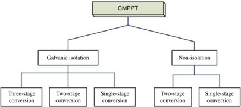

A recent classification focuses on the voltage level of the point of common coupling (PCC), the point at which the PV power production and distribution network couple in the interactive system. Low-voltage connected systems are usually installed close to electricity users, such as residential or commercial buildings. Such systems are mainly controlled by MPPT algorithm, in order to inject active power from PV generators into  the  grid.  A  unity  power  factor is  required at  the PCC, which is  maintained by  grid-connected converters. Furthermore, to  guard against grid  faults, so-called 'anti-islanding' protection is normally required, the term referring to a function to detect grid status and cease PV power injection when power outages happen (Basso and DeBlasio 2004).

With the fast increase of PV power generation, these systems are more and more prominent  in  electric  power  grids.  Utility-scale  power  plants,  which  are usually connected to medium-voltage networks or even the high-voltage grid, have a significant impact on grid capacity and stability. Grid operations are planned and regulated to maintain the stability of voltage and frequency. Static grid-support measures include reactive power injection, so that the power factors of such grid-connected converters can be operated at 'non-unity' power factors (Xiao et al. 2014). Active power regulation and fault ride-through can be used for dynamic grid support, approaches which are recommended by European grid codes (El Moursi et al. 2013; Kou et al. 2015).

In this chapter, all grid-connected systems are classified by the level at which MPPT becomes  active: centralized (CMPPT)  and  distributed (or  decentralized)  (DMPPT) systems. The structures of CMPPT and DMPPT systems are illustrated in Figures 2.1 and 2.2, respectively. The classification provides a clear framework for  identifying the differences among system architectures and configurations of grid-connected PV systems.

## 2.2 CMPPT Systems

A PV array comprises several strings connected in parallel to achieve the desired power rating. Each string is formed of several PV modules in series, so as to meet the input voltage requirements of the grid-connected converters. CMMPT  systems track the maximum power point using a centralized inverter at the array level (Romero-Cadaval et al. 2013).

Figure 2.2  Classification of grid-connected PV power systems with distributed maximum power point tracking.

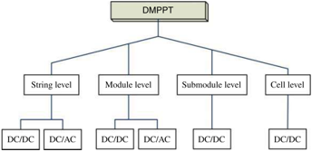

Functional grounding is required by certain grid codes and PV module manufacturers to ensure the safety of grid connections and the reliability of the modules. However, the requirements are inconsistent from region to region and country to country. A grounded PV system is defined as having DC conductors (either positive or negative) bonded to the equipment grounding system, which in turn is connected to earth. Grounding the PV system ensures safety by preventing electrical shock (Bower and Wiles 1994). The grid-connected inverter provides galvanic isolation to support common grounding for both DC and AC. Grid-connected systems typically include transformers in order to accommodate the required galvanic isolation. The DC/AC stage can be connected to single-phase or three-phase networks depending on the configuration at the point of the grid connection.

A three-stage conversion system is illustrated in Figure 2.3. It includes PV, HFAC, DC, and grid links (where HFAC refers to high-frequency AC). The conversion comes about by the sequence from DC to HFAC to DC to LFAC (the latter  standing for low-frequency AC). The PV link is the circuitry that links the power converter to the PV output terminals. The grid link is the circuitry connecting the power converter to the AC grid. The topology is generally complex because of the multiple conversion stages. However, the system uses a high-frequency transformer, which is advantageous in terms of its small size, low weight, and low cost. This topology is also referred to as a 'mixed-frequency inverter' in the literature (Freitas 2010). One implementation of such a topology is the Xantrex GT series, manufactured by the Schneider Electric Solar Energy Company.

Figure 2.3  Topology of centralized maximum power point tracker with galvanic isolation and three-stage power conversion.

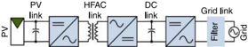

ke

Figure 2.4  Topology of centralized maximum power point tracker with galvanic isolation and two-stage power conversion.

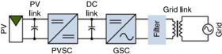

Low-frequency transformers are commonly used to provide galvanic isolation, as shown in Figure 2.4. The two-stage interfacing topology includes PV, DC, and grid links. The DC link is important in this system since it provides energy buffers between the DC/DC and DC/AC converters. The DC/DC converter is referred to as the PV-side converter (PVSC) in  this book. The DC/AC  converter is referred to  as the  grid-side converter (GSC). The PV link provides a filtering function between the PV generator  and the PVSC. The DC-link circuitry is commonly formed by capacitor banks, which mitigate harmonics caused by the DC/AC conversion and the high-frequency switching operation. High  capacitance in  the DC  link  can decouple fast dynamic interactions between the DC/DC and DC/AC stages (Hu et al. 2015). The grid link is designed to provide a filtering function in order to minimize harmonic injection into  the grid. Low-frequency transformers, so called 'line-frequency transformers,' are bulky and heavy, but generally robust and reliable. Their additional advantage is that galvanic isolation is provided exactly at the PCC, thus effectively preventing DC injection.

Figure 2.5 shows a one-stage conversion system, including only DC and grid links. The system converts the PV array output directly to LFAC through the grid-connected PV inverter, and a low-frequency transformer gives galvanic isolation. In such systems, the PV link is the same as the DC link, so only the latter is mentioned.

Certain grid codes allow ungrounded PV systems. Galvanic isolation is no longer mandatory, allowing transformers to be avoided. The grid-connected inverters are commonly referred to as transformer-less. Such systems aim for higher efficiency than their isolated counterparts thanks to the elimination of transformer loss. An ungrounded grid-connected PV system including two-stage conversion is shown in Figure 2.6a. The PV, DC, and grid links are clearly indicated. In the equivalent single-stage conversion system, the PV link is merged with the DC link, which is indicated only as the DC link in Figure 2.6b. The GSC is the key component, converting DC into AC for grid connection and performing the MPPT function.

Even though the multiple-stage conversion system circuits look  complicated, the design and evaluation of the PVSC and GSC can be decoupled. A significant capacitance appears at the DC link, which gives separation of the high-frequency dynamics. In the multiple-stage conversion systems, the control of the PVSC is mainly for the MPPT function, so as to give the highest solar energy harvesting. DC-link voltage regulation is one of the major control functions of the GSC. Other grid-connected functions, such as anti-islanding, power factor regulation, active power throttling, and fault ride-through are also implemented to control the GSC. The DC-link configuration in multiple stage conversion not only divides the control function into two separate tasks but also gives flexibility to implement modular DC/DC MPPT units that will achieve more effective energy harvesting (El Moursi et al. 2013).

Figure 2.5  Topology of centralized maximum power g . os -. point tracker with galvanic isolation and single-stage power conversion.

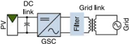

Figure 2.6  Centralized maximum power point tracker without galvanic isolation: (a) with two-stage conversion; (b) with single-stage conversion.

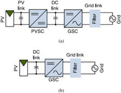

The single-stage power interface has shown the advantage of simplicity and high conversion efficiency. However, it should be based on an integrated design since the DC/AC inverter must be able to undertake MPPT and other functions required by the grid interconnection. Furthermore, the MPPT dynamic performance is no longer decoupled from the DC link, which is the same as the PV link. When the system is for a single-phase grid interconnection, a significant capacitance at the DC link is required to mitigate the double-line frequency ripples. This generally lowers the speed of MPPT due to the slow dynamic response at the PV link.

## 2.2.1 Power Loss due to PV Array Mismatch

Ideally,  a  solar  array  should be  always constructed of  PV  modules, all  with  the same electrical characteristics. It  should be installed in a shading-free environment. However, it is impossible to avoid either shading or other mismatch conditions. PV module mismatches result  from  conditions, such  as moving clouds, the  shadows of trees and buildings, dust, uneven temperature distributions, aging, or manufacturing imperfections. Perching birds  and bird  droppings can also cause unavoidable and unpredictable shading and mismatch conditions in CMPPT systems.

PV  array mismatches have a  disproportionate  impact  on  system performance, because the solar cell with the lowest output limits the current through other elements in the string. Significant power losses have been reported for CMPPT systems due to unbalanced generation among the cells (Xiao et al. 2007).

The mismatch impact can be demonstrated by a simple test. Figure 2.7 shows a test stand where two PV modules are installed on a shared frame with the same tilt angles and directions. Both modules are the same model, BP350, and were manufactured on the same date. The setup ensures that any testing can be conducted at the same time and under the same environment conditions. The specification of the PV module is summarized in Table 2.1.

Figure 2.7  Two PV modules installed on the same frame for a partial shading study.

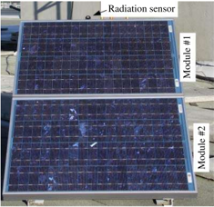

Table 2.1  Specification of photovoltaic module BP350.

| Parameter              | Specification     |
|------------------------|-------------------|
| Cell material          | Multi-crystalline |
| Number of cells        | 72                |
| Cellconfiguration      | 36%x2             |
| MPPvoltage             | 17.3V             |
| MPPcurrent?            | 2.89A             |
| Short-circuit current? | 3.20A             |

The initial test shows that the output characteristics of the two modules are slightly different, even though the test conditions are the same. The current-voltage (I-V) and power-voltage (PV)  curves for the two modules are plotted in Figure 2.8. Under the same testing condition, the peak power values are almost identical, at 21.52 W and 21.49 W. The difference is noticeable in  the output  characteristics in  terms of I-V  and P-V  curves between the two modules. The MPPs are located at  the points (16.16 V, 1.33 A) and (16.55V, 1.30 A) for the first and second module, respectively. The difference is not unexpected, since the PV manufacturer specifies that the tolerance of power output is +5%.

The initial study has the two PV modules in series. Figure 2.9 shows the output characteristics, of which the output current at the MPP is limited by the lowest value, of 1.30 A. The MPP is measured as 42.88 W, which is lower than the sum of the individual PV modules, 21.52 + 21.49 =  43.01 W. There is a 0.31% power loss even though the two healthy PV modules only show slight differences in output characteristics.

Figure 2.8  Plots of data acquired by |-V  tracer without PV partial shading.

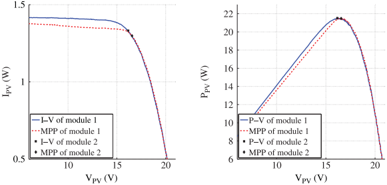

Figure 2.9  Plots of data acquired by |-V tracer without partial shading of PV.

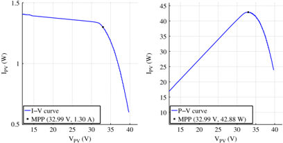

A mismatch condition is then created: one cell in module 2 is intentionally shaded. This represents a 1/72 partial shading condition since there are 72 cells in each PV module. The I-V and P-V curves are plotted in Figure 2.10. The unshaded module has the MPP located at (16.16 V, 1.33 A), giving 21.49 W in power. The shaded module produces 15.44 W, with the MPP location at (17.19 V, 0.90 A). The single-cell shading causes a 28% power loss compared to the unshaded condition. The sum of the available power from both modules becomes 36.93 W.

When the unshaded module and the partially shaded module are connected in series, the I-V and P-V curves of the terminal output are as plotted in Figure 2.11. Two power peaks are seen in the P-V plot. Neither can represent the true available power, which is equal to the sum of the individual maximum powers of the two PV modules. The MPP corresponds to a voltage of 35.10 V and a current of 0.93 A, and the power is measured as 32.65 W. The single-cell shading leads to  a 22% power loss when the shaded and unshaded modules are connected in series. The total loss can be divided into contributions of 14% and 8%, for the loss from the shading alone and that from the hidden MPP. The curves shown in Figure 2.10 can be used to predict the output when more unshaded PV modules are connected with the shaded module in series.

Figure 2.10  Plots of data acquired by I-V tracer with one cell shaded.

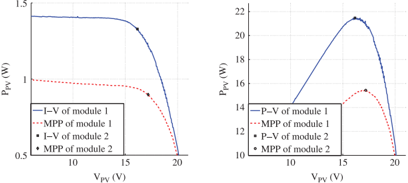

Figure 2.11  Plots of data acquired by I-V tracer with one cell shaded when two modules are connected in series.

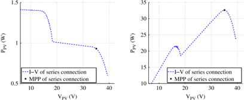

The above discussion is based on the condition of one cell out of 72 shaded. In the real world, the shading pattern will be more complicated and can be caused by many unpredictable factors. The study described in this section demonstrates the drawbacks of the CMPPT system and the importance of developing DMPPT systems.

## 2.2.2 Communication and Data Acquisition for CMPPT Systems

In CMPPT systems, hundreds and thousands of cells are interconnected to form the PV array. Mismatch effects should be always considered in the design stage, since they might result in significant power losses. Data acquisition and communication systems are commonly utilized in centralized MPPT  systems to report on real-time status in order to detect any mismatch conditions. Data acquisition is commonly implemented using grid-connected inverters to  sense and record the connection status, real and reactive power output, and the voltage at the interconnection point (Yu et al. 2011). The generation data can be transmitted to  any place in  the world  for  monitoring and storage, using the latest communication technologies of the Internet and cloud computing. Figure 2.12 shows a typical grid-connected system with data acquisition and communication functions.

Figure 2.12  Data acquisition and monitoring for centralized MPPT photovoltaic power systems.

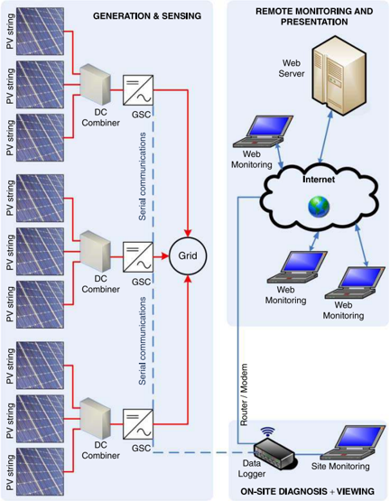

The generation data are collected by digital controller  units implemented inside the inverters. Serial communication technologies, such as the RS-485 protocol or power line communication (PLC), are commonly used to transmit data from individual inverters to the data logger. RS-485 is a serial communication protocol that is commonly used in industry. It has significant advantages over the previous serial communication standard, RS-232. The PLC technology uses existing electrical wires to transport data and support relatively high bandwidths. Either Ethernet or USB interfaces are used for on-site debugging and monitoring. Even though solar farms are installed in remote areas, the system owner and technical support team can access information about the real-time and historical statuses of the system operation, and receive warnings of about any abnormalities at the inverter level. The following variables are typically collected:

- solar array DC power production
- inverter AC output
- inverter status
- AC grid conditions
- weather station data, including solar irradiance
- temperature of key components.

Accurate data can also be used for the purpose of feed-in tariff calculations provided the metering device is certified by the relevant authorities.

Monitoring systems can incorporate the latest wireless communication technology. It  is  obviously  more  convenient  to  communicate  without  a  significant  cabling requirement. Technologies used include wireless local area networks (WLANs) and wireless  wide  area networks  (WWANSs) (Yu  et  al.  2011).  One  WLAN  standard is ZigBee, which was mainly developed for home network communications. The term 'WiFi' refers to the IEEE 802.11 WLAN technologies. Either of these can be utilized to monitor the detailed operation of a grid-connected PV system. Figure 2.13 shows a grid-connected system using wireless technology to monitor the operating status of PV modules, PV strings, and grid-connected inverters. The comprehensive monitoring and data acquisition allows for  fast identification of  any fault  caused by PV  array mismatches or component malfunctions.

The data logger that collects data through WLAN can transmit the data to remote areas through WWAN. Public cellphone carriers have attracted great interest, since WWAN could be used to transmit the collected data to a data center, from where it would be distributed to individual users through modular communication devices or computers. The cellular network has covered a significant area due to the fast growth of mobile networks. Wireless communication can give low-cost and convenient installation even though the system bandwidth is lower than that of modern wired counterparts, such as fiber-optic communication.

The implementation of  communication  and data acquisition systems allows for monitoring of the PV system operation, but it  can not provide a direct solution to minimize the losses caused by PV array mismatches. Therefore, more and more recent studies are focusing on DMPPT systems. Figure 2.14 illustrates the trend away from CMPPT and towards DMPPT  systems. The trend is driven by  the level at which MPPT is implemented. Lower-level MPPT  gives higher  solar power output in  the event  of  mismatch conditions, because the  individual issue  can  be  isolated without affecting other parts of the system. DMPPT systems at the string and module levels are commercially available. DMPPT at the submodule and cell levels is still under research and development.

Figure 2.13  Three-level monitoring of photovoltaic power systems using wireless communication technologies.

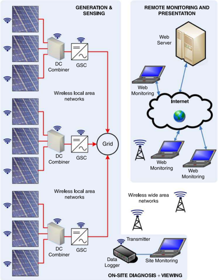

Figure 2.14  Trend towards distributed maximum power point tracking systems.

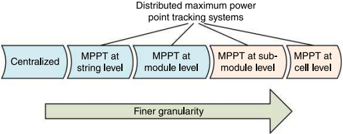

## 2.3 DMPPT Systems at PV String Level

DMPPT has attracted significant research attention, aiming to  address the issue of PV array mismatches (Femia et al. 2008). It has been widely adopted in commercial PV inverter products at the string level. The DMPPT solution has also been adopted in DC microgrid configurations. A PV array typically comprises multiple strings connected in parallel. The concept of the string inverter was introduced to avoid mismatches among strings. In contrast to CMPPT, the DC/AC grid-connected unit is rated and connected to individual PV strings instead of the whole PV array. Solar energy is collected by the string inverters and supplied to the AC interconnection, as shown in Figure 2.15, which shows multiple PV strings and PV links. The grid link is a series of AC filters that are required to guarantee the injection power quality. Transformers can be integrated into the grid link for galvanic isolation.

Figure 2.16 is another example of a grid-connected system, with three distributed maximum power  point  trackers  at  the  string level.  The  output  of  each  string  is modulated by  an independent DC/DC  converter, which is is  controlled for  MPPT. The common DC bus can be linked to either a DC microgrid or an AC grid through a centralized DC/AC inverter. Therefore, the power degradation caused by any mismatch effect at string level is minimized since the power of each PV string is individually extracted and processed.

Figure 2.15  Distributed maximum power point trackers at PV string level sharing AC link.

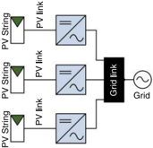

Figure 2.16  Distributed maximum power point trackers at PV string level sharing DC link.

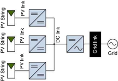

The DC/DC and DC/AC converters can be either independent units or integrated inside one enclosure with the DC/AC inverter. Some commercial systems implement the  DC/DC  units  inside  combiner  boxes  to  perform  independent  string-level MPPT  (Romero-Cadaval et  al. 2013). One  example is the Huawei SUN2000-42KTL grid-connected inverters.! The 42-kW inverter unit can connect up to eight PV strings, the operating status of which can be monitored. The unit includes four independent MPPT units in order to minimize the mismatch impacts among the PV strings.

## 2.4 DMPPT Systems at PV Module Level

Module-integrated converters provide independent MPPT operations within each PV module, which allows for local optimization and reduces power losses resulting from mismatches and partial shading. It should be noted that the diagrams in this section are mainly for conceptual purposes since many neglect the presence of DC and AC filters.

## 2.4.1 Module-integrated Parallel Inverters

The output terminals of module-integrated parallel inverters (MIPIs) are connected in parallel with the AC network. Each PV module is integrated and connected to one MIP], as illustrated in Figure 2.17. The MIPI units are usually PV microinverters or AC modules, which directly convert the PV module voltage, typically  22-45V, to  the low-voltage AC grid level (Xiao et al. 2013). The concept of AC modules refers to PV modules having AC output terminals, since the DC/AC conversion stages are integrated inside the junction boxes of the PV panels. However, PV microinverters or MIPIs can be an independent unit installed outside the PV modules. The parallel interconnection eliminates the single point failures that are common in series connections. In addition, the system becomes highly modular  and flexible because the parallel structure can be easily expanded or modified. Besides the normal benefits of a parallel structure, the direct DC/AC conversion of MIPIs brings the additional advantages of a highly modular solution for a DC/AC grid connection and simple system wiring; DC wiring is integrated in the module and AC wiring is easy for most electricians.

Figure 2.17  Configurations of module-integrated parallel inverters for grid interconnections.

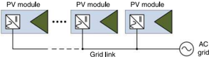

1  www.huawei.com/solar.

The drawbacks of MIPIs are also clear: the overall system cost per watt is higher than that of the centralized counterpart. Furthermore, the conversion efficiency is not as good as in a system based on PV string configuration. Due to the voltage limit of a single PV module, the MIPI should be designed for a high voltage boosting ratio in order to reach the grid voltage level. The MPPT effectiveness is influenced by the impact of double-line frequency ripple in single-phase systems. Lastly, harsh outdoor operating environments influence the lifetime and reliability of all electronic components. The manufacturers of such products include Enphase (USA), Petra (USA), Sunpower (USA), AP systems (USA), Enecsys (UK), and Involar (China).

Two-stage conversion is  generally required  because of  the  very  high  voltageconversion ratio (Edwin et al. 2014). As shown in Figure 2.18, the DC-DC stage steps up the voltage from the PV module to a higher level for grid interconnection. The DC/AC unit  converts the DC  voltage to  the AC line voltage through pulse width modulation. Due to the high capacitance across the DC link, as shown in Figure 2.183, the voltage can be kept steady to provide an energy buffer for energy transfer from DC to AC form.

The topology in Figure 2.18b does not  apply high capacitance at the DC link  to maintain the steady DC-link voltage. It  allows it  to  fluctuate with  the double-line frequency of the grid voltage. In the second stage, the DC current is unfolded into AC form and injected into the grid. The energy buffer for DC to AC conversion is allocated across the PV link.  The unfolding approach aims to  minimize the high-frequency switching loss at the DC/AC conversion stage. Since the majority of MIPIs are designed to be connected to a single-phase AC grid, significant capacitance must be present at the PV link in order to mitigate double-line frequency voltage ripples. The drawback of the high capacitance lies in the capacitor lifetime and the slow dynamics across the PV module terminal. However, industry has shown that this topology can achieve more than 96% efficiency, which is significant for the high step-up ratio of the DC to AC voltage conversion (Edwin et al. 2012).

Figure 2.18  Two types of module-integrated parallel inverter: (a) DC link for steady voltage (b) current-unfolding approach.

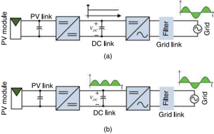

Data acquisition and communication can be implemented in the MIPI to report the status of individual PV modules and the converter in real time. PLC is usually utilized for  data communication. Another option is WLAN, which was discussed in Section 2.2.2.

## 2.4.2 Module-integrated Parallel Converters

In  contrast to MIPIs, module-integrated parallel converters (MIPCs) perform only DC/DC conversion, integrating PV modules in parallel on a common DC bus. The DC bus can be linked to either DC microgrids or AC grids through a centralized DC/AC inverter, as shown in Figure 2.19. MIPC-based PV systems take the advantage of the parallel structure of their counterparts, MIPIs. They provide the simplest solution for connection to a DC microgrid. In contrast to the interconnection to a single-phase AC grid, MIPCs show superior performance since the double-line frequency ripple is no longer present in the DC/DC conversion stage. However, for AC grid integration, MIPC systems are not as modular as MIPI structures, but share the same disadvantages in terms of high voltage-conversion ratios, relatively low conversion efficiencies, and harsh outdoor operating conditions.

;

Figure 2.19  System configurations of module-integrated parallel converters for: (a) DC grid connection; (b) AC grid connection.

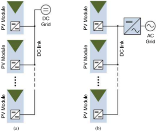

The MIPC-based system was commercially developed by  elQ Energy Inc, USA. The tapped-inductor topology was designed for high-step-up voltage gain and conversion efficiency (Krzywinski 2015). The tapped inductor  can be described as an autotransformer, which provides no  galvanic isolation. Derived from  the standard boost  topology, the  winding ratio  of  the  tapped inductor  offers flexibility  to  step up  the DC/DC  conversion to  a relatively high level. It  also utilizes  an interleaved structure  including two  conversion phases, which  reduces  the  filter  sizes in  both input  and output ports. High voltage stress is always presented to  the output rectifier, which can be made worse by the leakage inductance of the tapped inductor. The design and analysis of  the  tapped-inductor  topology  is  further  discussed in Section 5.1.5.

## 2.4.3 Module-integrated Series Converters

Module-integrated series converters (MISCs), also known commercially as DC power optimizers, are integrated with PV modules to perform MPPT and DC/DC conversion. The idea was originally proposed in the 2004 Annual Conference of the IEEE Industrial Electronics Society and subsequently published in IEEE Transactions on Industrial Electronics (Roman et al. 2006). However, the reported efficiency was not high enough to be used in practice. More recently, thanks to efficiency enhancements, commercial examples of MISCs have become available from National Semiconductor, SolarEdge, Tigo, and Xandex.

In contrast to MIPCs, the outputs of MISC: are serially connected to form a DC string, as shown in Figure 2.20. The DC string can be connected in parallel with other DC strings in order to create a DC link, which can be used for a DC microgrid or an AC grid through a centralized DC/AC inverter. The structure provides an ideal solution for a DC microgrid. The stack structure can build up the voltage of the DC string through multiple MISCs, each of which can be operated at a low conversion ratio which achieves a high conversion efficiency. The drawbacks are that the structure is not as modular as parallel configurations such as MIPIs and MIPCs. Reliability can also be a concern since a series connection can be affected by a single point failure. Extra protection should be considered and implemented to ensure reliability. Installations are mostly located outdoors, similar to other DMPPT units at the module level.

## 2.4.4 Module-integrated Differential Power Processors

Module-integrated  differential  power  processors (MIDPPs)  were  introduced  to balance  operations  of individual  PV  modules  and  to eliminate  mismatches

Figure 2.20  Configurations of module-integrated series converters to form a DC link.

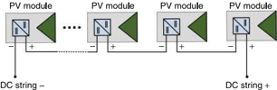

Figure 2.21  Configurations of module-integrated differential power processors to form a DC link.

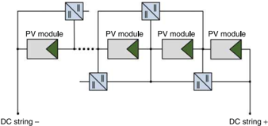

(Blumenfeld et  al.  2014). MIDPPs  are multi-port  DC/DC  converters, which provide a bypass route in parallel with the PV strings, forming a DC string, as shown in Figure 2.21. The DC string can be connected in parallel with other DC strings in order to create a DC link of the desired capacity. The system takes advantage of a standard string configuration since the MIDPPs carry only the mismatch current. The concept is similar to the active balancing methods used for mitigating battery mismatches.

Switched capacitor topologies are used to  achieve the goal of differential power processing. The DC bus voltage is formed by series-connected PV modules, which can be coupled to either DC microgrids or AC grids through a centralized DC/AC inverter. The system concept sounds ideal because the power interface is active only in the case of mismatch conditions. However, many constraints prevent practical implementation. Complex wiring is one of the drawbacks in comparison with module-level DMPPT units.  The reliability is  also not  as good as a parallel structure because the  series connection can be subject to short-circuit faults. Communication among the MIDPPs is generally required to achieve MPPT at the module level, which adds costs to the system.

## 2.4.5 Module-integrated Series Inverters

A new  configuration  utilizing  module-integrated  series  inverters  (MISIs)  has recently been proposed (Jafarian et al. 2015). The output terminals of the MISIs are series connected, to form a stacked AC string, as shown in Figure 2.22. This arrangement is also referred to as 'cascaded AC modules.'

The system has advantages over conventional parallel MIPI structures. High conversion efficiency can be expected, and low-voltage components can be used because a MISI system avoids high conversion ratios thanks to the structure of the AC voltage stack. However, it exhibits the disadvantages of series connections, such as single point failures and complication in  coordination of all the MISIs. Furthermore, the series connection of the AC output terminals is more difficult to control and coordinate than the DC  stack used for MISCs. A  central unit, shown as the grid link  in Figure 2.22, is essential to coordinate the operation of the MISIs. Grid monitoring, protection, and filtering functions are commonly implemented in the central unit, ensuring safety and power quality.

Figure 2.22  Series configurations of module-integrated series inverters for AC grid interconnection.

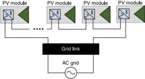

## 2.5 DMPPT Systems at PV Submodule Level

PV  submodules are not  independent units,  but  parts  of  a laminated  PV  panel Laminated crystalline PV modules are commonly made up  of 60 or  72 solar cells arranged in three or four submodules. Figure 1.3 illustrated an example in which each submodule consisted of 24 PV cells in series connection with parallel connected bypass diodes. Without losing generality, the following discussion and illustration is based on the  three-submodule-per-panel configuration, which is  common in  commercial PV products. In reducing mismatches, DMPPT at the submodule level provides better output than module-level approaches.

The output voltage of a submodule is usually less than 15 V. The voltage level matches the requirements of laptop computers and other mass-produced portable devices, so the  components to  construct the  submodule converters are widely available, and are compact, high performance, and low cost.

Due to the low voltage of the submodule output, parallel structures are uncommon for grid-connected applications. Three architectures based on series connections are introduced in the following subsections.

## 2.5.1 Submodule-integrated Series Converters

Submodule-integrated series converters (subMISCs) are integrated with PV submodules  to  perform MPPT  and DC/DC  conversion functions, as  shown in  Figure  2.23.

Figure 2.23  Series configurations of submodule-integrated series converters to form a DC link.

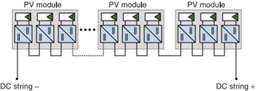

The  output  terminals of  subMISCs are  connected in  series  to  form  a  string, which provides a voltage stack for grid integration. The DC bus formed by subMISCs can be directly linked to a DC microgrid. For AC grid interconnections, subMISC-based systems process power in two stages: DC/DC and DC/AC conversion. To balance the output  currents among subMISCs, the preferred topology uses synchronous buck converters thanks to  their  high efficiency and wide conversion ranges. Due to  the cascaded connection to form the voltage stack, any open-circuit failure of subMISCs breaks the  complete string, as shown in  Figure 2.23. However, protection can be added to avoid a whole-system malfunction, bypassing or short-circuiting the faulty subMISC.

One issue that prevents the integration of subMISCs is that the submodules inside commercial PV  panels are internally  connected in  series prior  to  PV  lamination. Without breaking the interconnection, subMISC systems can not be implemented. Therefore, subMISC systems require that PV panel manufacturers revise the electrical layout of their PV panels prior to lamination. Systems based on subMISCs have not been commercialized up until now, but they might one day achieve high conversion efficiency, integrated inside the junction box of PV modules.

## 2.5.2 Submodule-integrated Differential Power Processors

The concept of differential power processors, discussed in Section 2.4.4, can be extended to the submodule level, an arrangement referred to as as a submodule-integrated differential power processor (subIDPP). The power in each submodule directly passes through the string of submodules, while the subIDPPs in the parallel path process only  the  mismatch power, as shown in  Figure 2.24. It  appears an ideal  solution since the losses are lower than in subMISC-based systems, which convert PV power full  time.  Unlike  subMISC-based systems, subIDPP-based systems do  not  need the  electrical  connections inside  the  PV  lamination  to  be  modified.  The system can be sized, designed, and constructed just as for  conventional CMPPT  systems. In  theory,  the  subIDPP  activates  power  conversion  for  energy  harvesting  only  in the  case of  unbalanced generation. From  a reliability point  of  view, the  subIDPP system is  advantageous since the  connection of converters provides a parallel path, which can protect  the system in  case of  short  circuits  or  open-circuit  failures of submodules. The drawbacks of the  subIDPP solution lie  in  the  complexity of  the topologies and the wiring requirements, which result in low  conversion efficiency compared to subMISC systems. Communication is generally required to coordinate distributed MPPT by the subIDPPs. In  outdoor installations, the additional wiring requirement for bypassed current and communication will significantly increase the system cost.

Figure 2.24  Series configurations of submodule-integrated differential power processors to form a DC link.

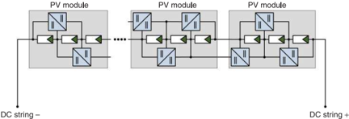

Figure 2.25  Series configurations of submodule-integrated isolated-port differential power processors to form a DC link.

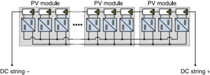

## 2.5.3 Isolated-port Differential Power Processors

Another differential power processing solution is known as an isolated-port differential power processor (subIPDPP), as shown in Figure 2.25. Since the outputs of subIPDPPs share a common ground, galvanic isolation is required in the converter topology. Each submodule is integrated in parallel with a dedicated converter, which makes it similar to a subMISC in terms of connectivity. A simple control strategy of voltage equalization of  submodules can be used for MPPT. The converters can be turned off when no mismatch is  detected. When  there is unbalanced generation in  the  submodules, the mismatch power is processed through converters to  adjust the string current  and eliminate the impact. From the connectivity point of view, the wiring is complicated, which makes practical implementations difficult outdoors. Furthermore, transformers are required to provide galvanic isolation, and these are costly and difficult to accommodate in the junction boxes of commercial PV modules. The need for  additional weather-resistant enclosures for  each PV module will also significantly increase the implementation cost.

## 2.6 DMPPT Systems at PV Cell Level

An on-chip integrated power management architecture has been proposed to achieve MPPT at PV cell level; the fully integrated circuit is claimed to eliminate partial shading issues completely (Shawky et al. 2014). Figure 2.26 illustrates the implementation of DMPPT at the  cell level.  The system adopts  the  topology of  synchronous DC/DC boost converters. To limit  the size, the switching frequency is set to  500 kHz. The solution  sounds ideal  to  push  the  MPPT  operation  down  to  the  finest  granular level, but there are drawbacks in the system's complexity and high cost, which arise because of  the  significant numbers of DC/DC  power units  required  for  a typical grid-connected PV system. There is also a concern to match the DC/DC converter lifetime with that of the PV cells under the same harsh environment of direct sunlight. Furthermore, it is difficult to design a high-efficiency DC/DC converter for the low input  voltages and high output  currents of  typical PV  cells; the maximum power output of a six-inch crystalline-based cell is about  4 W, at 0.5V and a current of 8 A. Few studies these days are focused on cell-level MPPT because of this difficulty and complexity.

Figure 2.26  Integrated power management architecture for DMPPT at PV cell level.

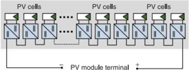

## 2,7 Summary

This chapter has given a classification of  grid-connected PV  systems. The majority  of  grid-connected PV power  systems can be categorized as centralized MPPT (CMPPT) or  distributed MPPT  (DMPPT). In  contrast to  conventional approaches, the  subclassification of  DMPPT  systems focuses on  the  level  at  which  MPPT is  applied:  string,  module,  submodule, or  cell  level. Each  application  has been discussed in  terms  of  its  advantages and disadvantages. In  summary, the  cost of DMPPT systems is generally higher than CMPPT systems because of the complex circuitry required.

The CMPPT solution was the initial approach for large-scale PV power systems. More and more DMPPT systems have been developed to deal with the significant power losses caused by PV mismatch conditions, which cannot be easily avoided in  real-world  environments. The DMPPT  approaches have been commercialized at  the  string  and  module  levels. Significant research is  pushing  into  even finer levels, such as the submodule. Submodule-level DMPPT  is  a promising approach since it  can adopt the low-voltage power  converters developed for  computer and communication devices. The voltage stack can be built to match the voltage required by the grid, while avoiding high voltage-conversion ratios. However, the integration of subMISC requires the modification of the electrical wiring inside conventional PV panels.

The above discussion provides a clear framework for  readers to understand the architectures that are widely used for grid-connected PV systems. To avoid confusion, some important definitions in this chapter are summarized:

- o  PVsubmodule: one section of the laminated PV module. A common crystalline-based PV module includes three or four sections that can be utilized as the submodules. Each submodule usually consists of 15-24 solar cells in series connection.

- e  PV  link:  the  circuitry connecting PV  components, such  as submodules, modules, strings, or arrays.
- e  HFAC link: the circuitry connecting two conversion units through high-frequency AC (see Figure 2.3).
- e  DC link: the circuitry connecting the DC/AC inverter for AC grid connection.
- e  DC string: the circuitry that is formed by series-connected DC/DC converters in parallel with or without PV components.
- o  Grid link: the circuitry connecting the DC/AC stage to the AC grid.
- e  PV-side converter (PVSC): the DC/DC converter that is coupled to the PV link.
- e Grid-side converter  (GSC): the DC/AC converter that is coupled to the grid link.

## Problems

- 2.1 Identify an industrial product that is used as an inverter for a grid-connected PV system. Identify at which level the MPPT function is applied.
- 2.2 Find another criterion to classify and distinguish different PV power systems.
- 2.3 List  some factors in your locale that might cause partial shading or  other PV mismatch conditions.

## References

- Basso T and DeBlasio R 2004 IEEE 1547 series of standards: interconnection issues. Power Electronics, IEEE Transactions on 19(5), 1159-1162.
- Blumenfeld A, Cervera A and Peretz MM 2014 Enhanced differential power processor for PV systems: Resonant switched-capacitor gyrator converter with local MPPT. Emerging and Selected Topics in Power Electronics, IEEE Journal of 2(4), 883-892.
- Bower W and Wiles JC 1994 Analysis of grounded and ungrounded photovoltaic systems Photovoltaic Energy Conversion,  1994, Conference Record of the Twenty Fourth. IEEE Photovoltaic Specialists Conference - 1994,  1994 IEEE First World Conference on, vol. 1, pp. 809-812.
- Edwin F, Xiao W and Khadkikar V 2012 Topology review of single phase grid-connected module integrated converters for PV applications [ECON2012 - 38th Annual Conference on IEEE Industrial Electronics Society, pp. 821-827.
- Edwin F, Xiao W and Khadkikar V 2014 Dynamic modeling and control of interleaved flyback module integrated converter for PV power applications. Industrial Electronics, IEEE Transactions on 61(3), 1377-1388.
- El Moursi MS, Xiao  W and Kirtley Jr JL 2013 Fault ride through capability for grid interfacing large scale PV power plants. IET Generation, Transmission &amp; Distribution 7(9), 1027-1036.
- Femia N, Lisi G, Petrone G, Spagnuolo G and Vitelli  M 2008 Distributed maximum power point tracking of photovoltaic arrays: Novel approach and system analysis. Industrial Electronics, IEEE Transactions on 55(7), 2610-2621.

- Freitas C 2010 How inverters work. Home Power Magazine. http://[www.homepower.com/ articles/solar-electricity/equipment-products/how-inverters-work.
- HuY, Du,  Xiao W, Finney S and Cao W 2015 DC-link voltage control strategy for reducing capacitance and total harmonic distortion in single-phase grid-connected photovoltaic inverters. IET Power Electronics 8(8), 1386-1393.
- Jafarian H, Mazhari I, Parkhideh B, Trivedi S, Somayajula D, Cox R and Bhowmik S 2015 Design and implementation of distributed control architecture of an AC-stacked PV inverter Energy Conversion Congress andExposition (ECCE), 2015 IEEE, pp. 1130-1135.
- Kou W, Wei D, Zhang P and Xiao  W 2015 A direct phase-coordinates approach to fault ride through of unbalanced faults in large-scale photovoltaic power systems. Electric Power Components and Systems 43(8-10), 902-913.
- Krzywinski G 2015 Integrating storage and renewable energy sources into a DC microgrid using high gain DC DC boost converters DC Microgrids (ICDCM), 2015 IEEE First International Conference on, pp. 251-256.
- Ramakumar R and Bigger J] 1993 Photovoltaic systems. Proceedings of the IEEE 81(3), 365-377.
- Roman E, Alonso R, Ibaiiez P, Elorduizapatarietxe S and Goitia D 2006 Intelligent PV module for grid-connected PV systems. IndustrialElectronics, IEEE Transactions on 53(4), 1066-1073.
- Romero-Cadaval E, Spagnuolo G, Franquelo L, Ramos-Paja C, Suntio T and Xiao  W 2013 Grid-connected photovoltaic generation plants: components and operation. IEEE Industrial Electronics Magazine 7(3), 6-20.
- Shawky A, Helmy F, Orabi M, Qahouq J, Dang Z et al. 2014 On-chip integrated cell-level power management architecture with MPPT for PV solar system AppliedPower Electronics Conference andExposition (APEC), 2014 Twenty-Ninth AnnualIEEE, pp. 572-579.
- Xiao W, Edwin FF, Spagnuolo G and Jatskevich J 2013 Efficient approaches for modeling and simulating photovoltaic power systems. Photovoltaics, IEEE Journal of 3(1), 500-508.
- Xiao W, Elmoursi M, Khan O and Infield D 2016 A review of grid-tied converter topologies used in photovoltaic systems. [ET Renewable Power Generation. In press.
- Xiao W, Ozog N and Dunford WG 2007 Topology study of photovoltaic interface for maximum power point tracking. Industrial Electronics, IEEE Transactions on 54(3), 1696-1704.
- Xiao W, Torchyan K, Moursi E, Shawky M and Kirtley JL 2014 Online supervisory voltage control for grid interface of utility-level PV plants. Sustainable Energy, IEEE Transactions on 5(3), 843-853.
- Yu FR, Zhang P, Xiao  W and Choudhury P 2011 Communication systems for grid integration of renewable energy resources. [EEE Network 25(5), 22-29.

## Links

- Source path: `C:/Users/Denys/Documents/Projects/PVplant/PV_books/2 Classification of PV Power Systems - PV PS -- modelling design control.pdf`
- Source hash: `33d908905fa284d5be6ea889ffe82f95727345310f13cac830f62586d598669b`
