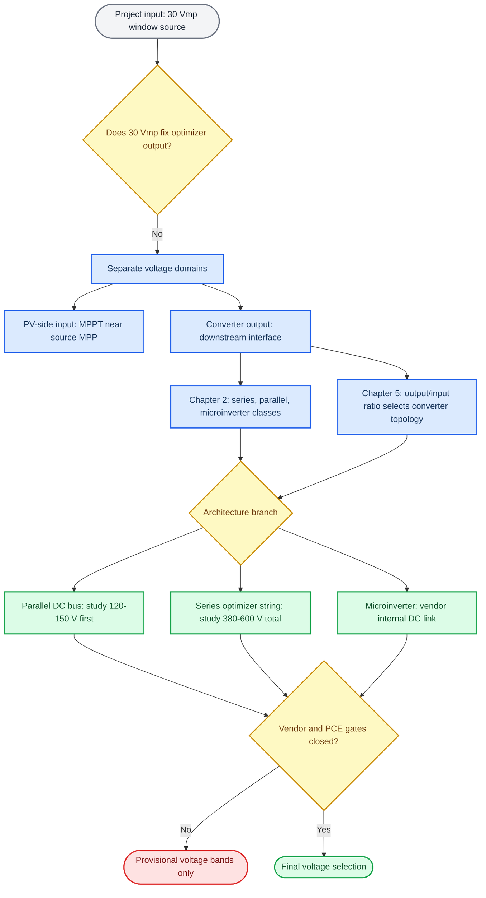
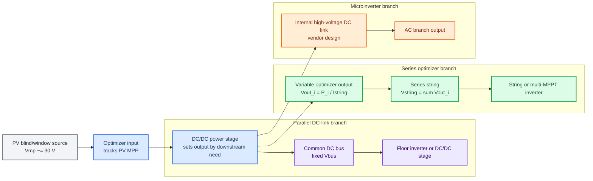
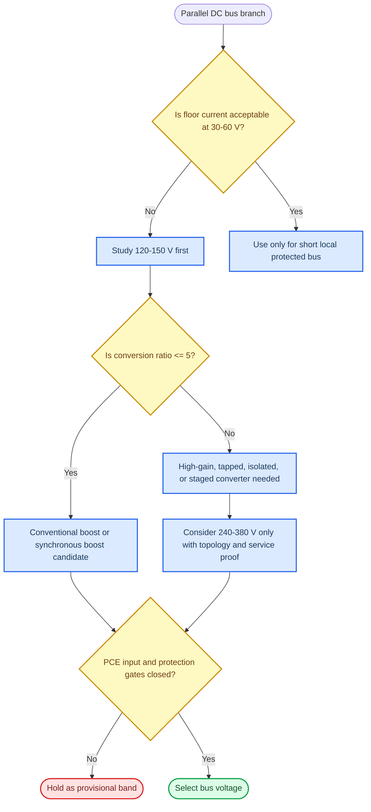
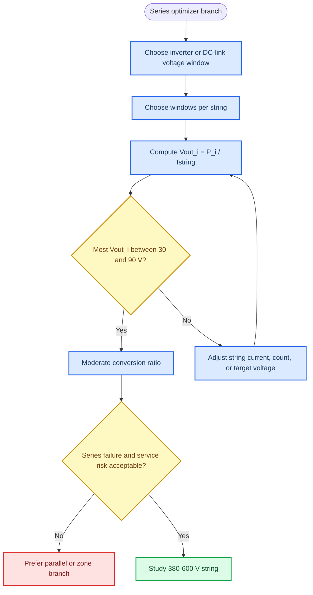
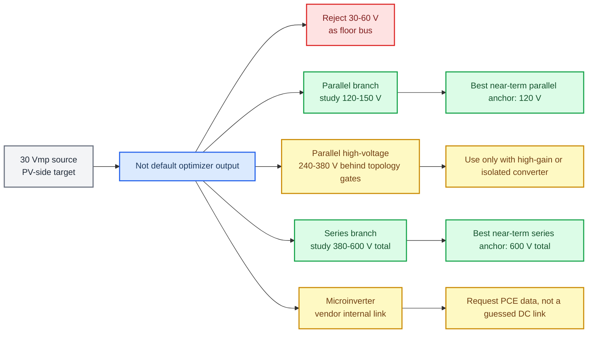

# DC-Link Output Voltage Review For iWin Shortlisted Architectures

_Source-grounded schematic review using Chapter 2, Chapter 5, and current iWin project assumptions. Date: 2026-05-27._

---

## Executive summary

The statement "the PV module target output is 30 V, therefore the DC/DC optimizer output should also be 30 V" is an invalid inference. The current `30 Vmp` value is a PV-side operating target for the iWin blind/window generator. A DC/DC optimizer has two different voltage domains: input voltage is chosen for PV MPPT, output voltage is chosen for the downstream DC link, string current, inverter MPPT window, protection concept, and wiring loss.

Conclusion: do not use `30 V` as the default optimizer output for floor or building aggregation. Use it as the source-side MPPT design point. For the shortlisted DC-link branches, use these provisional voltage anchors until vendor/PCE data closes the gates:

| Branch | Provisional voltage target | Reason |
|---|---:|---|
| Parallel common DC bus from per-window converters | `120-150 Vdc` as the first non-isolated/moderate-boost study band | Cuts floor current from `120-320 A` at 30 V to about `24-80 A`, while keeping conversion ratio near `4-5` from a 30 V source. |
| Parallel high-voltage DC bus | `240-380 Vdc` only if a high-gain or isolated topology is accepted | Better floor current, but `30 V -> 240/380 V` is `8x/12.7x`, which Chapter 5 pushes toward tapped-inductor, flyback, full-bridge isolated, or multi-stage conversion. |
| Series optimizer string | `380-600 Vdc` total string voltage, with variable per-optimizer output | Keeps bus/string current low and can keep each optimizer output near `30-80 V` if enough windows are in series. |
| Microinverter branch | No external DC-link target from this review | The high-voltage DC link is internal to the inverter/PCE; vendor MPPT range, startup, ripple, thermal, and certification data decide it. |

Personal opinion: the best next simulation split is `120 V parallel sub-bus` versus `600 V series optimizer string`. That pair exposes the real trade: parallel modularity and lower voltage versus series-string current reduction and lower per-converter step-up. Do not collapse both into "30 V output".

## Source map

| ID | Source | Used for | Evidence class |
|---|---|---|---|
| S1 | `C:\Users\Denys\Documents\Projects\PVplant\reports\drafts\2026-05-27_pv_ps_classification_literature_review\literature_review.md` | Chapter 2 taxonomy: CMPPT, string DMPPT, module MIPI/MIPC/MISC, mismatch example, module-level voltage range | Contextual literature review / PVplant-derived technical resource |
| S2 | `C:\Users\Denys\Documents\Projects\PVplant\reports\drafts\2026-05-27_chapter5_literature_review\literature_review.md` | Chapter 5 converter selection: buck/boost/tapped/flyback/full-bridge, PVSC/DC-link/GSC split, DC-link ripple | Contextual literature review / PVplant-derived technical resource |
| S3 | `C:\Users\Denys\Documents\Projects\PVplant\PVplant_iWin_BIPV_Knowledge_v1.md` | iWin assumptions: `Vmp,module ~= 30 V`, `60-160 W/m2`, `60 m2/floor`, H1-H4 definitions and data gates | Project-defined assumption / PVplant-derived technical resource |
| S4 | `C:\Users\Denys\Documents\Projects\PVplant\AGENTS.md` | Project rule: no final architecture down-select until electrical envelope, MPPT, isolation, protection, and service gates are closed | Project control instruction |

No current standards verification was performed. This note does not claim a compliant voltage class; it defines voltage bands for the next engineering comparison.

## Thought process schematic



## Voltage-domain schematic



## Critical claim screen

| Claim | Assessment | Evidence |
|---|---|---|
| `30 Vmp` source implies `30 V` optimizer output | Rejected | Chapter 5 separates PVSC input behavior from output/load voltage. Chapter 2 separates module-integrated series converters, parallel converters, and inverters. |
| Optimizer input should include the 30 V MPP point | Supported as current project assumption | S3 defines target `Vmp,module ~= 30 V`; actual vendor `Vmp`, `Voc`, `Isc`, and `Imp` remain required. |
| Parallel floor bus at 30 V is attractive | Rejected | S3 and both chapter reviews show floor current `120-320 A` at 30 V for `3.6-9.6 kW/floor`. |
| A 120-150 V parallel sub-bus is a useful first study band | Engineering inference | Ratio from 30 V is `4-5`, near Chapter 5's conventional boost screening boundary, and floor current becomes materially lower. |
| A 380-600 V series optimizer string is plausible | Engineering inference | Chapter 2 MISC class supports series-connected converter outputs; Chapter 5 favors avoiding high per-converter step-up when possible. |
| Microinverter DC link can be selected from Chapter 5 alone | Rejected | Chapter 5 explains DC-link ripple and high step-up burden; actual internal DC-link voltage is vendor PCE design data. |

## Parallel DC-link branch

For a parallel common bus, the bus current is:

```text
Ibus = Pfloor / Vbus
M = Vbus / Vmp_source
```

Using `Pfloor = 3.6-9.6 kW` and `Vmp_source = 30 V`:

| Vbus | Ratio from 30 V | Floor current at 3.6 kW | Floor current at 9.6 kW | Interpretation |
|---:|---:|---:|---:|---|
| 30 V | 1.00 | 120.0 A | 320.0 A | Reject as floor bus except very short protected demos. |
| 48 V | 1.60 | 75.0 A | 200.0 A | Still high for floor aggregation. |
| 60 V | 2.00 | 60.0 A | 160.0 A | Still high for floor aggregation. |
| 120 V | 4.00 | 30.0 A | 80.0 A | First credible moderate-boost study point. |
| 180 V | 6.00 | 20.0 A | 53.3 A | Lower current, but beyond simple boost comfort zone. |
| 240 V | 8.00 | 15.0 A | 40.0 A | Needs high-gain or isolated topology review. |
| 380 V | 12.67 | 9.5 A | 25.3 A | Attractive bus current, hard per-window step-up. |
| 600 V | 20.00 | 6.0 A | 16.0 A | Not a per-window parallel target without strong safety/topology justification. |
| 760 V | 25.33 | 4.7 A | 12.6 A | Too high as a first per-window parallel-output assumption. |



Result for parallel branch: `120-150 Vdc` is the most useful first-pass study band for a per-window parallel DC/DC output because it reduces bus current without forcing `12x+` step-up. `240-380 Vdc` should be tested only as a high-gain or isolated branch, likely with zone-level conversion rather than every window using a hard high-step converter.

## Series optimizer branch

For a series optimizer architecture, the relevant target is total string voltage, not equal output voltage from each module. The per-window optimizer output is controlled by power and string current:

```text
Vout_i = Pwindow_i / Istring
Vstring = sum(Vout_i)
M_i = Vout_i / 30 V
```

At likely window powers:

| Pwindow | Istring | Vout per window | Ratio from 30 V |
|---:|---:|---:|---:|
| 180 W | 8 A | 22.5 V | 0.75 |
| 180 W | 10 A | 18.0 V | 0.60 |
| 480 W | 8 A | 60.0 V | 2.00 |
| 480 W | 10 A | 48.0 V | 1.60 |
| 480 W | 12 A | 40.0 V | 1.33 |
| 720 W | 8 A | 90.0 V | 3.00 |
| 720 W | 10 A | 72.0 V | 2.40 |
| 720 W | 12 A | 60.0 V | 2.00 |

Total string-voltage examples:

| Vstring target | Windows in series | Per-window output | Ratio from 30 V |
|---:|---:|---:|---:|
| 380 V | 8 | 47.5 V | 1.58 |
| 380 V | 10 | 38.0 V | 1.27 |
| 380 V | 12 | 31.7 V | 1.06 |
| 600 V | 8 | 75.0 V | 2.50 |
| 600 V | 10 | 60.0 V | 2.00 |
| 600 V | 12 | 50.0 V | 1.67 |
| 600 V | 20 | 30.0 V | 1.00 |
| 760 V | 10 | 76.0 V | 2.53 |
| 760 V | 12 | 63.3 V | 2.11 |
| 760 V | 20 | 38.0 V | 1.27 |



Result for series branch: use `380-600 Vdc` total string voltage as the primary study range. `600 Vdc` is a strong simulation anchor because it can be reached by `20 x 30 V`, `12 x 50 V`, or `10 x 60 V` per-window optimizer outputs. That keeps per-converter ratio moderate while reducing floor/string current. The risk is not voltage math; it is series service behavior, isolation, shutdown, fault containment, and whether the PCE supports the resulting MPPT/string window.

## Combined conclusion schematic



## Architecture result table

| Architecture | Output voltage should be | Do not assume | Why |
|---|---|---|---|
| H1 parallel MIPC-style per-window DC/DC | `120-150 Vdc` first; `240-380 Vdc` only as high-gain/isolated branch | Do not assume 30 V output | Parallel bus voltage must reduce current; 30 V is only the input MPP target. |
| H1 series MISC-style optimizer string | Variable per-window output, total string `380-600 Vdc` | Do not force all optimizers to fixed 30 V | Output is set by string current and total DC-link target. |
| H2 zone DC/DC | `120-380 Vdc` depending on zone size and converter topology | Do not scale 30 V upward blindly | Larger zone converter can justify higher voltage, but mismatch grouping becomes harder. |
| H3 per-window microinverter | Vendor-defined internal DC link; external PV input around 30 Vmp if compatible | Do not select external DC-link voltage from Chapter 5 alone | Single-phase ripple, startup, MPPT, thermal, and certification data dominate. |
| H4 zone microinverter | Vendor-defined internal DC link; zone input must match PCE MPPT | Do not treat zone input as automatically 30 V | Multiple windows change current, voltage, protection, and mismatch behavior. |

## Required closure data before final voltage selection

| Closure item | Needed value |
|---|---|
| PV electrical envelope | Actual `Pmax`, `Vmp`, `Voc`, `Imp`, `Isc`, temperature coefficients |
| PCE input | MPPT range, startup voltage, max input current, max input power, allowed source capacitance |
| Output limits | Allowed DC-link range, bus/string voltage limits, current limits, ripple limits |
| Architecture constraints | Series count, parallel count, allowed aggregation, bypass/subdivision topology |
| Safety/service boundary | Isolation, shutdown, accessible voltage class, connector/feedthrough, replacement unit |
| Thermal limit | Converter location, ambient, enclosure, capacitor lifetime, derating |

## Bottom line

The useful design variable is not "optimizer output equals 30 V." It is:

```text
PV-side input: around 30 Vmp, pending vendor confirmation
Parallel optimizer output: study 120-150 V first
Parallel high-voltage branch: study 240-380 V only with high-gain/isolated topology
Series optimizer string: study 380-600 V total, with variable per-window outputs
Microinverter branch: defer DC-link voltage to vendor PCE data
```

This keeps Chapter 2's mismatch/DMPPT logic and Chapter 5's converter-ratio logic aligned: raise voltage where it reduces real bus current, but avoid forcing every window converter into an unnecessary high step-up ratio.
